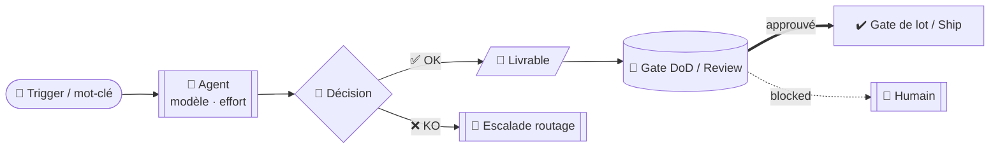
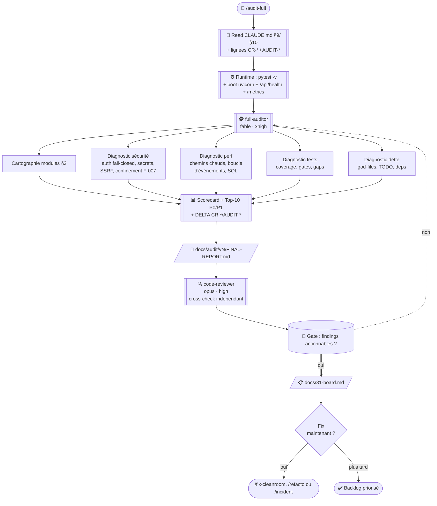
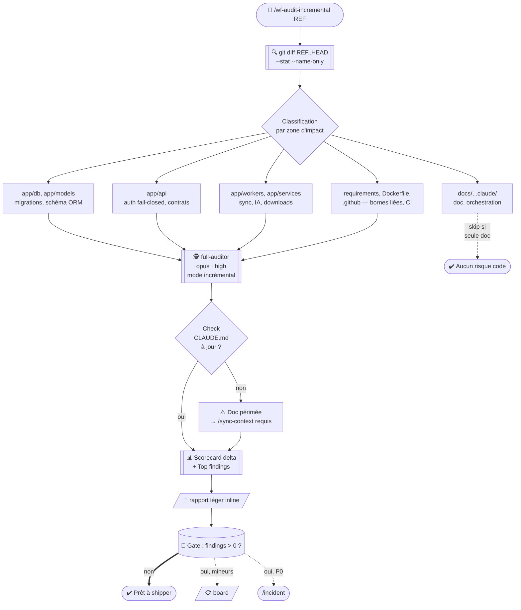
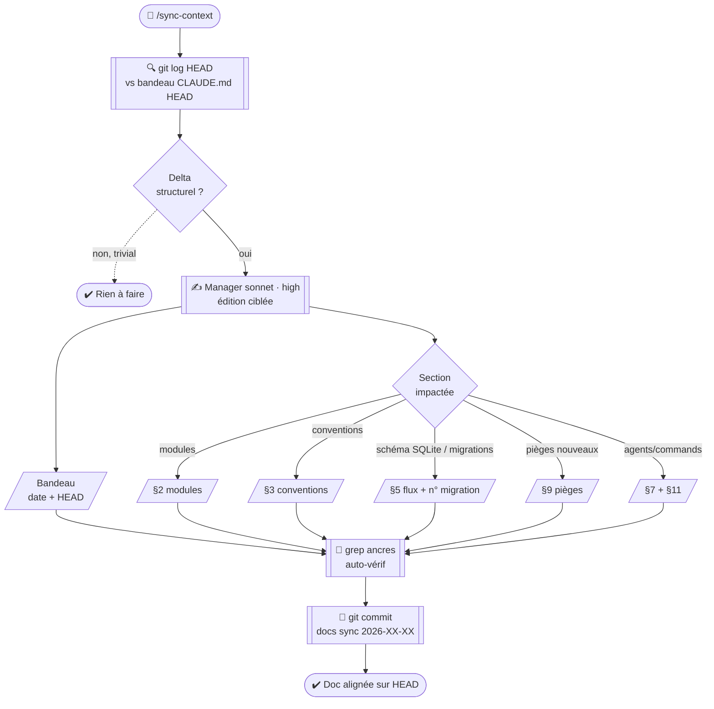
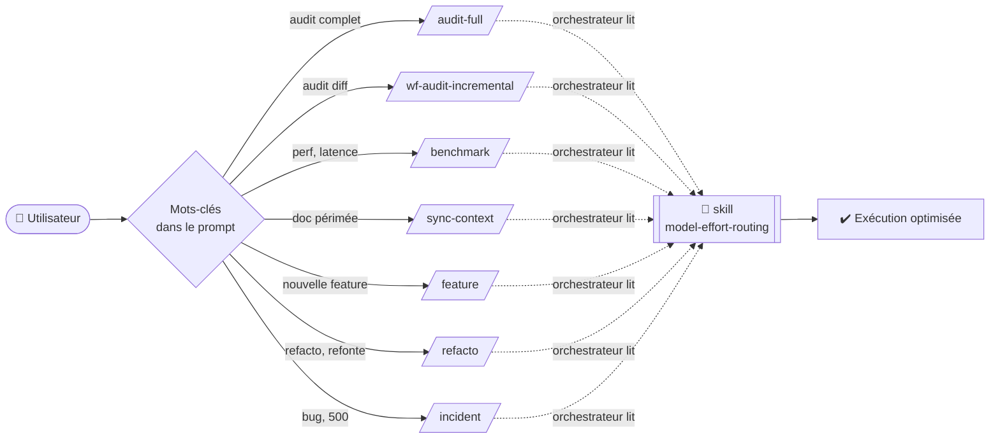

# 📊 Graphes détaillés des 7 workflows canoniques PlexHub Backend

> Compagnon visuel de `.claude/WORKFLOWS.md`. Chaque workflow détaillé sous forme de flowchart Mermaid (rendu natif dans VS Code / Cursor / GitHub) avec agents, modèles+effort de départ, gates, livrables et boucles d'escalade. Backend **FastAPI / Python 3.13**, dév direct sur `develop`.

## Légende commune



**Conventions** : `[[ agent ]]` = subagent invoqué via `Task` · `{ décision }` = branchement · `[/ livrable /]` = fichier produit · `[( gate )]` = point de contrôle bloquant · `==>` = flux nominal · `-.->` = fallback / escalade · `🎯` = trigger utilisateur · `👤` = agent avec modèle · `🚦` = gate DoD · `🚨` = escalade humaine.

---

## 1. `/audit-full` — Audit complet 360°

**Trigger** : « audit complet », « revue globale », « audit 360 », « état du code »
**Fréquence** : mensuel / trimestriel · **Sortie** : `docs/audit/v*/FINAL-REPORT.md`



**Escalade routage** : `full-auditor` en `fable/xhigh` par défaut. Si le rapport rate un axe → cross-check `code-reviewer opus/high`. Si findings vagues → 2ᵉ passe `full-auditor fable/max` (via override `CLAUDE_CODE_EFFORT_LEVEL=max`).

---

## 2. `/wf-audit-incremental` — Audit du diff `<REF>..HEAD`

**Trigger** : « audit diff », « check ce qui a bougé », « audit du lot », « audit avant release »
**Fréquence** : post-lot / hebdomadaire · **Sortie** : `docs/audit/incremental/<date>-<REF>-to-HEAD.md`



**Escalade routage** : `full-auditor opus/high` par défaut (scope réduit vs `/audit-full`). Si le diff touche schéma/migrations, sécurité (auth/secrets/downloads) ou worker partagé → `opus/xhigh`. Si mystère persistant → `fable/xhigh`.

---

## 3. `/benchmark` — Mesures de latence API

**Trigger** : « benchmark », « profile », « perf », « latence », « endpoint lent »
**Fréquence** : à la demande / après chantier perf · **Sortie** : `docs/audit/benchmark-<date>/REPORT.md`

```mermaid
flowchart TD
  T([🎯 /benchmark]) --> SRV{Serveur bootable ?<br/>.env minimal + DB peuplée}
  SRV -.->|non| BLK[🚨 BLOCKED<br/>env/DB manquants]
  SRV -->|oui| BOOT[[⚙️ uvicorn app.main:app<br/>+ /api/health 200]]
  BOOT --> PB[[⚡ perf-benchmarker<br/>opus · high]]
  PB --> SC1[Scénario 1<br/>listes /unified<br/>movies + shows p50/p90]
  PB --> SC2[Scénario 2<br/>recherche + filtres<br/>ILIKE, count]
  PB --> SC3[Scénario 3<br/>IA /rank cold + warm<br/>hydrate, sqlite-vec]
  PB --> SC4[Scénario 4<br/>génération Plex<br/>+ sync (boucle bloquée ?)]
  SC1 & SC2 & SC3 & SC4 --> METRICS[/📊 Métriques<br/>p50/p90 par étape,<br/>logs request_id, /metrics/]
  METRICS --> ANALYSE[[🔬 perf-benchmarker<br/>isolation goulots fichier:ligne]]
  ANALYSE --> RPT[/📄 docs/audit/benchmark-DATE/REPORT.md/]
  RPT --> OA[[📈 observability-analyst<br/>sonnet · medium<br/>cross-check chiffres]]
  OA --> GATE[(🚦 Gate : goulots identifiés ?)]
  GATE ==>|oui| FIX([/fix-bench-perf])
  GATE -.->|non, tout vert| END([✔️ Baseline archivée])
```

**Escalade routage** : `perf-benchmarker opus/high`. Si un goulot est ambigu (cause racine floue, ex. « pourquoi ce endpoint prend 4 s ? ») → escalade à `full-auditor fable/xhigh` OU `/incident`.

---

## 4. `/sync-context` — Recalage doc léger

**Trigger** : « sync context », « recale CLAUDE.md », « doc périmée », « bandeau à jour »
**Sortie** : commit avec bandeau CLAUDE.md à jour + sections concernées



**Escalade routage** : mono-agent, `Manager sonnet/high`. Si le delta est massif (>1000 lignes doc, refonte structurelle) → escalade `/refresh-context` (re-cartographie complète via `a0-cartographer`).

---

## 5. `/feature` — Nouvelle fonctionnalité multi-agents

**Trigger** : « feature », « implémente », « ajoute », « nouvel endpoint », « livre X »
**Sortie** : commits sur `develop` + `docs/10-prd-<feature>.md` + tests + boot vert

```mermaid
flowchart TD
  T([🎯 /feature « objectif »]) --> SKILL[/📖 skill model-effort-routing<br/>lue par cto + tech-manager/]
  SKILL --> P1[[📝 cpo<br/>opus · high<br/>skill prd-builder]]
  P1 --> PRD[/📄 docs/10-prd-feature.md/]
  PRD --> GATE1[(🚦 Gate produit :<br/>user stories + AC clairs ?)]
  GATE1 -.->|❌| P1
  GATE1 ==>|✅| P2[[🏗️ cto + tech-lead<br/>opus · high<br/>skill architecture-builder]]
  P2 --> ARCH[/📄 Contrats Pydantic + DAG<br/>docs/31-board.md/]
  ARCH --> GATE2[(🚦 Gate archi :<br/>impacts §9, migrations, secrets ?)]
  GATE2 -.->|risky| HUM[🚨 needs-approval]
  GATE2 ==>|safe| PM[[📊 tech-manager<br/>opus · high<br/>skill sprint-planner]]
  PM --> P3A[[🔧 backend-developer<br/>sonnet · high]]
  PM --> P3B[[🗄️ spécialistes domaine<br/>db-migration / sync /<br/>ai-recsys / plex-generator<br/>sonnet · high]]
  P3A & P3B -->|parallèle<br/>périmètres disjoints| CODE[/💻 Code commité<br/>develop/]
  CODE --> P4[[🧪 qa-engineer<br/>sonnet · high<br/>pytest + tests HTTP]]
  P4 --> P5A[[🔎 code-reviewer<br/>opus · high]]
  P4 --> P5B[[🔒 security-reviewer<br/>opus · xhigh<br/>si surface sensible]]
  P4 --> P5C[[⚡ perf-benchmarker<br/>opus · high<br/>si chemin chaud]]
  P5A & P5B & P5C --> GATE3[(🚦 Gate DoD :<br/>pytest -v + boot uvicorn<br/>+ /api/health 200<br/>+ migrations + ruff)]
  GATE3 -.->|❌ cycle 1..2| ESC[[🔁 escalade orchestrée par cto/tm<br/>prompt+ · model override · autre agent]]
  ESC --> P3A
  GATE3 -.->|❌ cycle 3| HUM
  GATE3 ==>|✅| MERGE[[✔️ tech-manager<br/>gate de lot + integration-agent]]
  MERGE --> SC[/sync-context si<br/>modules/§5/§9 touchés]
```

**Escalade routage** (cap 2 cycles avant BLOCKED) :
1. `sonnet/high` KO → même agent, prompt enrichi
2. Encore KO → override `model: "opus"` à l'invocation
3. `opus/high` KO → spécialiste domaine ou `tech-lead` opus/xhigh
4. Encore KO → `BLOCKED`, `🚨 needs-approval` humain

---

## 6. `/refacto` — Refonte ciblée

**Trigger** : « refacto », « refactor », « refonte », « extrait », « migre », « découpe »
**Sortie** : commits par vague sur `develop` + validation régressions + ADR

```mermaid
flowchart TD
  T([🎯 /refacto « périmètre »]) --> SKILL[/📖 skill model-effort-routing<br/>lue par tech-lead/]
  SKILL --> TL[[🏗️ tech-lead<br/>opus · xhigh<br/>cartographie]]
  TL --> CART[/📄 Cartographie<br/>+ plan migration<br/>+ contrats stables + ADR/]
  CART --> RISK{Risky ?<br/>schéma DB / auth / worker partagé}
  RISK -->|oui| HUM[🚨 needs-approval humain]
  RISK -->|non| WAVE{Découpe<br/>en vagues}
  HUM -->|approuvé| WAVE
  WAVE --> V1[Vague 1<br/>changements isolés]
  WAVE --> V2[Vague 2<br/>dépendante V1]
  WAVE --> V3[Vague 3<br/>gros moteur : services IA,<br/>plex_generator, schéma DB<br/>= isolée obligatoire]
  V1 --> DEV1[[🔧 backend-developer<br/>sonnet · high<br/>fichier par fichier]]
  DEV1 --> QA1[[🧪 qa-engineer<br/>sonnet · high<br/>non-régression pytest]]
  QA1 --> PB1[[⚡ perf-benchmarker<br/>opus · high<br/>si chemin chaud]]
  PB1 --> REV1[[🔎 code-reviewer<br/>opus · xhigh<br/>invariants §9 préservés ?]]
  REV1 --> G1[(🚦 Gate V1)]
  G1 -.->|KO cycle 1..2| ESC1[[🔁 escalade routage]]
  ESC1 --> DEV1
  G1 -.->|KO cycle 3| BLK[🚨 BLOCKED]
  G1 ==>|OK| M1[[✔️ tech-manager<br/>gate de lot V1]]
  M1 --> V2
  V2 -->|même chaîne| M2[✔️ gate V2]
  M2 --> V3
  V3 -->|isolée + retest complet| M3[✔️ gate V3]
  M3 --> ADR[/📄 docs/architecture/adr/NNNN-refacto.md/]
  ADR --> SC[/sync-context §9 + bandeau]
```

**Escalade routage** : refacto = `opus/xhigh` sur toute la chaîne (cartographie ET review). Le dev peut rester `sonnet/high` sur les vagues isolées à impact borné. Si une vague touche invariants §9 (migrations, db_retry, master-worker, secrets) → `opus/xhigh` sur le dev aussi.

---

## 7. `/incident` — Bug / 500 / régression

**Trigger** : « incident », « bug », « 500 », « régression », « ça marche plus », « erreur en prod »
**Sortie** : correctif commité + test de garde + `docs/daily/<date>-incident-*.md` + entrée §9

```mermaid
flowchart TD
  T([🎯 /incident « symptôme »]) --> MON[[📊 Monitor<br/>logs/plexhub.log request_id<br/>+ /metrics + repro curl]]
  MON --> TRIAGE[[🏗️ tech-lead<br/>opus · xhigh<br/>sévérité S0/S1/S2]]
  TRIAGE --> SEV{Sévérité}
  SEV -->|S0 prod down| HOT[🚨 hotfix depuis main<br/>needs-approval]
  SEV -->|S1/S2| ROOT[[🔬 tech-lead<br/>opus · xhigh<br/>skill systematic-debugging<br/>cause racine fichier:ligne]]
  HOT --> ROOT
  ROOT --> HYP[/📄 Hypothèses<br/>+ preuves code/]
  HYP --> REPRO{Reproductible<br/>pytest ou curl ?}
  REPRO -.->|non| MORE[[🔍 more logs<br/>ou instrumentation temporaire]]
  MORE --> ROOT
  REPRO -->|oui| GUARD[[🧪 qa-engineer<br/>sonnet · high<br/>test de garde ROUGE d'abord]]
  GUARD --> FIX[[🔧 backend-developer<br/>ou spécialiste domaine<br/>sonnet · high<br/>correctif ciblé]]
  FIX --> VERIF[[🧪 qa-engineer<br/>garde VERTE + pytest -v<br/>+ smoke boot /api/health]]
  VERIF --> REV[[🔎 code-reviewer<br/>opus · high]]
  REV --> GATE[(🚦 Gate incident :<br/>fix + garde + smoke ✓ ?)]
  GATE -.->|KO cycle 1..2| ESC[[🔁 escalade orchestrée par tech-lead<br/>prompt+ · model override · autre agent]]
  ESC --> FIX
  GATE -.->|KO cycle 3| BLK[🚨 BLOCKED humain]
  GATE ==>|OK| MERGE[[✔️ tech-manager gate de lot]]
  MERGE --> POST[[📝 Postmortem<br/>docs/daily/DATE-incident.md]]
  POST --> P9[/§9 CLAUDE.md<br/>+1 piège gravé/]
  P9 --> SC[/sync-context bandeau]
```

**Escalade routage** : cause racine = `tech-lead opus/xhigh` (souvent Fable 5 si mystère persistant — locks SQLite, races async). Correctif = `sonnet/high` typique. Test de garde = incontournable (« un test qui reproduit RED d'abord »).

---

## 🧭 Vue d'ensemble : quand appeler quoi ?



## Références croisées

- `.claude/WORKFLOWS.md` — routeur + garde-fous + politique de routage
- `.claude/skills/model-effort-routing/SKILL.md` — matrice couples + escalade
- `CLAUDE.md` §7 — roster agents · §9 — pièges · §11 — workflows
- `.claude/commands/{feature,refacto,incident,audit-full,wf-audit-incremental,benchmark,sync-context}.md` — spécifications workflow par workflow
