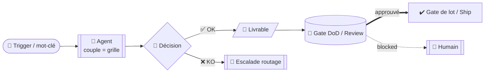
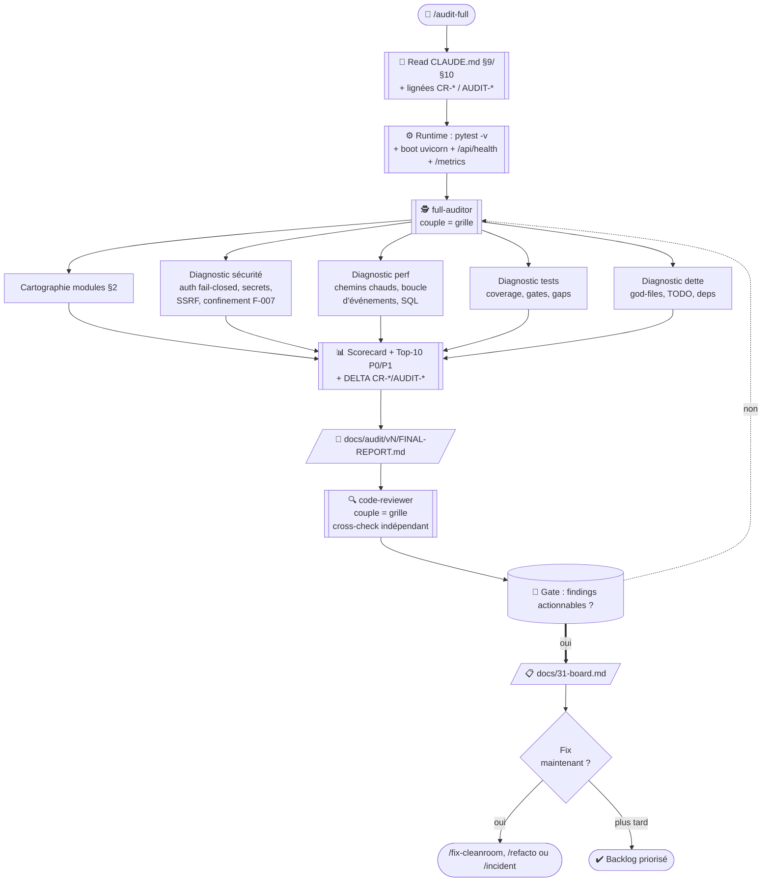
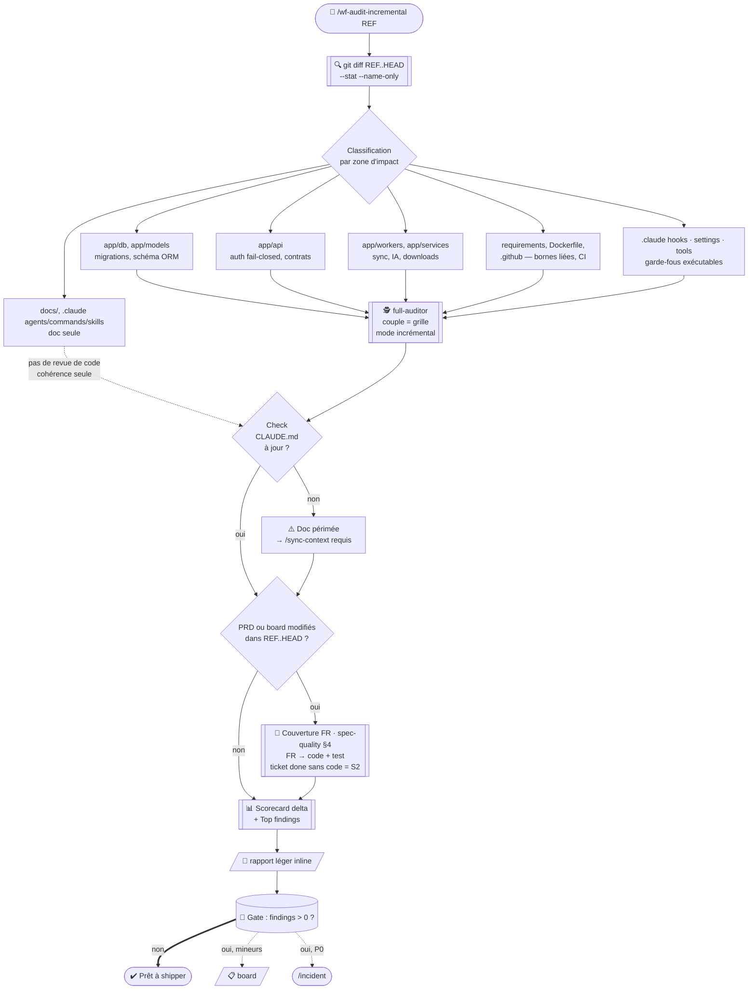
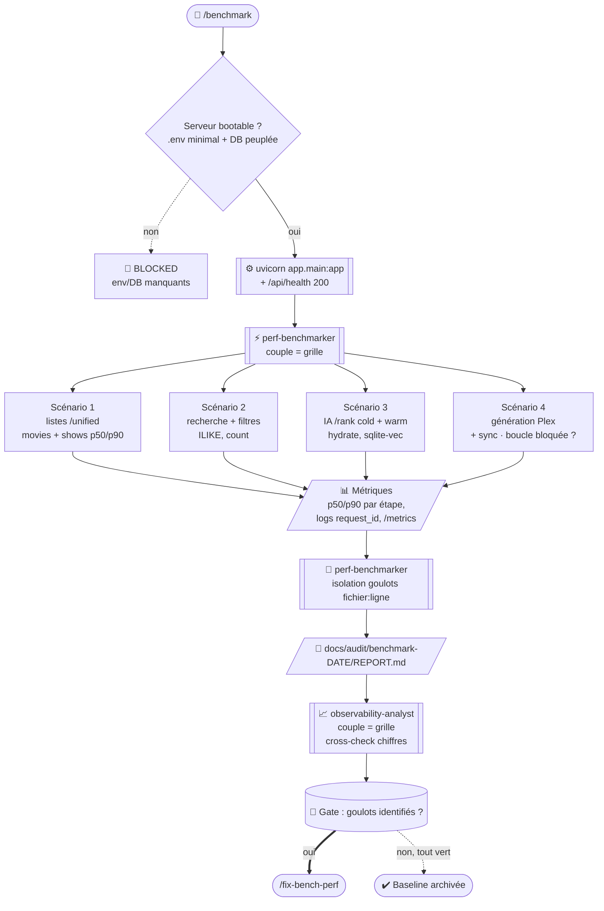
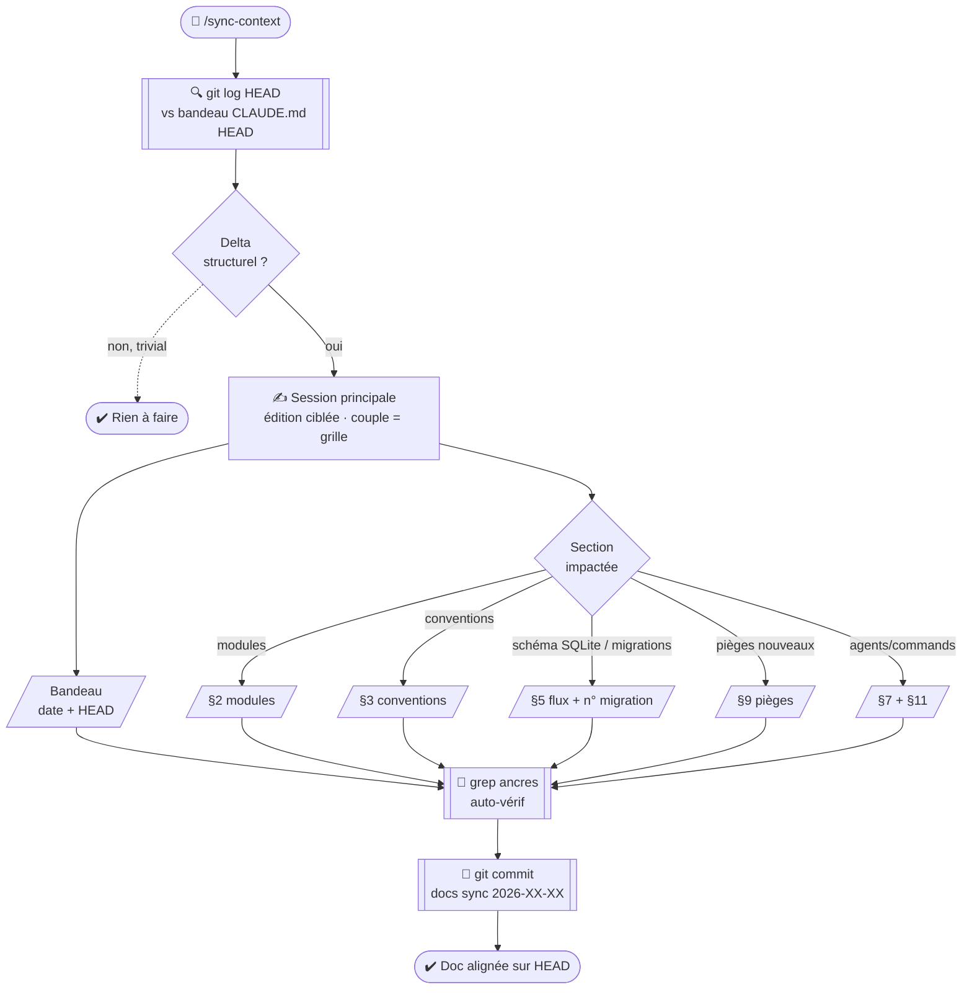
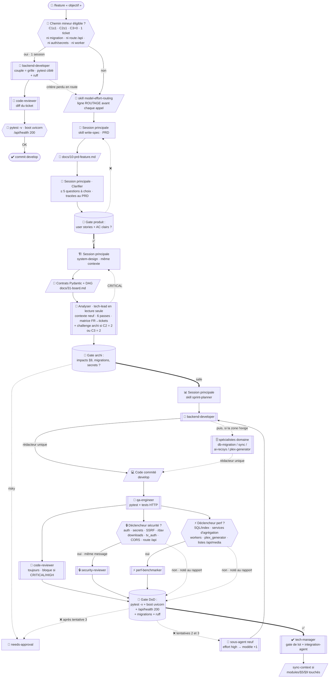
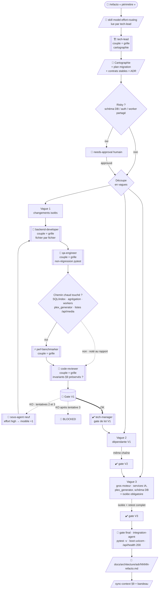
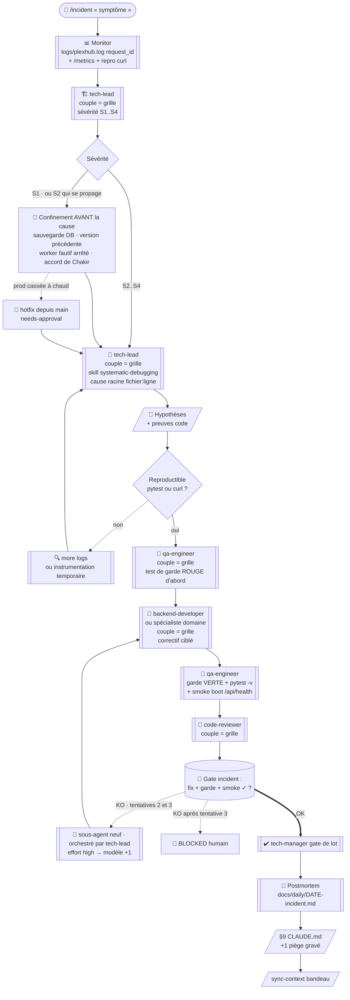
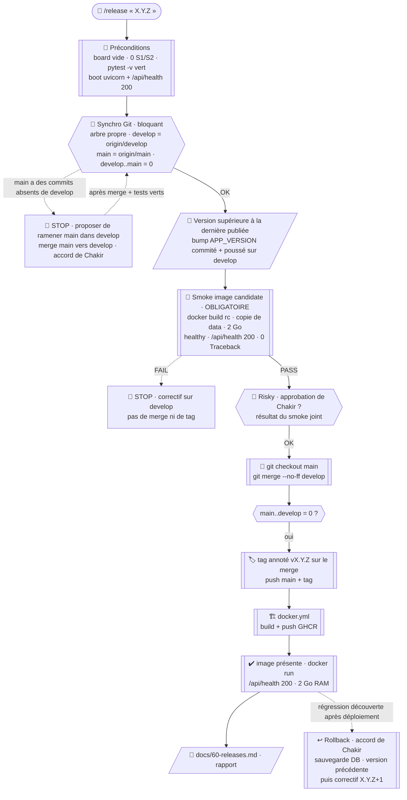
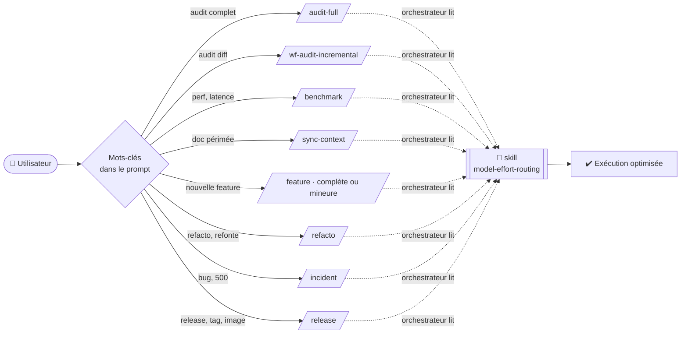

# 📊 Graphes détaillés des 7 workflows canoniques PlexHub Backend

> Compagnon visuel de `.claude/WORKFLOWS.md`. Chaque workflow détaillé sous forme de flowchart Mermaid (rendu natif dans VS Code / Cursor / GitHub) avec agents, gates, livrables et boucles d'escalade. Backend **FastAPI / Python 3.13**, dév direct sur `develop`.

> 🎚️ **Les nœuds affichent « couple = grille » au lieu d'un couple fixe** (revue 2026-09-24). Depuis le 2026-09-23, le couple réel est décidé **tâche par tâche** par la grille de la skill `model-effort-routing` (plage `haiku`..`opus` × `medium`..`high`, ligne `ROUTAGE` tracée avant chaque appel ; effort `high` = fiche jumelle `<agent>-high`). `low`, `xhigh`, `max` et `fable` sont hors routage. Dans les notes « Escalade routage » ci-dessous, un **plancher** est le couple minimum que la grille donne pour ce cas (C2 = 2, C3 = 2 ou C4 = 2) — jamais un couple fixé par rôle.

> 🧰 **Garde-fous transverses (hors diagrammes, 2026-09-25)** : hook `Stop` `.claude/tools/cost-tracker.py` (mesure des tokens par workflow/agent/modèle), hooks `PreCompact`/`SessionStart` `.claude/tools/lot-state.py` (état de lot survivant à la compaction), règles `permissions` ask/deny (`.env` refusé, `pyproject.toml` sur confirmation). Détail dans `WORKFLOWS.md`.

> ✍️ **Un seul rédacteur à la fois** : les devs s'enchaînent, seules les relectures et les audits partent en parallèle. **Échec = compteur unique** de 3 tentatives (sous-agent neuf + effort `high` → modèle +1 → `BLOCKED`).

## Légende commune

```mermaid
flowchart LR
  T([🎯 Trigger / mot-clé]) --> A[[👤 Agent<br/>couple = grille]]
  A --> D{🔀 Décision}
  D -->|✅ OK| L[/📄 Livrable/]
  D -->|❌ KO| E[[🔁 Escalade routage]]
  L --> G[(🚦 Gate DoD / Review)]
  G ==>|approuvé| M[✔️ Gate de lot / Ship]
  G -.->|blocked| H[[🚨 Humain]]
```

**Conventions** : `[[ agent ]]` = subagent invoqué via `Task` · `{ décision }` = branchement · `[/ livrable /]` = fichier produit · `[( gate )]` = point de contrôle bloquant · `==>` = flux nominal · `-.->` = fallback / escalade · `🎯` = trigger utilisateur · `👤` = agent avec modèle · `🚦` = gate DoD · `🚨` = escalade humaine.

---

## 1. `/audit-full` — Audit complet 360°

**Trigger** : « audit complet », « revue globale », « audit 360 », « état du code »
**Fréquence** : mensuel / trimestriel · **Sortie** : `docs/audit/v*/FINAL-REPORT.md`

```mermaid
flowchart TD
  T([🎯 /audit-full]) --> R[[📖 Read CLAUDE.md §9/§10<br/>+ lignées CR-* / AUDIT-*]]
  R --> RT[[⚙️ Runtime : pytest -v<br/>+ boot uvicorn + /api/health + /metrics]]
  RT --> FA[[🕵️ full-auditor<br/>couple = grille]]
  FA --> A1[Cartographie modules §2]
  FA --> A2[Diagnostic sécurité<br/>auth fail-closed, secrets,<br/>SSRF, confinement F-007]
  FA --> A3[Diagnostic perf<br/>chemins chauds, boucle<br/>d'événements, SQL]
  FA --> A4[Diagnostic tests<br/>coverage, gates, gaps]
  FA --> A5[Diagnostic dette<br/>god-files, TODO, deps]
  A1 & A2 & A3 & A4 & A5 --> S[[📊 Scorecard + Top-10 P0/P1<br/>+ DELTA CR-*/AUDIT-*]]
  S --> RPT[/📄 docs/audit/vN/FINAL-REPORT.md/]
  RPT --> CX[[🔍 code-reviewer<br/>couple = grille<br/>cross-check indépendant]]
  CX --> GATE[(🚦 Gate : findings actionnables ?)]
  GATE ==>|oui| BOARD[/📋 docs/31-board.md/]
  GATE -.->|non| FA
  BOARD --> FIX{Fix<br/>maintenant ?}
  FIX -->|oui| REFACTO([/fix-cleanroom, /refacto ou /incident])
  FIX -->|plus tard| END([✔️ Backlog priorisé])
```

**Escalade routage** : couple de `full-auditor` noté par la grille — en pratique **plancher** `opus`·`high` (jugement cross-module, vérification indirecte : C5 = 2, C4 = 2). Si le rapport rate un axe → cross-check `code-reviewer` (couple = grille). Si findings vagues → 2ᵉ passe `full-auditor` avec prompt enrichi ; `xhigh`/`max` = décision humaine uniquement (`CLAUDE_CODE_EFFORT_LEVEL`).

---

## 2. `/wf-audit-incremental` — Audit du diff `<REF>..HEAD`

**Trigger** : « audit diff », « check ce qui a bougé », « audit du lot », « audit avant release »
**Fréquence** : post-lot / hebdomadaire · **Sortie** : `docs/audit/incremental/<date>-<REF>-to-HEAD.md`

```mermaid
flowchart TD
  T([🎯 /wf-audit-incremental REF]) --> GD[[🔍 git diff REF..HEAD<br/>--stat --name-only]]
  GD --> CL{Classification<br/>par zone d'impact}
  CL --> Z1[app/db, app/models<br/>migrations, schéma ORM]
  CL --> Z2[app/api<br/>auth fail-closed, contrats]
  CL --> Z3[app/workers, app/services<br/>sync, IA, downloads]
  CL --> Z4[requirements, Dockerfile,<br/>.github — bornes liées, CI]
  CL --> Z5[docs/, .claude agents/commands/skills<br/>doc seule]
  CL --> Z6[.claude hooks · settings · tools<br/>garde-fous exécutables]
  Z1 & Z2 & Z3 & Z4 & Z6 --> FA[[🕵️ full-auditor<br/>couple = grille<br/>mode incrémental]]
  Z5 -.->|pas de revue de code<br/>cohérence seule| CROSS
  FA --> CROSS{Check<br/>CLAUDE.md<br/>à jour ?}
  CROSS -->|non| WARN[⚠️ Doc périmée<br/>→ /sync-context requis]
  CROSS -->|oui| COV{PRD ou board modifiés<br/>dans REF..HEAD ?}
  WARN --> COV
  COV -->|oui| FRC[[🧾 Couverture FR · spec-quality §4<br/>FR → code + test<br/>ticket done sans code = S2]]
  COV -->|non| SC[[📊 Scorecard delta<br/>+ Top findings]]
  FRC --> SC
  SC --> RPT[/📄 rapport léger inline/]
  RPT --> GATE[(🚦 Gate : findings > 0 ?)]
  GATE ==>|non| RELEASE([✔️ Prêt à shipper])
  GATE -.->|oui, mineurs| BOARD[/📋 board/]
  GATE -.->|oui, P0| INCIDENT([/incident])
```

**Escalade routage** : couple de `full-auditor` noté par la grille selon les zones du diff (`sonnet`·`medium` si le delta est trivial ; scope réduit vs `/audit-full`). Si le diff touche schéma/migrations, sécurité (auth/secrets/downloads) ou worker partagé → **plancher** `opus`·`high` (C2 = 2). Si mystère persistant → `/incident` (cause racine `tech-lead`).

---

## 3. `/benchmark` — Mesures de latence API

**Trigger** : « benchmark », « profile », « perf », « latence », « endpoint lent »
**Fréquence** : à la demande / après chantier perf · **Sortie** : `docs/audit/benchmark-<date>/REPORT.md`

```mermaid
flowchart TD
  T([🎯 /benchmark]) --> SRV{Serveur bootable ?<br/>.env minimal + DB peuplée}
  SRV -.->|non| BLK[🚨 BLOCKED<br/>env/DB manquants]
  SRV -->|oui| BOOT[[⚙️ uvicorn app.main:app<br/>+ /api/health 200]]
  BOOT --> PB[[⚡ perf-benchmarker<br/>couple = grille]]
  PB --> SC1[Scénario 1<br/>listes /unified<br/>movies + shows p50/p90]
  PB --> SC2[Scénario 2<br/>recherche + filtres<br/>ILIKE, count]
  PB --> SC3[Scénario 3<br/>IA /rank cold + warm<br/>hydrate, sqlite-vec]
  PB --> SC4[Scénario 4<br/>génération Plex<br/>+ sync · boucle bloquée ?]
  SC1 & SC2 & SC3 & SC4 --> METRICS[/📊 Métriques<br/>p50/p90 par étape,<br/>logs request_id, /metrics/]
  METRICS --> ANALYSE[[🔬 perf-benchmarker<br/>isolation goulots fichier:ligne]]
  ANALYSE --> RPT[/📄 docs/audit/benchmark-DATE/REPORT.md/]
  RPT --> OA[[📈 observability-analyst<br/>couple = grille<br/>cross-check chiffres]]
  OA --> GATE[(🚦 Gate : goulots identifiés ?)]
  GATE ==>|oui| FIX([/fix-bench-perf])
  GATE -.->|non, tout vert| END([✔️ Baseline archivée])
```

**Escalade routage** : couple de `perf-benchmarker` noté par la grille — **plancher** `opus`·`high` pour une mesure réelle (C4 = 2). Si un goulot est ambigu (cause racine floue, ex. « pourquoi ce endpoint prend 4 s ? ») → escalade à `full-auditor` (couple = grille) OU `/incident`.

---

## 4. `/sync-context` — Recalage doc léger

**Trigger** : « sync context », « recale CLAUDE.md », « doc périmée », « bandeau à jour »
**Sortie** : commit avec bandeau CLAUDE.md à jour + sections concernées

```mermaid
flowchart TD
  T([🎯 /sync-context]) --> DIFF[[🔍 git log HEAD<br/>vs bandeau CLAUDE.md HEAD]]
  DIFF --> CHECK{Delta<br/>structurel ?}
  CHECK -.->|non, trivial| END([✔️ Rien à faire])
  CHECK -->|oui| MGR[✍️ Session principale<br/>édition ciblée · couple = grille]
  MGR --> B[/Bandeau<br/>date + HEAD/]
  MGR --> S{Section<br/>impactée}
  S -->|modules| S2[/§2 modules/]
  S -->|schéma SQLite / migrations| S5[/§5 flux + n° migration/]
  S -->|conventions| S3[/§3 conventions/]
  S -->|pièges nouveaux| S9[/§9 pièges/]
  S -->|agents/commands| SB[/§7 + §11/]
  B & S2 & S3 & S5 & S9 & SB --> V[[🔎 grep ancres<br/>auto-vérif]]
  V --> COMMIT[[💾 git commit<br/>docs sync 2026-XX-XX]]
  COMMIT --> END2([✔️ Doc alignée sur HEAD])
```

**Escalade routage** : mono-agent (session principale ; la grille donne le plus souvent `haiku`/`sonnet` · `medium`). Si le delta est massif (>1000 lignes doc, refonte structurelle) → escalade `/refresh-context` (re-cartographie complète via `a0-cartographer`).

---

## 5. `/feature` — Nouvelle fonctionnalité multi-agents

**Trigger** : « feature », « implémente », « ajoute », « nouvel endpoint », « livre X »
**Sortie** : commits sur `develop` + `docs/10-prd-<feature>.md` + tests + boot vert
**🚀 Chemin mineur** : si l'éligibilité est remplie (C1≤1, C2≤1, C3=0, un ticket, ni migration ni route `/api/*` ni auth/secrets ni worker), tout se fait en **une session** sans PRD ni board.
**🎯 Revues spécialisées** : `security-reviewer` et `perf-benchmarker` ne partent que si le diff coche un déclencheur (liste dans `commands/feature.md`).
**🧭 Spec (chemin complet)** : **Clarifier** (≤ 5 questions à choix, tracées au PRD) puis, avant le gate archi, **Analyser** (sous-agent neuf en lecture seule, matrice FR → tickets, un CRITICAL bloque) — skill `spec-quality`.

```mermaid
flowchart TD
  T([🎯 /feature « objectif »]) --> TRI{{🔀 Chemin mineur éligible ?<br/>C1≤1 · C2≤1 · C3=0 · 1 ticket<br/>ni migration · ni route /api · ni auth/secrets · ni worker}}
  TRI -->|oui · 1 session| M1[[🔧 backend-developer<br/>couple = grille · pytest ciblé + ruff]]
  M1 --> M2[[🔎 code-reviewer<br/>diff du ticket]]
  M2 --> M3{{🚦 pytest -v · boot uvicorn<br/>/api/health 200}}
  M3 -->|OK| MC([✔️ commit develop])
  M1 -.->|critère perdu en route| SKILL
  TRI -->|non| SKILL[/📖 skill model-effort-routing<br/>ligne ROUTAGE avant chaque appel/]
  SKILL --> P1[📝 Session principale<br/>skill write-spec · PRD]
  P1 --> PRD[/📄 docs/10-prd-feature.md/]
  PRD --> CLR[🧭 Session principale · Clarifier<br/>≤ 5 questions à choix · tracées au PRD]
  CLR --> GATE1[(🚦 Gate produit :<br/>user stories + AC clairs ?)]
  GATE1 -.->|❌| P1
  GATE1 ==>|✅| P2[🏗️ Session principale<br/>system-design · même contexte]
  P2 --> ARCH[/📄 Contrats Pydantic + DAG<br/>docs/31-board.md/]
  ARCH --> ANA[[🔎 Analyser · tech-lead en lecture seule<br/>contexte neuf · 6 passes · matrice FR→tickets<br/>+ challenge archi si C2 = 2 ou C3 = 2]]
  ANA -.->|CRITICAL| P2
  ANA --> GATE2[(🚦 Gate archi :<br/>impacts §9, migrations, secrets ?)]
  GATE2 -.->|risky| HUM[🚨 needs-approval]
  GATE2 ==>|safe| PM[📊 Session principale<br/>skill sprint-planner]
  PM --> P3A[[🔧 backend-developer]]
  P3A -.->|puis, si la zone l'exige| P3B[[🗄️ spécialistes domaine<br/>db-migration / sync /<br/>ai-recsys / plex-generator]]
  P3A -->|rédacteur unique| CODE[/💻 Code commité<br/>develop/]
  P3B -.->|rédacteur unique| CODE
  CODE --> P4[[🧪 qa-engineer<br/>pytest + tests HTTP]]
  P4 --> P5A[[🔎 code-reviewer<br/>toujours · bloque si CRITICAL/HIGH]]
  P4 --> DSEC{{🔒 Déclencheur sécurité ?<br/>auth · secrets · SSRF · /dav<br/>downloads · tv_auth · CORS · route /api}}
  DSEC -->|oui · même message| P5B[[🔒 security-reviewer]]
  P4 --> DPERF{{⚡ Déclencheur perf ?<br/>SQL/index · services d'agrégation<br/>workers · plex_generator · listes /api/media}}
  DPERF -->|oui| P5C[[⚡ perf-benchmarker]]
  P5A & P5B & P5C --> GATE3[(🚦 Gate DoD :<br/>pytest -v + boot uvicorn<br/>+ /api/health 200<br/>+ migrations + ruff)]
  DSEC -.->|non · noté au rapport| GATE3
  DPERF -.->|non · noté au rapport| GATE3
  GATE3 -.->|❌ tentatives 2 et 3| ESC[[🔁 sous-agent neuf<br/>effort high → modèle +1]]
  ESC --> P3A
  GATE3 -.->|❌ après tentative 3| HUM
  GATE3 ==>|✅| MERGE[[✔️ tech-manager<br/>gate de lot + integration-agent]]
  MERGE --> SC[/sync-context si<br/>modules/§5/§9 touchés/]
```

**Compteur unique — 3 tentatives max par tâche** (une ligne `ROUTAGE` par tentative ; un « cycle de correction » = une tentative) :
1. Tentative 1 → couple noté par la grille
2. 1er KO → **sous-agent neuf** + rapport de revue + effort `high` (fiche `<agent>-high`) ; si déjà `high` → modèle +1
3. 2e KO → modèle +1 (`haiku` → `sonnet` → `opus`) ou spécialiste domaine, effort `high`
4. KO suivant (ou 2e KO déjà en `opus`·`high`) → `BLOCKED`, `🚨 needs-approval` humain (`xhigh`/`max` = décision de Chakir seul)

---

## 6. `/refacto` — Refonte ciblée

**Trigger** : « refacto », « refactor », « refonte », « extrait », « migre », « découpe »
**Sortie** : commits par vague sur `develop` + validation régressions + ADR

```mermaid
flowchart TD
  T([🎯 /refacto « périmètre »]) --> SKILL[/📖 skill model-effort-routing<br/>lue par tech-lead/]
  SKILL --> TL[[🏗️ tech-lead<br/>couple = grille<br/>cartographie]]
  TL --> CART[/📄 Cartographie<br/>+ plan migration<br/>+ contrats stables + ADR/]
  CART --> RISK{Risky ?<br/>schéma DB / auth / worker partagé}
  RISK -->|oui| HUM[🚨 needs-approval humain]
  RISK -->|non| WAVE{Découpe<br/>en vagues}
  HUM -->|approuvé| WAVE
  WAVE --> V1[Vague 1<br/>changements isolés]
  WAVE --> V2[Vague 2<br/>dépendante V1]
  WAVE --> V3[Vague 3<br/>gros moteur : services IA,<br/>plex_generator, schéma DB<br/>= isolée obligatoire]
  V1 --> DEV1[[🔧 backend-developer<br/>couple = grille<br/>fichier par fichier]]
  DEV1 --> QA1[[🧪 qa-engineer<br/>couple = grille<br/>non-régression pytest]]
  QA1 --> DP1{Chemin chaud touché ?<br/>SQL/index · agrégation · workers<br/>plex_generator · listes /api/media}
  DP1 -->|oui| PB1[[⚡ perf-benchmarker<br/>couple = grille]]
  DP1 -.->|non · noté au rapport| REV1
  PB1 --> REV1[[🔎 code-reviewer<br/>couple = grille<br/>invariants §9 préservés ?]]
  REV1 --> G1[(🚦 Gate V1)]
  G1 -.->|KO · tentatives 2 et 3| ESC1[[🔁 sous-agent neuf<br/>effort high → modèle +1]]
  ESC1 --> DEV1
  G1 -.->|KO après tentative 3| BLK[🚨 BLOCKED]
  G1 ==>|OK| M1[[✔️ tech-manager<br/>gate de lot V1]]
  M1 --> V2
  V2 -->|même chaîne| M2[✔️ gate V2]
  M2 --> V3
  V3 -->|isolée + retest complet| M3[✔️ gate V3]
  M3 --> GF[[🚦 gate final · integration-agent<br/>pytest -v · boot uvicorn · /api/health 200]]
  GF --> ADR[/📄 docs/architecture/adr/NNNN-refacto.md/]
  ADR --> SC[/sync-context §9 + bandeau/]
```

**Escalade routage** : cartographie et review notées par la grille ; **plancher** `opus`·`high` dès que la vague touche un invariant §9 (C2 = 2). Le dev peut rester `sonnet`·`high` sur les vagues isolées à impact borné. Si une vague touche invariants §9 (migrations, db_retry, master-worker, secrets) → **plancher** `opus`·`high` pour le dev aussi.

---

## 7. `/incident` — Bug / 500 / régression

**Trigger** : « incident », « bug », « 500 », « régression », « ça marche plus », « erreur en prod »
**Sortie** : correctif commité + test de garde + `docs/daily/<date>-incident-*.md` + entrée §9

```mermaid
flowchart TD
  T([🎯 /incident « symptôme »]) --> MON[[📊 Monitor<br/>logs/plexhub.log request_id<br/>+ /metrics + repro curl]]
  MON --> TRIAGE[[🏗️ tech-lead<br/>couple = grille<br/>sévérité S1..S4]]
  TRIAGE --> SEV{Sévérité}
  SEV -->|S1 · ou S2 qui se propage| CONF[🛑 Confinement AVANT la cause<br/>sauvegarde DB · version précédente<br/>worker fautif arrêté · accord de Chakir]
  CONF -.->|prod cassée à chaud| HOT[🚨 hotfix depuis main<br/>needs-approval]
  SEV -->|S2..S4| ROOT[[🔬 tech-lead<br/>couple = grille<br/>skill systematic-debugging<br/>cause racine fichier:ligne]]
  CONF --> ROOT
  HOT --> ROOT
  ROOT --> HYP[/📄 Hypothèses<br/>+ preuves code/]
  HYP --> REPRO{Reproductible<br/>pytest ou curl ?}
  REPRO -.->|non| MORE[[🔍 more logs<br/>ou instrumentation temporaire]]
  MORE --> ROOT
  REPRO -->|oui| GUARD[[🧪 qa-engineer<br/>couple = grille<br/>test de garde ROUGE d'abord]]
  GUARD --> FIX[[🔧 backend-developer<br/>ou spécialiste domaine<br/>couple = grille<br/>correctif ciblé]]
  FIX --> VERIF[[🧪 qa-engineer<br/>garde VERTE + pytest -v<br/>+ smoke boot /api/health]]
  VERIF --> REV[[🔎 code-reviewer<br/>couple = grille]]
  REV --> GATE[(🚦 Gate incident :<br/>fix + garde + smoke ✓ ?)]
  GATE -.->|KO · tentatives 2 et 3| ESC[[🔁 sous-agent neuf · orchestré par tech-lead<br/>effort high → modèle +1]]
  ESC --> FIX
  GATE -.->|KO après tentative 3| BLK[🚨 BLOCKED humain]
  GATE ==>|OK| MERGE[[✔️ tech-manager gate de lot]]
  MERGE --> POST[[📝 Postmortem<br/>docs/daily/DATE-incident.md]]
  POST --> P9[/§9 CLAUDE.md<br/>+1 piège gravé/]
  P9 --> SC[/sync-context bandeau/]
```

**Escalade routage** : cause racine = `tech-lead`, couple noté par la grille — **plancher** `opus`·`high` (cause inconnue : C3 = 2) (`xhigh`/`max` seulement sur décision de Chakir si mystère persistant — locks SQLite, races async). Correctif : couple noté par la grille (souvent `sonnet`·`high`). Test de garde = incontournable (« un test qui reproduit RED d'abord »).

---

## 8. `/release` — Publication d'une image Docker

**Trigger** : « release », « publie », « tag », « image Docker », « livre version » (gate `/app-ship` puis `/release`)
**Sortie** : merge `develop`→`main`, tag annoté `vX.Y.Z`, image GHCR `ghcr.io/…:X.Y.Z` + `:latest`, smoke `docker run`, notes `docs/60-releases.md`

```mermaid
flowchart TD
  T([🎯 /release « X.Y.Z »]) --> PRE[[🔐 Préconditions<br/>board vide · 0 S1/S2 · pytest -v vert<br/>boot uvicorn + /api/health 200]]
  PRE --> SYNC{{🔀 Synchro Git · bloquant<br/>arbre propre · develop = origin/develop<br/>main = origin/main · develop..main = 0}}
  SYNC -.->|main a des commits absents de develop| BACK[🚨 STOP · proposer de ramener main dans develop<br/>merge main vers develop · accord de Chakir]
  BACK -.->|après merge + tests verts| SYNC
  SYNC -->|OK| VER[/📄 Version supérieure à la dernière publiée<br/>bump APP_VERSION commité + poussé sur develop/]
  VER --> RC[[🐳 Smoke image candidate · OBLIGATOIRE<br/>docker build rc · copie de data · 2 Go<br/>healthy · /api/health 200 · 0 Traceback]]
  RC -.->|FAIL| STOPRC[🚨 STOP · correctif sur develop<br/>pas de merge ni de tag]
  RC -->|PASS| GAPP{{🚦 Risky · approbation de Chakir ?<br/>résultat du smoke joint}}
  GAPP -->|OK| MERGE[["🔀 git checkout main<br/>git merge --no-ff develop"]]
  MERGE --> CHK2{{main..develop = 0 ?}}
  CHK2 -->|oui| TAG[[🏷️ tag annoté vX.Y.Z sur le merge<br/>push main + tag]]
  TAG --> CI[[🏗️ docker.yml<br/>build + push GHCR]]
  CI --> SMOKE[[✔️ image présente · docker run<br/>/api/health 200 · 2 Go RAM]]
  SMOKE --> NOTES[/📝 docs/60-releases.md · rapport/]
  SMOKE -.->|régression découverte après déploiement| RBK[[↩️ Rollback · accord de Chakir<br/>sauvegarde DB · version précédente<br/>puis correctif X.Y.Z+1]]
```

**Smoke de l'image candidate (bloquant, 2026-09-24)** : l'image est construite et démarrée sur une **copie** des données **avant** le merge et le tag — un tag `v*` publie sur GHCR. Tags d'image **sans** `v` (`X.Y.Z`). **Rollback** = sauvegarde de la base avant tout déploiement porteur d'une migration, retour à la version précédente, correctif `X.Y.Z+1`.

**Pourquoi la synchro est bloquante** : si `main` porte des commits absents de `develop` (hotfix, commit direct), promouvoir `develop` vers `main` ne les ramène jamais dans `develop`, et les deux branches divergent à chaque release. On les rapatrie d'abord (`develop..main` = 0), puis on contrôle après le merge que tout `develop` est bien dans `main` (`main..develop` = 0). Tag immuable, jamais de force-push.

---

## 🧭 Vue d'ensemble : quand appeler quoi ?

```mermaid
flowchart LR
  U([👤 Utilisateur]) --> KW{Mots-clés<br/>dans le prompt}
  KW -->|audit complet| W1[/audit-full/]
  KW -->|audit diff| W2[/wf-audit-incremental/]
  KW -->|perf, latence| W3[/benchmark/]
  KW -->|doc périmée| W4[/sync-context/]
  KW -->|nouvelle feature| W5[/feature · complète ou mineure/]
  KW -->|refacto, refonte| W6[/refacto/]
  KW -->|bug, 500| W7[/incident/]
  KW -->|release, tag, image| W8[/release/]
  W1 & W2 & W3 & W4 & W5 & W6 & W7 & W8 -.->|orchestrateur lit| DOCTRINE[[📖 skill<br/>model-effort-routing]]
  DOCTRINE --> EXEC[✔️ Exécution optimisée]
```

## Références croisées

- `.claude/WORKFLOWS.md` — routeur + garde-fous + politique de routage
- `.claude/skills/model-effort-routing/SKILL.md` — matrice couples + escalade
- `CLAUDE.md` §7 — roster agents · §9 — pièges · §11 — workflows
- `.claude/commands/{feature,refacto,incident,audit-full,wf-audit-incremental,benchmark,sync-context,release}.md` — spécifications workflow par workflow (`release` = annexe, seule voie de publication)
