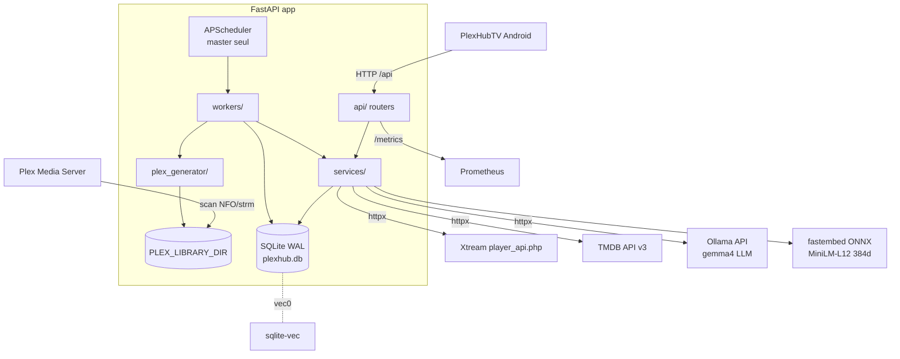
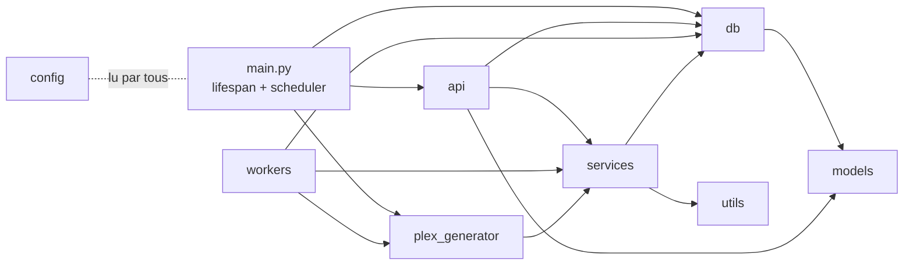

# PlexHub Backend — Architecture

> **À jour au : 2026-06-16 (HEAD `4887ee6`).** Document régénéré contre le code à HEAD (`/refresh-context`, agent a0-cartographer). Chaque fait est sourcé `fichier:ligne`. Deltas depuis `1da2ab9` : **LLM Ollama/gemma4** (`services/ollama_service.py` + endpoints `/api/ai/describe|chat|llm/status`), **dédup unifiée par `unification_id`** (`services/aggregation_service.py`, 2 consommateurs : API REST + générateur Plex/Jellyfin), **scraping TMDB v2** (cache persistant `tmdb_scrape_cache`, migration **010**, métrique `plexhub_tmdb_match_total`). Remplace les notes périmées `architecture-2026-05-13.md` / `architecture-2026-05-14.md`.

## 1. Vue d'ensemble

Backend **FastAPI async** qui miroite des bibliothèques **Xtream-IPTV** (VOD, séries, chaînes Live, EPG), enrichit les métadonnées via **TMDB** (scraping v2 : scoring ScraperMatcher + tie-break résumé + cache persistant), valide les flux, génère une **bibliothèque unifiée compatible Plex + Jellyfin** (NFO + arborescence + `.strm`/images, dédupliquée par `unification_id`), expose une **API de recommandations IA** (embeddings + recherche vectorielle sqlite-vec), une **génération LLM** (Ollama/gemma4 : présentations + chat) et un **appairage TV** device-flow. Client : app Android `PlexHubTV`.

Cible de déploiement : **Docker/Linux** (l'élection master-worker repose sur `fcntl.flock`, POSIX — `app/main.py:226-227`). Image `python:3.12-slim` (`Dockerfile:1`) ; CI sur Python 3.13 (`.github/workflows/tests.yml`).

## 2. Graphe de modules

- **`api/`** (router → service → db) : `health`, `accounts`, `categories`, `live`, `media` (+ endpoints `/unified` dédupliqués), `stream`, `sync`, `plex`, `tv_auth`, `ai` (recos vectorielles **+ LLM Ollama**), `admin`. `deps.py` = `verify_api_key`.
- **`services/`** : `xtream_service`, `tmdb_service`, **`scrape_cache_service`**, `media_service`, **`aggregation_service`** (dédup partagée), `category_service`, `stream_service`, `nfo_import_service`, `embedding_service`, `recommendation_service`, **`ollama_service`** (LLM).
- **`workers/`** : `sync_worker`, `enrichment_worker`, `health_check_worker`, `embedding_worker`.
- **`plex_generator/`** : `source` (`DatabaseSource` agrégée multi-comptes), `generator`, `storage`, `nfo_builder`, `naming`, `mapping`, `models`.
- **`db/`** : `database.py`, `migrations.py`. **`models/`** : `database.py`, `schemas.py`. **`utils/`**, **`scripts/`**, **`templates/admin/`**, **`cli.py`**, **`config.py`**.

Règle d'architecture : la logique métier vit dans `services/`/`workers/` ; les routers (`api/`) ne font que valider (Pydantic v2) et déléguer. Accès DB via `async_session_factory` / dépendance `get_db` (`db/database.py:57-65`).

## 3. Stack & versions réelles

### Runtime — `requirements.txt`
| Paquet | Contrainte | Rôle |
|---|---|---|
| fastapi | ≥0.115 | framework web async |
| uvicorn[standard] | ≥0.27 | serveur ASGI |
| sqlalchemy[asyncio] | ≥2.0 | ORM async |
| aiosqlite | ≥0.20 | driver SQLite async |
| httpx | ≥0.27 | client HTTP (Xtream, TMDB, validation, **Ollama** — pas de SDK dédié) |
| pydantic | ≥2.6 | validation v2 |
| pydantic-settings | ≥2.1 | **déclarée mais non utilisée** (`config.py` est une classe maison) |
| apscheduler | ≥3.10 | planificateur (master) |
| rapidfuzz | ≥3.6 | matching de titres TMDB |
| python-dotenv | — | chargement `.env` |
| typer | ≥0.9.0 | CLI |
| prometheus-fastapi-instrumentator | ≥7.0 | métriques HTTP |
| prometheus-client | ≥0.20 | métriques métier |
| jinja2 | ≥3.1 | templates admin |
| python-multipart | ≥0.0.9 | forms (admin/upload NFO) |
| **fastembed** | ≥0.7,<1.0 | embeddings (ONNX) |
| onnxruntime | ≥1.20,<2.0 | runtime ONNX |
| **sqlite-vec** | ≥0.1,<0.2 | recherche vectorielle (`vec0`) |
| numpy | ≥1.26,<3.0 | calcul cosinus/centroïde |
| psutil | ≥6.0,<7.0 | RSS dans `/embed/status` |
| cryptography | ≥42,<46 | Fernet (tv-auth) |

> **LLM Ollama** : aucune dépendance pip — `services/ollama_service.py` parle à l'API Ollama via `httpx` (env `OLLAMA_URL` défaut `http://khoj-ollama:11434`, `OLLAMA_MODEL` défaut `gemma4:e4b`, `config.py:60-62`).

### Tests — `requirements-dev.txt`
`pytest≥7.0`, `pytest-asyncio≥0.23` (mode `auto`, `pyproject.toml`), `respx≥0.21`. **Aucun linter** (ruff/black) câblé.

### Runtimes
- CI : Python **3.13** (`tests.yml`, étape setup-python).
- Docker : **`python:3.12-slim`** (`Dockerfile:1`), `uvicorn app.main:app` sur `APP_PORT` (défaut 8000).
- `docker-compose.yml` : limite mémoire **2 G** (`docker-compose.yml:39`), healthcheck `/api/health`, rotation logs json-file.

## 4. Schéma SQLite & migrations

`init_db()` (`db/database.py:68-89`) : applique les PRAGMA (`journal_mode=WAL`, `synchronous=NORMAL`, `cache_size=-64000`, `temp_store=MEMORY`, `busy_timeout=5000`, `mmap_size=256MB`), `Base.metadata.create_all`, puis `run_migrations()`. Le listener `register_sqlite_vec_listener` charge **sqlite-vec sur chaque connexion** et journalise l'état dans `_VEC_LOADED` (`database.py:25-54`).

### Tables (SQLAlchemy — `app/models/database.py`)
| Table | PK | Notes |
|---|---|---|
| `media` | `(rating_key, server_id, filter, sort_order)` | catalogue VOD/séries/épisodes ; ~30 colonnes ; `dto_hash`/`content_hash` (incrémental), `is_broken`/`stream_error_count`/`last_stream_check` (validation), `is_in_allowed_categories`, `cast`. 18 index (`database.py:87-106`) |
| `xtream_accounts` | `id` (MD5(baseUrl+user)[:8]) | comptes ; `category_filter_mode` (`all`/`whitelist`/`blacklist`) |
| `xtream_categories` | `id` autoinc | catégories `vod`/`series`/`live` ; unique `(account_id,category_id,category_type)` |
| `live_channels` | `(stream_id, server_id)` | chaînes Live IPTV ; catchup `tv_archive` |
| `epg_entries` | `id` autoinc | EPG (epoch ms) ; unique `(server_id,stream_id,start_time)` |
| `tv_auth_sessions` | `id` (uuid4 hex) | appairage TV ; `device_code`/`user_code` uniques ; `payload_encrypted` (Fernet) |
| `enrichment_queue` | `id` autoinc | file d'enrichissement TMDB ; `existing_tmdb_id`/`existing_imdb_id`/**`existing_summary`** (plot Xtream pour le tie-break, `database.py:269`) |
| `ai_tmdb_cache` | `tmdb_id` | cache TMDB IA (`overview`/`genres`/`embedded_at`) — créée par M008 (SQL brut) |
| `ai_embeddings` | `tmdb_id` | **table virtuelle `vec0`** `embedding FLOAT[384]` — créée par M008, dépend de sqlite-vec |
| **`tmdb_scrape_cache`** | `cache_key` (`media_type|titre_norm|year`) | cache de scrape **persistant** (`result`/`tmdb_id`/`imdb_id`/`confidence`/`payload`/`fetched_at`) — créée par M010 ; TTL 30 j match / 3 j négatif (`database.py:278-296`, `scrape_cache_service.py`) |

### Chaîne de migrations (`app/db/migrations.py:11-32`)
Ordre d'**exécution** (≠ ordre de définition dans le fichier) :
1. **001** `xtream_categories` (table + 2 index).
2. **002** `xtream_accounts.category_filter_mode` (ADD COLUMN défaut `all`).
3. **003** `media.is_in_allowed_categories` (+ index).
4. **004** `enrichment_queue.existing_tmdb_id` + `existing_imdb_id`.
5. **005** `media."cast"`.
6. **006** `live_channels` + `epg_entries` (tables + index).
7. **007** index composé `ix_media_stream_validation` (perf pipeline).
8. **008** (exécutée sur une **connexion** dédiée, `migrations.py:28-29`) `ai_embeddings` (vec0 `FLOAT[384]`) + `ai_tmdb_cache` + 2 index — **dépend du chargement sqlite-vec** (`migrations.py:317-346`).
9. **009** `tv_auth_sessions` (table + 2 unique index + 2 index, `migrations.py:234`).
10. **010** `enrichment_queue.existing_summary` (ADD COLUMN, transaction isolée) + `tmdb_scrape_cache` (table + index `fetched_at`) — chacun dans sa propre transaction pour qu'un ADD COLUMN gardé n'avorte pas le CREATE TABLE (`migrations.py:273-314`).

**Migration courante = 010.** Toutes idempotentes (`IF NOT EXISTS` / `ADD COLUMN` gardé par try/except). Nouvelle migration à ajouter **en fin** de `run_migrations()`.

## 5. Surface API

| Router | Préfixe monté | Auth | Endpoints clés |
|---|---|---|---|
| `health` | `/api/health` | non | `GET /health` |
| `accounts` | `/api/accounts` | non | `GET`/`POST` `""`, `PUT`/`DELETE` `/{id}`, `POST /{id}/test` |
| `categories` | `/api/accounts/{id}/categories` | non | `GET`, `PUT`, `POST /refresh` |
| `live` | `/api/live` | non | `/channels`, `/channels/{id}`, `/channels/{id}/stream`, `/channels/{id}/epg`, `/epg` |
| `media` | `/api/media` | non | `/movies`, `/movies/stats`, `/shows`, `/episodes`, **`/movies/unified`, `/shows/unified`, `/episodes/unified`** (dédup `unification_id`), `GET`/`PATCH` `/{rating_key}`, `POST /{rating_key}/rescrape` |
| `stream` | `/api/stream/{rating_key}` | non | résolution URL de flux |
| `sync` | `/api/sync` | non | `POST /xtream`, `/xtream/all`, `/enrichment`, `/validate-streams`, `/full-pipeline` (202) ; `DELETE /cancel/{task}` ; `GET /status/{job}`, `/jobs` |
| `plex` | `/api/plex` | **non** ⚠️ | `POST /generate` (`outputDir` client non confiné — CR-S02) |
| `tv_auth` | `/api/tv-auth` | **`/approve` seul** | `POST /start` (201), `POST /approve` (X-API-Key), `GET /status` (param `device_code` snake_case ⚠️), `POST /complete` |
| `ai` | `/api/ai` | **router entier** | `POST /rank`, `POST /rank-multi`, `POST /embed/rebuild` (202), `GET /embed/jobs/{id}`, `GET /embed/status` · **LLM** : `POST /describe`, `POST /chat` (+ SSE), `GET /llm/status` |
| `admin` | `/admin` (pas de `/api`) | non | UI HTML/HTMX (movies, stats, import NFO, rescrape) |
| instrumentator | `/metrics` | non | métriques Prometheus |

**Auth** : `verify_api_key` (`api/deps.py:22-49`) compare `X-API-Key` à **`AI_API_KEY`** en temps constant (`secrets.compare_digest`), **après** deux gardes 503 (AI_API_KEY vide ; sqlite-vec non chargé). Appliquée **uniquement** au router `/api/ai` (dépendance module, `ai.py:43` — recos **ET** LLM Ollama) et à `POST /api/tv-auth/approve` (`tv_auth.py:270`). Tous les autres routers (catalogue, sync, plex, admin) sont **non authentifiés** — dette de sécurité (CR-S01/S02) à traiter en façade. NB : les endpoints LLM (`/describe`/`/chat`/`/llm/status`) héritent donc des 503 sqlite-vec **bien qu'ils n'utilisent pas vec0**.

**Conventions API** : schémas Pydantic v2 avec alias camelCase (`alias_generator=to_camel`, `populate_by_name=True`, `ai.py:48`, `tv_auth.py:94`) ; réponses `response_model_by_alias=True`.

## 6. Flux services / workers

> 📐 **Diagrammes de séquence** (un par fonctionnalité, vue dynamique des échanges) : `docs/architecture/SEQUENCE-DIAGRAMS.md`. La présente §6 est la description textuelle ; le fichier de séquences en est la contrepartie visuelle (boot/élection, sync, enrichissement, validation, génération Plex, IA rank/rebuild, LLM Ollama, appairage TV).

### 6.1 Sync (`workers/sync_worker.py`)
`run_all_accounts()` (`:1290`) → `sync_account(id)` (`:854`, lock async par compte). Séquence : refresh catégories → VOD (incrémental `dto_hash`, fetch détails parallèle sém. 25, batches 100 + savepoints) → séries → épisodes (séries changées seulement) → Live → recalcul visibilité catégories → `last_synced_at`. Cleanup différentiel selon `filter_mode`. `server_id = f"xtream_{account_id}"` (`utils/server_id.py`). Métrique `plexhub_sync_duration_seconds`.

### 6.2 Enrichissement — scraping TMDB v2 (`workers/enrichment_worker.py`)
2 phases (movies `media_type="movie"` puis séries `media_type="show"`), concurrence 8, `BATCH_SIZE=200`, `MAX_ATTEMPTS=3`. Titres nettoyés par `clean_title` (`string_normalizer.py:100-155` : préfixes langue/pays empilés, séparateurs scène, année parenthésée OU nue, tags qualité partout, brackets). Résolution par item (`_resolve`, `enrichment_worker.py:65`) :
1. **Cache de scrape persistant d'abord** (`scrape_cache_service`, clé `media_type|titre_norm|year`) → 0 appel TMDB cross-comptes + survit au redémarrage (TTL match 30 j / négatif 3 j).
2. Sur miss : chaîne de fallback `_search_with_fallback` (`enrichment_worker.py:33-62`) — défaut → sans année → `language=en-US` → `/search/multi`, stop au 1ᵉʳ auto-match.
3. **Scoring ScraperMatcher** (`tmdb_service._best_match`, `tmdb_service.py:352-414`) : `titleScore = max(sim(titre), sim(original_title))` (rapidfuzz `max(ratio, token_set_ratio)`), `confidence = 0.7·title + 0.3·year` (`TITLE_WEIGHT`/`YEAR_WEIGHT`, `tmdb_service.py:22-26`). **Auto-match** si `confidence ≥ 0.85` ET `titleScore ≥ 0.90` ET marge ≥ 0.05 vs 2ᵉ.
4. **Tie-break par résumé Xtream** (marge < 0.05) : `_summary_sim` (token_set_ratio) entre `existing_summary` et l'overview candidat, seuils `SUMMARY_MIN_SIM=0.30` / `SUMMARY_TIEBREAK_MARGIN=0.10` (`tmdb_service.py:29-30,401-414`).
5. Match → `get_*_details` (1 appel `append_to_response=credits,external_ids`) ; résultat écrit en DB + scrape cache + métrique `plexhub_tmdb_match_total{media_type,result}`.

Borné par `ENRICHMENT_DAILY_LIMIT` (défaut **50000** ; ⚠️ `api_used` est une estimation par appel, sous-compte les retries — CR-F07). Caches TTL mémoire : recherche 24 h, imdb→tmdb 7 j. Gauges `plexhub_enrichment_queue_size`.

### 6.3 Validation de flux (`workers/health_check_worker.py`)
`run_pipeline_validation()` (`:274`, pipeline, cible non-checkés/stale) + `run()` (`:179`, cron `hour=2`, échantillon aléatoire). Méthode : HEAD → si ambigu Range GET `bytes=0-8191` → inspection Content-Type + magic bytes (`_looks_like_video`). Échecs **définitifs** (404/403/error-CT/empty/magic-fail) marquent cassé immédiatement, sinon seuil `STREAM_BROKEN_THRESHOLD` (défaut 3). Circuit breaker par compte à **90 %** d'échecs sur échantillon de 50 → abort + rollback. Client httpx singleton. Gauge `plexhub_streams_alive_ratio`.

### 6.4 Génération bibliothèque unifiée Plex + Jellyfin (`plex_generator/` + `app/main.py:77-118`)
**Dédup partagée par `unification_id`** via `aggregation_service` (mêmes fonctions que l'API REST §6.5bis). `DatabaseSource(account_ids=None)` charge **tous les comptes actifs** (ou un sous-ensemble) et regroupe les lignes `media` par `group_key` (`unification_id` ou fallback `server_id:rating_key`) → chaque groupe = 1 `PlexMovie`/`PlexSeries` portant N `versions` (`source.py:38-72`). `PlexLibraryGenerator.generate()` → `GenerationReport(created/updated/deleted/unchanged/errors/duration_seconds)` ; `_resolve_movie_names`/`_resolve_series_names` (`generator.py:52,92`) désambiguïsent les groupes distincts qui collisionnent sur `(titre, année)`. `LocalStorage` écrit **1 dossier + 1 `movie.nfo`/`tvshow.nfo` + 1 poster/fanart** par titre, et **1 `.strm` par version** nommé ` - Label` (films **et** épisodes — convention Plex + Jellyfin, plus de tag `{edition-}`, `naming.py:170-205`) ; images via `_image_pool` ThreadPoolExecutor 8 threads (`storage.py:36`), écritures atomiques (tempfile + `os.replace` + fsync). Épisodes agrégés par `(saison, épisode)` à travers les comptes du groupe (`aggregate_series`, match par `(server_id, grandparent_rating_key)`). Suppression folder-aware. `MappingStore` (`.plex_mapping.json`) trace source_id → fichier/URL. **Un seul arbre plat dédupliqué** (plus de `output/{account_id}`). Déclenchable : auto au boot/pipeline master, `POST /api/plex/generate` (`accountId` optionnel restreint), `python -m app.cli generate` (`cli.py:68-69`).

### 6.5 Recommandations IA vectorielles (`api/ai.py` + `services/`)
Pipeline `/rank` (`ai.py:186`) : résolution refs (imdb→tmdb via `find_by_imdb_id`, movie/tv seulement, ignore défensivement épisode/saison/personne `tmdb_service.py:281`) → `load_cached_vectors` (SELECT `ai_embeddings`) → `hydrate_misses` (cap **20**, timeout 10 s/tâche, fetch TMDB + embed + INSERT cache + DELETE/INSERT vec0, `recommendation_service.py:28-29`) → `cosine_rank` (dot product sur vecteurs L2-normalisés). `/rank-multi` (`ai.py:260`) : centroïde pondéré (poids 1.0,0.9,… min 0.1, `ai.py:326-327`) puis ranking. `embedding_service` : fastembed `paraphrase-multilingual-MiniLM-L12-v2` (384 dim, `embedding_service.py:26-27`), singleton lazy chargé en `asyncio.to_thread` (cold start ~30 s), `EmbeddingUnavailableError` → 503. Rebuild : `enqueue_rebuild()` (`ai.py:351`) → background, scan `embedded_at IS NULL`, curseur `tmdb_id`, `PAGE_SIZE=50`, **jamais au boot** (`embedding_worker.py:3`).

### 6.5bis Agrégation unifiée API REST (`services/aggregation_service.py`, `media_service.py`, `api/media.py`)
Mêmes fonctions pures que la génération Plex. Endpoints `GET /api/media/{movies,shows}/unified` (`media.py:120,154`) + `/episodes/unified?unification_id=…` (`media.py:188`) : `media_service.get_unified_list`/`get_unified_episodes` agrègent en mémoire → 1 `UnifiedMediaResponse`/`UnifiedEpisodeResponse` par titre/créneau avec `versions[]`. Titre du groupe nettoyé via `canonical_title_year` (qualifieur + année embarquée strippés) ; qualifieur conservé sur le label de chaque version (`version_label`). Endpoints bruts par-ligne inchangés (non-cassant).

### 6.6 Appairage TV (`api/tv_auth.py`, `utils/payload_crypto.py`)
Device-flow RFC 8628-like : `start` (201, `deviceCode` token_urlsafe(32) + `userCode`) → `approve` (X-API-Key, payload Fernet chiffré) → `status` (poll, payload **livré une seule fois**) → `complete` (one-shot, scrub). TTL `TV_AUTH_TTL_SECONDS` (défaut 900 s). Clé Fernet : `TV_AUTH_ENCRYPTION_KEY` explicite, sinon dérivée de `AI_API_KEY` (SHA-256), sinon `None` → 503 (`payload_crypto.py:34-47`). ⚠️ `GET /status` attend `device_code` snake_case (`tv_auth.py:316`) alors que le reste de l'API est camelCase.

### 6.7 Génération LLM Ollama/gemma4 (`api/ai.py:428-551`, `services/ollama_service.py`)
Router `/api/ai` (donc **authentifié X-API-Key + soumis aux 503 IA configuration/sqlite-vec**) → `ollama_service` (httpx async vers `OLLAMA_URL`/`OLLAMA_MODEL`) :
- `POST /describe` (`ai.py:493`) : prompt FR/EN expert recommandations à partir de `{title, overview, genres, year, language}` → `generate()` (`/api/generate`, `stream=False`) → `{recommendation, model}`.
- `POST /chat` (`ai.py:516`) : `stream=False` → `chat()` (`/api/chat`) → `{reply, model}` ; `stream=True` → `StreamingResponse` **SSE** via `stream_generate()` du dernier message, terminé par `data: [DONE]` (ou `[ERROR]` sur exception, flux déjà ouvert — pas de 503 propre).
- `GET /llm/status` (`ai.py:542`) : `is_healthy()` → `GET /api/tags` (timeout 5 s), vérifie que `OLLAMA_MODEL` est installé → `{healthy, model, ollamaUrl, detail}`.
- 503 distinct : `_ollama_503` (`ai.py:485-490`) « LLM unavailable — Ollama unreachable or model not loaded ». Timeouts httpx : génération 120 s, status 5 s (`ollama_service.py:21-22`). Aucun client SDK : httpx réutilisé (AsyncClient éphémère par appel).

## 7. Ordonnancement (master seul)
`lifespan` (`app/main.py:194-350`) : `init_db()` → élection master via `fcntl.flock(LOCK_EX|LOCK_NB)` sur `DATA_DIR/server_start.lock` (`main.py:226-227`). Le master démarre un `AsyncIOScheduler` :
- `sync_enrich_generate` : sync → enrichissement → validation → génération Plex unifiée, `interval=SYNC_INTERVAL_HOURS` (6 h), `max_instances=1`, `coalesce=True`, `misfire_grace_time=300` (`main.py:248-273`).
- `health_check` : cron `hour=2` (`main.py:274-282`).
- `epg_cleanup` : cron `hour=3` (`main.py:283-291`).
- `db_backup` : cron `hour=BACKUP_HOUR` (défaut 4) si `BACKUP_ENABLED` ; `sqlite3.backup` en `asyncio.to_thread` (`main.py:292-307`).

Plus un **run initial non bloquant** (sync→enrich→validation→génération) via `create_background_task` (`main.py:311-321`). ⚠️ Ce run initial et le job d'intervalle **ne partagent aucune exclusion mutuelle** (CR-F24). Les workers esclaves restent passifs (`main.py:322-323`). Shutdown : annule les tâches de fond, libère le flock, ferme clients httpx + pool d'images (`main.py:327-350`).

## 8. Intégrations externes
- **Xtream** (`services/xtream_service.py`) : `player_api.php` (auth, catégories, VOD/séries/Live, infos détaillées). httpx async.
- **TMDB** (`services/tmdb_service.py`) : API v3 (`https://api.themoviedb.org/3`), `search`/`movie|tv/{id}`/`find`/`/search/multi` ; retry 3× backoff (1/2/4 s) + gestion 429 `Retry-After` ; langue `TMDB_LANGUAGE` (avec fallback `en-US` au scraping v2). Images `image.tmdb.org` (poster w342, backdrop w1280, `tmdb_service.py:18-19`).
- **Ollama** (`services/ollama_service.py`) : API LLM locale (`OLLAMA_URL` défaut `http://khoj-ollama:11434`), endpoints `/api/generate`, `/api/chat`, `/api/tags` ; modèle `OLLAMA_MODEL` (défaut `gemma4:e4b`). httpx async, AsyncClient éphémère par appel, timeouts 120 s / 5 s. **Aucun SDK** — pas de dépendance pip.
- **Plex / Jellyfin** : aucune API appelée — intégration **par système de fichiers** (NFO + `.strm` + arbo scannés par le serveur média).
- **fastembed/ONNX** : téléchargement des poids au cold start (cache `AI_EMBED_CACHE_DIR`).

## 9. Observabilité
- **Logs** : logger `plexhub` (DEBUG fichier rotatif `SafeRotatingFileHandler` 10 Mo×5 / INFO console), `request_id` injecté par `RequestIdMiddleware` + `RequestIdLogFilter` (header `X-Request-ID`). Tiers en WARNING+.
- **Métriques** (`utils/metrics.py`, **5 métriques métier**, exposées `/metrics`) : `plexhub_sync_duration_seconds` (Histogram, account_id/result), `plexhub_tmdb_requests_total` (Counter, kind/result), **`plexhub_tmdb_match_total`** (Counter, `media_type`×`result=matched|nomatch|ambiguous`, `metrics.py:27-31`), `plexhub_streams_alive_ratio` (Gauge, account_id), `plexhub_enrichment_queue_size` (Gauge, status) + métriques HTTP par requête (instrumentator). **Aucune métrique LLM Ollama dédiée** à ce jour.
- **Health** : `GET /api/health` ; `GET /api/ai/embed/status` (compteurs IA, RSS, état modèle + sqlite-vec) ; `GET /api/ai/llm/status` (santé Ollama).

## 10. Dette technique (réelle, à HEAD `4887ee6` ; IDs `CR-*` = audit clean-room `docs/audit/cleanroom-2026-06-15/`, P0/P1 recoupés au code)
1. **CI réellement ROUGE (P0, CR-T01)** : `tests/test_ai_status.py:113` affirme l'ancien nom `intfloat/multilingual-e5-small`, le code renvoie `…MiniLM-L12-v2` (`embedding_service.py:26`) ; seul le base64 flaky est désélectionné (`tests.yml:33`) → signal de build vert mort.
2. **Auth incomplète (P0, CR-S01)** : `X-API-Key` ne protège que `/api/ai` (recos + LLM) et `POST /api/tv-auth/approve` ; catalogue/sync/plex/admin sont ouverts.
3. **Écriture FS arbitraire (P0, CR-S02)** : `POST /api/plex/generate` non authentifié + `outputDir` client → `Path()` → `LocalStorage` sans confinement (`plex.py:38-44,55-56`).
4. **Couplage LLM↔vec0** : les endpoints Ollama (`/describe`/`/chat`/`/llm/status`) héritent des 503 `AI_API_KEY`/`sqlite-vec` du router `/api/ai` (`deps.py`), bien qu'ils n'utilisent pas d'embeddings.
5. **Index modèle↔DB divergents (P1, CR-P01/P02)** : index composés déclarés `models/database.py` absents de la DB live → COUNT plein-scan + pagination profonde lente.
6. **Pipeline boot vs intervalle sans exclusion mutuelle (P1, CR-F24)** ; **`ENRICHMENT_DAILY_LIMIT` sous-compté** (CR-F07) ; **cleanup épisodes manquant** (CR-F01).
7. **Contrat tv-auth incohérent** : `GET /api/tv-auth/status` attend `device_code` snake_case (`tv_auth.py:316`) vs camelCase ailleurs.
8. **Orchestration Plex-gen triplée** (`main.py`/`plex.py`/`cli.py`) + logique métier/DB brut dans plusieurs routers (CR-A02/A03).
9. **`pydantic-settings` déclarée mais inutilisée** (`config.py` = classe maison) ; **lint (ruff/black) non câblé** ; **Docker 3.12 vs CI 3.13** ; mots de passe Xtream **en clair** au repos (CR-S04) ; `CORS_ORIGINS` défaut `*`.
10. **`fcntl.flock` POSIX-only** : pas de master-worker sous Windows natif (dev local).
11. **État in-memory** : jobs sync/IA (cap 100 chacun), locks par compte — non partagés entre process/workers.
12. **M008 fragile par construction** : si sqlite-vec ne charge pas, `ai_embeddings` (vec0) échoue et les endpoints IA renvoient 503 (comportement voulu, dépendance dure).
13. **Helpers `{edition-}` morts** : `sanitize_edition_label`/`_EDITION_INVALID_CHARS` (`naming.py:24-32`) subsistent mais aucun tag `{edition-}` n'est plus émis (nommage de versions ` - Label`).
