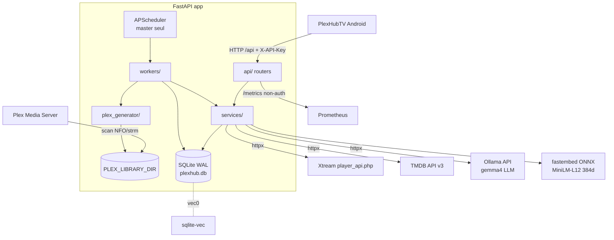
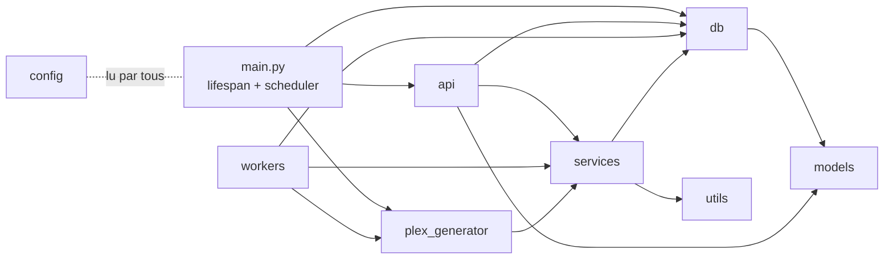

# PlexHub Backend — Architecture

> **À jour au : 2026-07-11 (HEAD `742cd5d`, release v1.1.5, branche `develop`).** Document régénéré contre le code à HEAD (`/refresh-context`, agent a0-cartographer). `742cd5d` est un commit **docs-only** (`sync-context`) au-dessus du parent code `1879f83` → le **code auditté ici == `1879f83`**. Chaque fait est sourcé `fichier:ligne` ; les points non re-vérifiables sont marqués « à confirmer ». Source de cartographie fraîche et indépendante : `docs/audit/cleanroom-2026-07-11/` (photo clean-room à ce HEAD, 56 findings). Remplace les notes périmées `architecture-2026-05-13.md` / `architecture-2026-05-14.md`.
>
> **Changements de fond vs l'ancienne version de ce document (v1.0.2 / `3958c0d` / migration courante M013) :**
> - **Auth désormais FAIL-CLOSED sur toute l'API JSON** — l'ancien modèle « catalogue/sync/plex OUVERTS » est **CADUC** (confirmé empiriquement : `GET /api/media/movies` sans `X-API-Key` → **401**). `_guard = [Depends(verify_backend_secret)]` garde `accounts`/`categories`/`live`/`media`/`stream`/`sync`/`plex` (`main.py:399-405`).
> - **Migration courante = 014** (chaîne 001→014, `media` +13 colonnes métadonnées NFO tinyMM), plus M013 `media.is_adult`.
> - **`GET /api/health` renvoie la version live** (`request.app.version`, `health.py:33`) — la dette « version 1.0.0 codée en dur » est **RÉSOLUE**.
> - **Nouveau module de gestion multi-clés API** : router `api_keys` (`/api/admin/keys`, master-only), service `api_key_service`, entité ORM `ApiKey` (12 routers au total).
> - **`APP_VERSION = "1.1.5"`** (`main.py:17`) ; CI **verte** (484 passed / 1 deselected, `docs/audit/cleanroom-2026-07-11/00-benchmark.md`).

## 1. Vue d'ensemble

Backend **FastAPI async** qui miroite des bibliothèques **Xtream-IPTV** (VOD, séries, chaînes Live, EPG), enrichit les métadonnées via **TMDB** (scraping v2 : scoring ScraperMatcher + tie-break résumé + cache persistant), valide les flux, génère une **bibliothèque unifiée compatible Plex + Jellyfin** (NFO + arborescence + `.strm`/images, dédupliquée par `unification_id`), expose une **API IA** (recommandations vectorielles sqlite-vec + recherche sémantique NL + assistant RAG + blurb FR + explications), une **génération LLM** (Ollama/gemma4 : présentations, chat, traduction de sous-titres) et un **appairage TV** device-flow. Les films de catégorie « adulte » sont tagués (+18/XXX). Client : app Android `PlexHubTV`.

Cible de déploiement : **Docker/Linux**. L'élection master-worker repose sur `fcntl.flock` (POSIX) : `import fcntl` est fait **dans le lifespan** (`app/main.py:198`) → `uvicorn app.main:app` **ne peut pas démarrer sous Windows natif** (`ModuleNotFoundError` à l'ASGI startup), même si le module s'importe proprement (l'import est différé) — ce qui permet aux tests + à la sonde ASGI de tourner sous Windows (`docs/audit/cleanroom-2026-07-11/00-benchmark.md`). Image `python:3.12-slim` (`Dockerfile:1`) ; CI sur Python 3.13 (`.github/workflows/tests.yml`).

## 2. Graphe de modules

- **`api/`** (router → service → db), **12 routers** : `health`, `accounts`, `categories`, `live`, `media` (+ endpoints `/unified` dédupliqués), `stream`, `sync`, `plex`, `tv_auth`, `ai` (**13 endpoints** : recos vectorielles + recherche sémantique + assistant RAG + blurb + sous-titres + LLM Ollama), `admin` (UI HTML/HTMX, hors `/api`), **`api_keys`** (gestion des clés par-utilisateur, `/api/admin/keys`, master-only). `deps.py` = 4 gardes d'auth (`verify_backend_secret`/`verify_api_key`/`verify_master_key`/`verify_admin_basic_auth`).
- **`services/`** : `xtream_service`, `tmdb_service`, **`scrape_cache_service`**, `media_service`, **`aggregation_service`** (dédup partagée), `category_service` (+ `update_media_adult_flags`), `stream_service`, `nfo_import_service` (arbre plat), `embedding_service`, `recommendation_service` (+ `semantic_search`/`generate_blurb`), **`ollama_service`** (LLM), **`subtitle_service`** (parse/traduit SRT+VTT), **`api_key_service`** (mint/`resolve`/revoke/expiry, digest SHA-256).
- **`workers/`** : `sync_worker` (1390 LOC), `enrichment_worker` (340 LOC), `health_check_worker` (558 LOC), `embedding_worker` (146 LOC).
- **`plex_generator/`** : `source` (`DatabaseSource` agrégée multi-comptes), `generator`, `storage`, `nfo_builder`, `naming`, `mapping`, `models`.
- **`db/`** : `database.py`, `migrations.py`. **`models/`** : `database.py`, `schemas.py`. **`utils/`**, **`scripts/`**, **`templates/admin/`**, **`cli.py`**, **`config.py`**.

Règle d'architecture : la logique métier vit dans `services/`/`workers/` ; les routers (`api/`) ne font que valider (Pydantic v2) et déléguer. Accès DB via `async_session_factory` / dépendance `get_db` (`db/database.py:63-71`). ⚠️ La règle n'est que **partiellement** respectée : `live`/`accounts`/`categories`/`stream` portent encore de la logique métier + SQL brut dans les handlers, l'orchestration Plex-gen est **triplée** (`main.py`/`plex.py`/`cli.py`), `sync.py:74` importe un symbole privé de `app.main`, et `sync_worker.py`/`ai.py`/`nfo_import_service.py` sont des god-files (CR-A01/A02/A03, cf. §10).

## 3. Stack & versions réelles

### Runtime — `requirements.txt`
> ⚠️ **Bornes liées (outage corrigé `a8a0ce7`)** : `fastapi` et `prometheus-fastapi-instrumentator` sont **épinglés ensemble** (`<0.116` / `<8`). FastAPI 0.116+ émet des objets de route internes `_IncludedRouter` que le route-name walker de l'instrumentator 8.x ne sait pas traiter (`route.path` AttributeError → **tous les `/api/*` renvoient 500**). Un rebuild non borné avait résolu vers 0.137.1 + 8.0.0 et mis toute l'API à terre. **Ne pas délier ces deux bornes.**

| Paquet | Contrainte | Rôle |
|---|---|---|
| fastapi | **≥0.115,<0.116** (épinglé) | framework web async |
| uvicorn[standard] | ≥0.27 | serveur ASGI |
| sqlalchemy[asyncio] | ≥2.0 | ORM async |
| aiosqlite | ≥0.20 | driver SQLite async |
| httpx | ≥0.27 | client HTTP (Xtream, TMDB, validation, **Ollama** — pas de SDK dédié) |
| pydantic | ≥2.6 | validation v2 |
| pydantic-settings | ≥2.1 | **déclarée mais JAMAIS utilisée** (`config.py:21` = classe maison `os.getenv`, 0 import `pydantic_settings` — CR-C07) |
| apscheduler | ≥3.10 | planificateur (master) |
| rapidfuzz | ≥3.6 | matching de titres TMDB |
| python-dotenv | — | chargement `.env` |
| typer | ≥0.9.0 | CLI |
| prometheus-fastapi-instrumentator | **≥7.0,<8** (épinglé) | métriques HTTP (voir note ci-dessus) |
| prometheus-client | ≥0.20 | métriques métier |
| jinja2 | ≥3.1 | templates admin |
| python-multipart | ≥0.0.9 | forms (admin/upload NFO) |
| **fastembed** | ≥0.7,<1.0 | embeddings (ONNX) |
| onnxruntime | ≥1.20,<2.0 | runtime ONNX |
| **sqlite-vec** | ≥0.1,<0.2 | recherche vectorielle (`vec0`) |
| numpy | ≥1.26,<3.0 | calcul cosinus/centroïde |
| psutil | ≥6.0,<7.0 | RSS dans `/embed/status` |
| cryptography | ≥42,<46 | Fernet (tv-auth) |

> **Pack IA & LLM Ollama : zéro dépendance pip ajoutée.** `services/ollama_service.py` + `subtitle_service.py` parlent à l'API Ollama via `httpx` (env `OLLAMA_URL` défaut `http://khoj-ollama:11434`, `OLLAMA_MODEL` défaut `gemma4:e4b`, `config.py:67-68`) ; search/assistant/blurb réutilisent fastembed + sqlite-vec déjà présents.

### Tests — `requirements-dev.txt`
`pytest≥7.0`, `pytest-asyncio≥0.23` (mode `auto`, `pyproject.toml`), `respx≥0.21`. **Aucun outillage de qualité** : ni linter/formateur (ruff/black/isort — CR-C06), ni type-checker (mypy), ni couverture (`pytest-cov`/`coverage` — CR-T09). `pyproject.toml` ne contient que `[tool.pytest.ini_options]`. CI = `pytest -v` seul, déclenchée uniquement sur `main` (pas `develop` — CR-T10).

### Runtimes
- CI : Python **3.13** (`tests.yml`, étape setup-python), un seul test base64 « flaky » désélectionné (`tests.yml:29-33` — en réalité un vrai bug masqué, cf. §10 CR-T01).
- Docker : **`python:3.12-slim`** (`Dockerfile:1`), `uvicorn app.main:app` sur `APP_PORT` (défaut 8000).
- `docker-compose.yml` : limite mémoire **2 G** (`docker-compose.yml:39`), healthcheck `/api/health`, rotation logs json-file. Scaffold **cloudflared** commenté/inerte (`docker-compose.yml`/`.env.example`).

## 4. Schéma SQLite & migrations

`init_db()` (`db/database.py:74-95`) : enregistre le listener sqlite-vec (`register_sqlite_vec_listener`, charge l'extension **sur chaque connexion** et journalise l'état dans `_VEC_LOADED`, `database.py:31-60`), applique les PRAGMA (`journal_mode=WAL`, `synchronous=NORMAL`, `cache_size=-64000`, `temp_store=MEMORY`, **`busy_timeout=60000`** (60 s), `mmap_size=256MB`, `database.py:86-91`), `Base.metadata.create_all` (`:92`), puis `run_migrations()` (`:95`). En complément, chaque connexion **du pool** porte `connect_args={"check_same_thread": False, "timeout": 60}` (`database.py:15`) — le `busy_timeout` PRAGMA ne couvrait que la connexion d'init, d'où des `database is locked` sur les workers pendant que la validation de flux tenait le writer WAL. Coût `init_db` à froid mesuré ≈ **74 ms** (schéma + 14 migrations + sqlite-vec) ; **sqlite-vec chargé = true** (`00-benchmark.md`).

### Entités SQLAlchemy (`app/models/database.py` — 11 entités ORM)
| Entité (table) | PK | Notes |
|---|---|---|
| `Media` (`media`) | `(rating_key, server_id, filter, sort_order)` | catalogue VOD/séries/épisodes ; `dto_hash`/`content_hash` (incrémental), `is_broken`/`stream_error_count`/`last_stream_check` (validation), `is_in_allowed_categories`, `cast`, **`is_adult`** (+ index `ix_media_adult`, M013), **13 colonnes métadonnées NFO** (`original_title`/`tagline`/`premiered`/`status`/`studio`/`country`/`tvdb_id`/`wikidata_id`/`imdb_rating`/`imdb_votes`/`tmdb_rating`/`tmdb_votes`/`cast_json` + index `ix_media_tvdb`, M014, peuplées par `nfo_import_service`) |
| `XtreamAccount` (`xtream_accounts`) | `id` (MD5[:8]) | comptes ; `category_filter_mode` (`all`/`whitelist`/`blacklist`) ; ⚠️ `password` stocké **en clair** (`database.py:136`, CR-S03) |
| `XtreamCategory` (`xtream_categories`) | `id` autoinc | catégories `vod`/`series`/`live` ; unique `(account_id,category_id,category_type)` |
| `LiveChannel` (`live_channels`) | `(stream_id, server_id)` | chaînes Live IPTV ; catchup `tv_archive` ; `is_adult` |
| `EpgEntry` (`epg_entries`) | `id` autoinc | EPG (epoch ms) ; unique `(server_id,stream_id,start_time)` |
| `TvAuthSession` (`tv_auth_sessions`) | `id` (uuid4 hex) | appairage TV ; `device_code`/`user_code` uniques ; `payload_encrypted` (Fernet) |
| `AiSubtitleCache` (`ai_subtitle_cache`) | `cache_key` (SHA-256) | sous-titres traduits en cache (M011) |
| `AiMediaBlurb` (`ai_media_blurb`) | `(tmdb_id, media_type, lang)` | synopsis FR + mood tags générés (M012) |
| `EnrichmentQueue` (`enrichment_queue`) | `id` autoinc | file d'enrichissement TMDB ; `existing_tmdb_id`/`existing_imdb_id`/**`existing_summary`** (plot Xtream pour le tie-break) |
| `TmdbScrapeCache` (`tmdb_scrape_cache`) | `cache_key` (`media_type\|titre_norm\|year`) | cache de scrape **persistant** (M010 ; TTL 30 j match / 3 j négatif) |
| **`ApiKey`** (`api_keys`) | `id` | clés par-utilisateur : `key_hash` (SHA-256, jamais le plaintext), `revoked`/`expires_at`. **Créée par `Base.metadata.create_all`, PAS par une migration numérotée** |

> Deux tables **hors ORM** créées en SQL brut par la migration 008 : `ai_tmdb_cache` (PK `tmdb_id` : `overview`/`genres`/`embedded_at`) et `ai_embeddings` (**table virtuelle `vec0`** `embedding FLOAT[384]`, dépend de sqlite-vec).

### Chaîne de migrations (`app/db/migrations.py:11-38`)
Ordre d'**exécution** (≠ ordre de définition dans le fichier — M008 est défini tout en bas, ~200 lignes après M014, CR-C10) :
1. **001** `xtream_categories` (table + 2 index).
2. **002** `xtream_accounts.category_filter_mode` (ADD COLUMN défaut `all`).
3. **003** `media.is_in_allowed_categories` (+ index `ix_media_category_visible`).
4. **004** `enrichment_queue.existing_tmdb_id` + `existing_imdb_id`.
5. **005** `media."cast"`.
6. **006** `live_channels` + `epg_entries` (tables + index).
7. **007** index composé `ix_media_stream_validation` (perf pipeline).
8. **008** (exécutée sur une **connexion dédiée**, `migrations.py:28-29`) `ai_embeddings` (vec0 `FLOAT[384]`) + `ai_tmdb_cache` + index — **dépend du chargement sqlite-vec**.
9. **009** `tv_auth_sessions` (table + 2 unique index + 2 index).
10. **010** `enrichment_queue.existing_summary` (ADD COLUMN, transaction isolée) + `tmdb_scrape_cache` (table + index `fetched_at`).
11. **011** `ai_subtitle_cache` (table + 2 index).
12. **012** `ai_media_blurb` (PK `(tmdb_id, media_type, lang)` + 2 index).
13. **013** `media.is_adult` (ADD COLUMN défaut 0 + index `ix_media_adult`).
14. **014** `media` **+13 colonnes métadonnées NFO** tinyMM (`original_title`/`tagline`/`premiered`/`status`/`studio`/`country`/`tvdb_id`/`wikidata_id`/`imdb_rating`/`imdb_votes`/`tmdb_rating`/`tmdb_votes`/`cast_json`) + index `ix_media_tvdb`, chaque `ADD COLUMN` en transaction isolée.

**Migration courante = 014.** Toutes idempotentes (`IF NOT EXISTS` / `ADD COLUMN` gardé par try/except). Nouvelle migration à ajouter **en fin** de `run_migrations()`.

> ⚠️ **Deux sources de vérité pour le schéma `media`** (CR-C05/CR-P02) : `Base.metadata.create_all` construit d'abord les colonnes **et les index** déclarés dans l'ORM ; les migrations 013/014 refont ensuite `ADD COLUMN` sur les mêmes colonnes → sur une DB fraîche chaque `ADD COLUMN` lève `duplicate column name` (avalé par le try/except, mais **log WARNING bruyant à chaque boot**). Surtout, `create_all` **n'ajoute les index d'une table déjà existante que si elle est créée à neuf** : les migrations ne (re)créent que 4 index `media` (`ix_media_category_visible`, `ix_media_stream_validation`, `ix_media_adult`, `ix_media_tvdb`) — **une DB mise à niveau perd silencieusement** les autres index ORM (`ix_media_type_added`, `ix_media_type_rating`, `ix_media_title_sort`, `ix_media_unification`, `ix_media_grandparent`, …), d'où full-scans + filesorts sur les requêtes de liste/tri en prod.

## 5. Surface API

| Router | Préfixe monté | Auth | Endpoints clés |
|---|---|---|---|
| `health` | `/api/health` | **public** | `GET /health` → renvoie la **version live** (`request.app.version` = `APP_VERSION="1.1.5"`, `health.py:33`) + comptes catalogue |
| `accounts` | `/api/accounts` | **`verify_backend_secret`** | `GET`/`POST` `""`, `PUT`/`DELETE` `/{id}` (cascade 6 tables), `POST /{id}/test` |
| `categories` | `/api/accounts/{id}/categories` | **`verify_backend_secret`** | `GET`, `PUT`, `POST /refresh` (⚠️ renvoie `vod_count`/`series_count` snake_case, CR-C02) |
| `live` | `/api/live` | **`verify_backend_secret`** | `/channels`, `/channels/{id}`, `/channels/{id}/stream`, `/channels/{id}/epg`, `/epg` |
| `media` | `/api/media` | **`verify_backend_secret`** | `/movies`, `/movies/stats`, `/shows`, `/episodes`, **`/movies/unified`, `/shows/unified`, `/episodes/unified`** (dédup `unification_id`) + `?unification_id=` (`get_unified_group`), `GET`/`PATCH` `/{rating_key}`, `POST /{rating_key}/rescrape` |
| `stream` | `/api/stream/{rating_key}` | **`verify_backend_secret`** | résolution URL de flux |
| `sync` | `/api/sync` | **`verify_backend_secret`** | `POST /xtream`, `/xtream/all`, `/enrichment`, `/validate-streams`, `/full-pipeline` (202) ; `DELETE /cancel/{task}` ; `GET /status/{job}`, `/jobs` |
| `plex` | `/api/plex` | **`verify_backend_secret`** | `POST /generate` — ⚠️ `outputDir` client → `Path()` → `LocalStorage` **sans confinement** (écriture FS arbitraire post-auth, CR-S01) |
| `tv_auth` | `/api/tv-auth` | **public sauf `/approve`** | `POST /start` (201), `POST /approve` (backend secret), `GET /status` (param `device_code` snake_case, `tv_auth.py:298` ⚠️), `POST /complete` |
| `ai` | `/api/ai` (auto-préfixé) | **`verify_api_key` (router entier, `ai.py:52-56`)** | **Recos** : `POST /rank`, `POST /rank-multi` (+`explain=true`) ; **Recherche** : `POST /search` NL ; **RAG** : `POST /assistant` ; **Blurb** : `POST /blurb`, `GET /blurb/{tmdb_id}` ; **Sous-titres** : `POST /subtitles/translate` ; **LLM** : `POST /describe`, `POST /chat` (+ SSE), `GET /llm/status` ; **Embeddings** : `POST /embed/rebuild` (202), `GET /embed/jobs/{id}`, `GET /embed/status` |
| `admin` | `/admin` (pas de `/api`) | **Basic Auth** (`verify_admin_basic_auth`) | UI HTML/HTMX (movies, stats, import NFO, rescrape, gestion de clés) |
| `api_keys` | `/api/admin/keys` (auto-préfixé) | **`verify_master_key` (secret maître SEUL)** | `GET`/`POST` (mint, plaintext renvoyé **une seule fois**), `POST /{id}/revoke` |
| `/docs` + `/openapi.json` | — | **Basic Auth** | ré-exposés derrière `verify_admin_basic_auth` (`main.py:423-430`) ; défauts `docs_url`/`openapi_url`=`None` |
| instrumentator | `/metrics` | **public ⚠️** | métriques Prometheus, **aucune garde** (`metrics.py:46-51`, CR-S02) |

**Auth — FAIL-CLOSED sur toute l'API JSON** (`api/deps.py`, confirmé empiriquement : requête sans clé → **401** en ~0,5 ms, avant handler/DB, `00-benchmark.md`) :
- **`verify_backend_secret`** (`deps.py:59-68`) garde `accounts`/`categories`/`live`/`media`/`stream`/`sync`/`plex` via `_guard=[Depends(...)]` (`main.py:399-405`). Accepte le **secret maître `AI_API_KEY`** (compare temps-constant `secrets.compare_digest`, `deps.py:42-46`) **OU** toute clé par-utilisateur active de `api_keys` (`api_key_service.resolve`, `deps.py:49-56`) → **401** sinon.
- **`verify_api_key`** (`deps.py:71-85`) garde tout `/api/ai` (dépendance module, `ai.py:55`) : **même auth** + **1 garde 503 sqlite-vec** (`AI vector storage unavailable` si l'extension n'est pas chargée). ⚠️ Cette garde 503 s'applique à **tous** les endpoints `/api/ai`, y compris LLM pur (`/describe`/`/chat`/`/llm/status`/`/subtitles`) qui n'utilisent pourtant pas vec0.
- **`verify_master_key`** (`deps.py:88-102`) garde `api_keys` (`/api/admin/keys`) : **secret maître seul** (une clé par-utilisateur ne peut pas en créer/révoquer) ; 503 si `AI_API_KEY` vide.
- **`verify_admin_basic_auth`** (`deps.py:108-140`) garde `/admin` + `/docs` + `/openapi.json` : HTTP Basic (`ADMIN_USERNAME`/`ADMIN_PASSWORD`, comparés temps-constant), **503 si `ADMIN_PASSWORD` vide** (défaut → admin/docs verrouillés).

> **Changement de fond** : l'ancienne assertion « seuls `/api/ai` + `/api/tv-auth/approve` authentifiés ; catalogue/sync/plex OUVERTS » est **CADUC**. Reste **public** : `health`, `tv_auth` start/status/complete, et **`/metrics`** (dette CR-S02).

**Motifs 503 IA** (contractuels) : **1 garde router** (`deps.py:76-80`, sqlite-vec) + **1 motif endpoint** « AI model unavailable » (fastembed KO → `EmbeddingUnavailableError`, sur `/rank`/`/rank-multi`/`/search`/`/assistant`, `ai.py:351,450,550,651` à confirmer) + **1 motif LLM distinct** `_ollama_503` (`ai.py:855`, « LLM unavailable — Ollama unreachable or model not loaded »). `/subtitles/translate` ajoute **422** (format) / **413** (taille). ⚠️ L'ancien 503 « AI service not configured » (`AI_API_KEY` vide) a **disparu** : un secret vide donne désormais **401** (fail-closed) via `_authenticate`.

**Conventions API** : schémas Pydantic v2 avec alias camelCase (`alias_generator=to_camel`, `populate_by_name=True`) ; réponses `response_model_by_alias=True` ; le router `/api/ai` est exemplaire (chaque endpoint typé + taxonomie 503 cohérente). ⚠️ `sync.py` (7/8 endpoints), `media.py:353` (`rescrape`), `categories.py` renvoient encore des **dicts bruts non typés** (absents de l'OpenAPI, CR-C02/C03).

## 6. Flux services / workers

> 📐 **Diagrammes de séquence** : `docs/architecture/SEQUENCE-DIAGRAMS.md` (boot/élection, sync, enrichissement, validation, génération Plex, IA rank/rebuild, LLM Ollama, appairage TV). La présente §6 en est la description textuelle.

### 6.1 Sync (`workers/sync_worker.py`, 1390 LOC)
`run_all_accounts()` → `sync_account(id)` (lock async par compte, `sync_worker.py:34-41`). Séquence : refresh catégories → VOD (incrémental `dto_hash`, fetch détails parallèle sém. 25, batches 100 + savepoints) → séries → épisodes (séries changées seulement) → Live → EPG → **recalcul visibilité catégories** → **recalcul tags adultes** (`update_media_adult_flags`, `sync_worker.py:1290`) → `last_synced_at`. `server_id = f"xtream_{account_id}"` (`utils/server_id.py`). Métrique `plexhub_sync_duration_seconds`. ⚠️ `sync_account` est une **god-function ~446 lignes** (`:920-1366`, CR-A03).

**Cleanup différentiel** : `differential_cleanup*` couvre movie/show/live — **jamais `type="episode"`** (CR-F01 : épisodes orphelins jamais supprimés, seulement `is_in_allowed_categories=False`). **Éviction par `page_offset`** (`upsert_media_batch` `:557-576`) : `page_offset` n'est pas dans l'identité `(rating_key, server_id, filter, sort_order)` → un reorder de catégorie côté provider peut **supprimer une ligne inchangée toujours listée**, qui reperd son enrichment (`tmdb_id`/`unification_id`) au ré-INSERT (CR-F02). Épisodes d'une série dont le DTO-hash n'a pas changé **jamais re-synchronisés** (CR-F11).

**Tagging adulte (+18/XXX)** : `update_media_adult_flags` (`category_service.py:410`) reset tous les films à `is_adult=False`, puis flag `is_adult=True` les films (`type='movie'` uniquement) dont la catégorie VOD matche `_is_adult_category_name` ou `category_id ∈ config.ADULT_CATEGORY_IDS`, et force `content_rating=ADULT_CONTENT_RATING` (défaut `"XXX"`, écrit en DB → NFO `<mpaa>`). Le préfixe `[XXX] ` (`schemas.apply_adult_prefix`) est appliqué à la **sérialisation API** ET à la **bibliothèque générée** (dossiers/`.strm`/`<title>` NFO), **jamais persisté**. Idempotent et rétroactif.

### 6.2 Enrichissement — scraping TMDB v2 (`workers/enrichment_worker.py`, 340 LOC)
2 phases (movies puis séries), concurrence 8, `MAX_ATTEMPTS=3`. Titres nettoyés par `clean_title` (préfixes langue/pays, séparateurs scène, année, tags qualité, brackets). Résolution par item :
1. **Cache de scrape persistant d'abord** (`scrape_cache_service`, clé `media_type|titre_norm|year`) → 0 appel TMDB cross-comptes + survit au redémarrage (TTL match 30 j / négatif 3 j).
2. Sur miss : fallback `_search_with_fallback` (défaut → sans année → `language=en-US` → `/search/multi`, stop au 1ᵉʳ auto-match).
3. **Scoring ScraperMatcher** (`tmdb_service._best_match`) : `titleScore = max(sim(titre), sim(original_title))` (rapidfuzz `max(ratio, token_set_ratio)`), `confidence = 0.7·title + 0.3·year`. **Auto-match** si `confidence ≥ 0.85` ET `titleScore ≥ 0.90` ET marge ≥ 0.05 vs 2ᵉ.
4. **Tie-break par résumé Xtream** (marge < 0.05) : `_summary_sim` (token_set_ratio) entre `existing_summary` et l'overview candidat, seuils `SUMMARY_MIN_SIM=0.30` / `SUMMARY_TIEBREAK_MARGIN=0.10`.
5. Match → `get_*_details` (1 appel `append_to_response=credits,external_ids`) ; écrit en DB + scrape cache + métrique `plexhub_tmdb_match_total{media_type,result}`.

Borné par `ENRICHMENT_DAILY_LIMIT` (défaut **50000**, `config.py:43`). ⚠️ **Budget mal compté** (CR-F03) : `api_used` compte des items *logiques* (≤5 appels/item) mais **pas** les 4 retries HTTP de `_request` → volume TMDB réel jusqu'à ~4× ; « daily » est un abus de langage (reset à chaque `run()`, donc par-run). Métrique `plexhub_enrichment_queue_size`.

### 6.3 Validation de flux (`workers/health_check_worker.py`, 558 LOC)
`run_pipeline_validation()` (pipeline, cible non-checkés/stale, **sans `LIMIT`** — CR-P05) + `run()` (cron `hour=2`, échantillon aléatoire `ORDER BY random()` — CR-P06). Méthode : HEAD → Range GET `bytes=0-8191` → Content-Type + magic bytes (`_looks_like_video`). Échecs **définitifs** (404/403/error-CT/empty/magic-fail) marquent cassé immédiatement, sinon seuil `STREAM_BROKEN_THRESHOLD` (défaut 3). Client httpx singleton. Gauge `plexhub_streams_alive_ratio`. Les deux writers sont sérialisés par `_VALIDATION_LOCK` (`:215`). ⚠️ **Circuit breaker évalué une seule fois à exactement 50 checks** (`:459-462`, ≥90 % d'échecs) → aveugle aux comptes <50 flux et aux pannes tardives ; un `403` transitoire peut masquer du contenu jusqu'à ~24 h (recovery au prochain `STREAM_VALIDATION_RECHECK_HOURS`, CR-F08).

### 6.4 Génération bibliothèque unifiée Plex + Jellyfin (`plex_generator/` + `app/main.py:77`)
**Dédup partagée par `unification_id`** via `aggregation_service` (mêmes fonctions pures que l'API REST §6.5bis). `DatabaseSource(account_ids=None)` **streame** depuis la DB (`yield_per=1000`, `source.py:96,147`) mais **collecte tout en mémoire** (`rows = [...]`) puis regroupe par `group_key` → chaque groupe = 1 `PlexMovie`/`PlexSeries` portant N `versions`. `PlexLibraryGenerator.generate()` (`generator.py:192`) → `SyncReport` (created/updated/deleted/unchanged/pruned/errors/duration) ; `_resolve_movie_names` (`generator.py:70`)/`_resolve_series_names` (`:116`) désambiguïsent les groupes qui collisionnent sur `(titre, année)` via un token d'id réel (`[tt…]`/`[tmdb…]`/`[<titre>]`, jamais `[imdb]`/`[tmdb]`/`[title_]`) et appliquent le tag `[XXX] ` aux films `is_adult` (**après** `parse_title_year_and_suffix`). `LocalStorage` écrit **1 dossier + 1 `movie.nfo`/`tvshow.nfo` + 1 poster/fanart** par titre, **1 `.strm` par version** nommé ` - Label` (films **et** épisodes, convention Plex + Jellyfin, plus de tag `{edition-}` — helpers morts `naming.py:7,24`, CR-C08) ; images via `_image_pool` ThreadPoolExecutor 8 threads (`storage.py`, offloadées), écritures atomiques (tempfile + `fsync` + `os.replace`). Épisodes agrégés par `(saison, épisode)` (`aggregate_series`, match `(server_id, grandparent_rating_key)`). Suppression **folder-aware** (`prune_orphan_dirs`). `MappingStore` (`.plex_mapping.json`, sauvegarde crash-safe `mapping.py:59-77`). **Un seul arbre plat dédupliqué** (plus de `output/{account_id}`). Déclenchable : auto au boot/pipeline master, `POST /api/plex/generate` (`accountId` optionnel), `python -m app.cli generate`.

> ⚠️ **Deux dettes majeures sur ce chemin** : (a) **CR-C01** — `.strm`/`.nfo` writes fsync + `mapping.save()` + `prune_orphan_dirs` (rglob/rmtree) s'exécutent **directement sur la boucle d'événements** du master (seules les images sont offloadées) → **starvation du loop** au boot et à chaque pipeline. (b) **CR-S01** — `output_dir` client non confiné (écriture FS arbitraire, exfiltration des creds Xtream dans les `.strm`, cf. §5/§10).

### 6.5 Recommandations IA vectorielles (`api/ai.py` + `services/`)
Pipeline `/rank` : résolution refs (imdb→tmdb via `find_by_imdb_id`, movie/tv seulement, ignore défensivement épisode/saison/personne) → `load_cached_vectors` → `hydrate_misses` (cap **20**, timeout 10 s/tâche, fetch TMDB + embed + INSERT cache + DELETE/INSERT vec0) → `cosine_rank` (dot product L2). `/rank-multi` : centroïde pondéré (1.0,0.9,… min 0.1) puis ranking. **Explications « why recommended »** (`explain=true`) : `_explain_items` génère via gemma4 une phrase FR pour les 5 premiers (best-effort, **jamais de 503**). `embedding_service` : fastembed `paraphrase-multilingual-MiniLM-L12-v2` (384 dim), singleton lazy chargé en `asyncio.to_thread` (cold start ~30 s), `EmbeddingUnavailableError` → 503. Rebuild : `enqueue_rebuild()` → background, scan `embedded_at IS NULL`, curseur `tmdb_id`, `PAGE_SIZE=50`, **jamais au boot** (`embedding_worker.py`). KNN vec0 = `MATCH … AND k=` (index natif), pas de full-scan.

### 6.5bis Agrégation unifiée API REST (`services/aggregation_service.py`, `media_service.py`, `api/media.py`)
Mêmes fonctions pures que la génération Plex. Endpoints `GET /api/media/{movies,shows}/unified` + `/episodes/unified?unification_id=…` : `media_service.get_unified_list`/`get_unified_episodes` agrègent → 1 `UnifiedMediaResponse`/`UnifiedEpisodeResponse` par titre/créneau avec `versions[]`. Titre du groupe nettoyé via `canonical_title_year` ; qualifieur conservé sur le label de chaque version. Convergence d'identité `_converge` (Passe A : fusion par `imdb_id`/`tmdb_id` partagé ; Passe B : absorption de la jumelle `title_…` de même titre+année) folde les 3 clés d'un même film (`imdb://`/`tmdb://`/`title_…`) côté lecture, sans toucher `calculate_unification_id`.

> ⚠️ **CR-P01 (P0) — falaise de perf sur le chemin de navigation principal** : `get_unified_list` (`media_service.py:143-147`) exécute `select(Media)` **sans `LIMIT`/`OFFSET` SQL**, matérialise **tout** le catalogue autorisé, lance `aggregate_movies` + `_converge` (Python, O(n)) **sur la boucle d'événements**, trie, puis **paginé après coup** (`groups[offset:offset+limit]`). Sur 10⁴+ lignes = stalls loop de plusieurs centaines de ms→secondes **par requête**, mémoire O(catalogue) par appel concurrent, `limit/offset` n'apportent **aucun** gain, aucun cache. La branche `?unification_id=` (`get_unified_group`, `:149-179`, index `ix_media_unification`) est en revanche efficace — mais **sous-reporte les versions** pour les groupes convergés (elle ne relit que les lignes portant littéralement l'id représentatif, `_converge` ne folde rien, CR-F05).

### 6.6 Appairage TV (`api/tv_auth.py`, `utils/payload_crypto.py`)
Device-flow RFC 8628-like : `start` (201, `deviceCode`=`token_urlsafe(32)` + `userCode`) → `approve` (backend secret, payload Fernet chiffré) → `status` (poll, payload **livré une seule fois**) → `complete` (one-shot, scrub). TTL `TV_AUTH_TTL_SECONDS` (défaut 900 s, `config.py:36`). Clé Fernet : `TV_AUTH_ENCRYPTION_KEY` explicite, sinon **dérivée de `AI_API_KEY`** (SHA-256, réutilisation de clé — CR-S04), sinon 503. ⚠️ `GET /status` attend `device_code` **snake_case** (`tv_auth.py:298`) alors que `start`/`complete` utilisent `deviceCode` camelCase (CR-F06). ⚠️ Livraison **non atomique** : deux polls concurrents peuvent délivrer le payload deux fois (pas de compare-and-set, CR-F07).

### 6.7 Génération LLM Ollama/gemma4 (`api/ai.py` + `services/ollama_service.py`)
Router `/api/ai` (donc **authentifié + soumis à la garde 503 sqlite-vec**) → `ollama_service` (httpx async, `AsyncClient` éphémère par appel, timeouts génération 120 s / status 5 s) :
- `POST /describe` : prompt FR/EN expert recommandations → `generate()` (`/api/generate`) → `{recommendation, model}`.
- `POST /chat` : `stream=False` → `chat()` → `{reply, model}` ; `stream=True` → `StreamingResponse` **SSE** via `stream_generate()`, terminé par `data: [DONE]` (ou `[ERROR]` sur exception, flux déjà ouvert — pas de 503 propre).
- `GET /llm/status` : `is_healthy()` → `GET /api/tags` (vérifie que `OLLAMA_MODEL` est installé) → `{healthy, model, ollamaUrl, detail}`.
- 503 distinct : `_ollama_503` (`ai.py:855`). Dépendance réseau : `OLLAMA_URL` défaut `http://khoj-ollama:11434` (**injoignable en dev local hors compose**).

### 6.8 Pack IA « feature pack » — recherche / assistant / blurb / sous-titres (`api/ai.py`, `recommendation_service.py`, `subtitle_service.py`)
Tous sur `/api/ai` (**authentifié + garde 503 sqlite-vec**) :
- **`POST /search`** (NL) : reformulation best-effort via gemma4 (Ollama KO → requête brute, **pas de 503**) → `embed_query` (KO → 503) → `semantic_search` (KNN `vec0 MATCH … AND k=`, filtre `media_type` **post-KNN** car vec0 n'a pas de colonne type, over-fetch `min(limit*4,200)`, `cosine = 1 - dist²/2`) → `{results[], queryUsed, model}`.
- **`POST /assistant`** (RAG) : `embed_query` → `semantic_search_with_overview` (top-`limit` 1-10) → prompt FR « réponds UNIQUEMENT avec les titres du catalogue » + `ollama_service.chat()` (échec → `_ollama_503`) → `{reply, sources[], model}`.
- **`POST /blurb`** + **`GET /blurb/{tmdb_id}`** : synopsis FR + 3-6 mood tags via `generate_blurb` (gemma4, parse JSON robuste + fallback). Cache `ai_media_blurb` (M012) ; `force=true` bypasse ; miss sans source → 422 ; échec Ollama → `_ollama_503` ; GET inexistant → 404.
- **`POST /subtitles/translate`** : SRT/VTT → `targetLang` via `subtitle_service.translate_subtitles` (parse → chunks `SUBTITLE_CHUNK_CUES` traduits en parallèle `SUBTITLE_CONCURRENCY` → re-sérialise ; sentinelle ` ⏎ ` ; fallback texte d'origine si mismatch). Cache `ai_subtitle_cache` (M011). Erreurs : 422 (format), 413 (`SUBTITLE_MAX_BYTES` 2 Mo / `SUBTITLE_MAX_CUES` 3000), `_ollama_503`. Cleanup cron quotidien.

## 7. Ordonnancement (master seul)
`lifespan` (`main.py:195-367`) : `init_db()` → auto-provision Xtream si env (`_auto_provision_xtream_account`, `:122`) → **élection master** via `fcntl.flock(LOCK_EX|LOCK_NB)` sur `DATA_DIR/server_start.lock` (`import fcntl` `:198`, flock `:226-228`). Le master démarre un `AsyncIOScheduler` :
- `sync_enrich_generate` : sync → enrichissement → validation → génération Plex, `interval=SYNC_INTERVAL_HOURS` (6 h), `max_instances=1`, `coalesce=True`, `misfire_grace_time=300` (`main.py:249-274`).
- `health_check` : cron `hour=2` (`main.py:275-283`).
- `epg_cleanup` : cron `hour=3` → `_cleanup_stale_epg` (`main.py:180-192`, `:284-292`).
- `subtitle_cache_cleanup` : cron `hour=3` → `subtitle_service.cleanup_cache` (`main.py:294-307`).
- `db_backup` : cron `hour=BACKUP_HOUR` (défaut 4) si `BACKUP_ENABLED` ; `sqlite3.backup` en `asyncio.to_thread` (`main.py:309-324`).

Plus un **run initial non bloquant** (`initial_sync_then_enrich`, `main.py:328-338`) via `create_background_task`. Les esclaves restent passifs. Shutdown : annule les tâches de fond, libère le flock, ferme clients httpx + pool d'images.

> ⚠️ **CR-F04** : le run initial (hors scheduler) et le job d'intervalle **ne partagent aucune exclusion mutuelle** (`max_instances=1` ne sérialise que l'intervalle). Sur un 1ᵉʳ boot lent (> 6 h), les deux tournent en concurrence : sync (lock par compte) et validation (`_VALIDATION_LOCK`) sont protégés, mais **enrichissement et génération Plex ne le sont pas** → double budget TMDB + course sur l'arbre généré / `.plex_mapping.json`. `POST /api/plex/generate` peut aussi tourner en concurrence avec le pipeline.

## 8. Intégrations externes
- **Xtream** (`services/xtream_service.py`) : `player_api.php` (auth, catégories, VOD/séries/Live, infos détaillées). httpx async, UA media-player configurable (`XTREAM_USER_AGENT`, `config.py:87`).
- **TMDB** (`services/tmdb_service.py`) : API v3, `search`/`movie|tv/{id}`/`find`/`/search/multi` ; retry 4 tentatives backoff (1/2/4 s) + gestion 429 `Retry-After` ; langue `TMDB_LANGUAGE` (défaut `fr-FR`, fallback `en-US`).
- **Ollama** (`services/ollama_service.py`) : API LLM locale (`OLLAMA_URL`), `/api/generate`, `/api/chat`, `/api/tags` ; modèle `OLLAMA_MODEL` (défaut `gemma4:e4b`). httpx async, **aucun SDK**.
- **Plex / Jellyfin** : aucune API appelée — intégration **par système de fichiers** (NFO + `.strm` + arbo scannés par le serveur média).
- **fastembed/ONNX** : téléchargement des poids au cold start (cache `AI_EMBED_CACHE_DIR`).

> ⚠️ **SSRF post-auth** (CR-S08) : `base_url`/`port` d'un compte et les `image_url` (téléchargement d'images `follow_redirects=True`) sont fournis par l'appelant → requêtes serveur vers des hôtes internes / metadata possibles.

## 9. Observabilité
- **Logs** : logger `plexhub` (DEBUG fichier rotatif `SafeRotatingFileHandler` 10 Mo×5 / INFO console), `request_id` injecté par `RequestIdMiddleware` + `RequestIdLogFilter` (header `X-Request-ID`). ⚠️ Le `X-Request-ID` client est réinjecté sans borne/charset (CR-S09). Tiers en WARNING+.
- **Métriques** (`utils/metrics.py`, **5 métriques métier** + instrumentator, exposées `/metrics`) : `plexhub_sync_duration_seconds` (Histogram, account_id/result), `plexhub_tmdb_requests_total` (Counter, kind/result), **`plexhub_tmdb_match_total`** (Counter, `media_type`×`result=matched|nomatch|ambiguous`), `plexhub_streams_alive_ratio` (Gauge, account_id), `plexhub_enrichment_queue_size` (Gauge, status) + métriques HTTP par requête (instrumentator). **Aucune métrique LLM/pack IA dédiée.** ⚠️ `/metrics` **non authentifié** sur le tunnel public, expose `account_id` + inventaire d'endpoints (CR-S02).
- **Health** : `GET /api/health` renvoie la **version live** (`request.app.version`, `health.py:33`) + comptes catalogue ; `GET /api/ai/embed/status` (compteurs IA, RSS, état modèle + sqlite-vec) ; `GET /api/ai/llm/status` (santé Ollama).

## 10. Dette technique
> Re-cartographiée **2026-07-11**, HEAD `742cd5d` (code `1879f83`). IDs `CR-*` = audit clean-room **`docs/audit/cleanroom-2026-07-11/`** (photo indépendante à ce HEAD : **56 findings — 1 P0, 17 P1, 26 P2, 12 debt**). P0/P1 recoupés au code cette session.

### Résolu depuis l'ancienne version de ce document (ne plus présenter comme dette)
- **Auth catalogue/sync/plex « OUVERTE » → CADUC.** L'API JSON est **fail-closed** (`_guard` sur 7 routers, `main.py:399-405` ; 401 sans clé confirmé empiriquement). L'ancien P0 auth-bypass n'existe plus.
- **Version `/api/health` codée en dur → RÉSOLU.** Renvoie `request.app.version` (`health.py:33`) = `APP_VERSION="1.1.5"` ⇆ OpenAPI cohérents.
- **CI « rouge »/build vert factice → RÉSOLU.** Suite **verte** : 484 passed / 1 deselected (`00-benchmark.md`).

### Dette actuelle (par sévérité)
1. **CR-P01 (P0)** — `/movies\|shows/unified` chargent **tout** le catalogue en mémoire et agrègent **sur la boucle d'événements**, `limit/offset` appliqués après coup, sans cache (`media_service.py:143-147`). Endpoints de navigation principaux de l'app → stalls loop de plusieurs secondes + mémoire O(catalogue) par requête à l'échelle réelle.
2. **CR-S01 (P1)** — écriture FS arbitraire / path-traversal **post-auth** via `outputDir` client sur `POST /api/plex/generate` (`plex.py:39-56` → `storage.py`, aucun confinement). Toute clé par-utilisateur active peut écrire n'importe où et **exfiltrer les creds Xtream** (embarqués dans les `.strm`). Fix : ignorer/confiner `outputDir`, exiger `verify_master_key`.
3. **CR-F02 (P1)** — éviction par `page_offset` dans `upsert_media_batch` (`sync_worker.py:557-576`) supprime des lignes **inchangées toujours listées** sur reorder provider → titres disparus ≤6 h + **perte d'enrichment** au ré-INSERT.
4. **CR-T02 (P1, borderline P0)** — la garde fail-closed de toute l'API JSON a **zéro test de rejet** (`grep verify_backend_secret tests/` = 0) → un drop de `dependencies=_guard` **passe vert**. Fix le moins cher/plus fort levier.
5. **CR-T01 (P1)** — le test base64 « flaky » désélectionné masque un **vrai bug déterministe** : `_try_base64_decode` (`api/live.py`) mange des titres EPG courants (`News/Test/Info/Kids` → charabia — rejette les contrôles ASCII mais pas `U+FFFD`). Reproduit cette session.
6. **CR-F04 (P1)** — run boot vs job d'intervalle **sans exclusion mutuelle** (`main.py:328-338` vs `:249-274`) → double budget TMDB + course génération Plex sur boot lent (cf. §7).
7. **CR-P02 (P1)** — la plupart des index ORM `media` ne sont créés que par `create_all` sur table **fraîche** ; les migrations n'en garantissent que 4 → **DBs mises à niveau sans les index hot** de liste/tri (`models/database.py:104-125` vs `migrations.py`). Fix : une migration `CREATE INDEX IF NOT EXISTS` pour **tous** les index ORM.
8. **CR-F03 (P1)** — `ENRICHMENT_DAILY_LIMIT` compte des items logiques, **pas** les retries `_request` (≤4×), reset à chaque run → dépense TMDB réelle jusqu'à 2-4× sous rate-limit.
9. **CR-F01 (P1)** — épisodes **jamais** nettoyés en différentiel (`differential_cleanup*` = movie/show/live seulement) → orphelins illimités.
10. **CR-C01 (P1)** — `generate()` fait les writes fsync `.strm`/`.nfo` + `mapping.save()` + rglob/rmtree **directement sur la boucle** (seules les images offloadées, `generator.py:192`) → starvation du loop au boot/pipeline.
11. **Contrats P1/P2** — CR-F05 (`/unified?unification_id=` sous-reporte les jumelles convergées) ; CR-F06 (`tv-auth/status` snake_case `device_code`, `tv_auth.py:298`) ; CR-F07 (livraison one-shot non atomique) ; CR-F08 (breaker à exactement 50 checks) ; CR-F09 (Passe B non déterministe) ; CR-F11 (épisodes de série DTO-inchangée non re-synchronisés).
12. **Sécurité P2 (durcissement)** — CR-S02 (`/metrics` non-auth) ; CR-S03 (mots de passe Xtream **en clair** + backups non chiffrés) ; CR-S04 (clé Fernet tv-auth **dérivée du secret bearer**) ; CR-S05 (aucun rate-limit / anti-brute-force) ; CR-S06 (CORS défaut `*`, `config.py:61-63`) ; CR-S07 (CSRF sur `/admin`) ; CR-S08 (SSRF post-auth Xtream/images) ; CR-S09 (fuites d'erreurs verbeuses).
13. **Perf P2** — CR-P03 (recherche `ILIKE '%term%'` non-sargable + COUNT-over-subquery = double full-scan) ; CR-P04 (pagination OFFSET profonde) ; CR-P05 (générateur + validation matérialisent tout le catalogue) ; CR-P06 (`ORDER BY random()`) ; CR-P07 (sérialisation grandes pages) ; CR-P08 (over-fetch KNN sous mix de types).
14. **Conventions/archi P1-P2** — CR-A01 (logique métier + SQL brut dans routers `live`/`accounts`/`categories`/`stream`) ; CR-A02 (orchestration Plex-gen triplée + `sync.py:74` importe un symbole privé de `app.main`) ; CR-A03 (god-files `sync_worker.py` 1390 / `ai.py` 1228 / `nfo_import_service.py` 888) ; CR-A04 (3 conventions de montage de routers, auth par discipline) ; CR-C02 (`vod_count`/`series_count` snake_case sur le fil) ; CR-C03 (dicts bruts non typés dans `sync`/`media`/`categories`) ; CR-C04 (`commit_with_retry` non appliqué aux writes du request-path) ; CR-C05 (schéma dupliqué ORM↔migrations, WARNING duplicate-column à chaque boot).
15. **Outillage/tests (debt)** — CR-C06/CR-T09 (aucun ruff/black/mypy/pytest-cov ni gate de couverture) ; CR-T10 (CI seulement sur `main`, pas `develop`) ; CR-T03/T04/T05/T06/T07 (sync-orchestration, lifespan/scheduler, validation/enrichment, `api_key_service`, 7 routers HTTP **non testés**) ; CR-C07 (`pydantic-settings` inutilisée) ; CR-C08 (helpers `{edition-}` morts, `naming.py:7,24`) ; CR-C09/CR-T11 (`HTTP_422_UNPROCESSABLE_ENTITY` déprécié dans `ai.py` + marks async mal posés).

> Remédiation via `/fix-cleanroom` (ordre P0→debt). Roadmap détaillée : `docs/audit/cleanroom-2026-07-11/README.md`.
