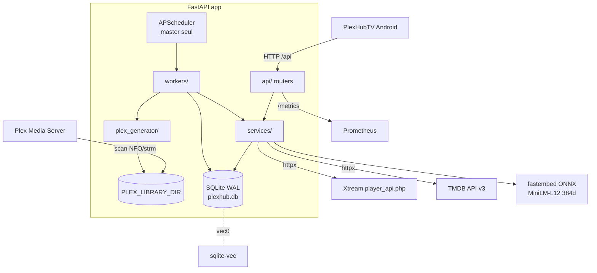
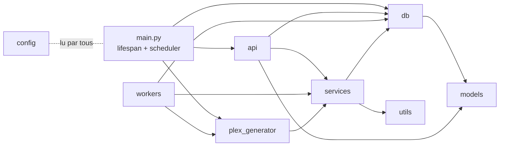

# PlexHub Backend — Architecture

> **À jour au : 2026-06-15 (HEAD `1da2ab9`).** Document régénéré contre le code à HEAD (`/refresh-context`, agent a0-cartographer). Chaque fait est sourcé `fichier:ligne`. Remplace les notes périmées `architecture-2026-05-13.md` / `architecture-2026-05-14.md` (antérieures aux features IA / tv-auth / auth X-API-Key).

## 1. Vue d'ensemble

Backend **FastAPI async** qui miroite des bibliothèques **Xtream-IPTV** (VOD, séries, chaînes Live, EPG), enrichit les métadonnées via **TMDB**, valide les flux, génère une **bibliothèque compatible Plex** (NFO + arborescence + `.strm`/images), expose une **API de recommandations IA** (embeddings + recherche vectorielle sqlite-vec) et un **appairage TV** device-flow. Client : app Android `PlexHubTV`.

Cible de déploiement : **Docker/Linux** (l'élection master-worker repose sur `fcntl.flock`, POSIX — `app/main.py:196,226`). Image `python:3.12-slim` (`Dockerfile:1`) ; CI sur Python 3.13 (`.github/workflows/tests.yml`).

## 2. Graphe de modules

- **`api/`** (router → service → db) : `health`, `accounts`, `categories`, `live`, `media`, `stream`, `sync`, `plex`, `tv_auth`, `ai`, `admin`. `deps.py` = `verify_api_key`.
- **`services/`** : `xtream_service`, `tmdb_service`, `media_service`, `category_service`, `stream_service`, `nfo_import_service`, `embedding_service`, `recommendation_service`.
- **`workers/`** : `sync_worker`, `enrichment_worker`, `health_check_worker`, `embedding_worker`.
- **`plex_generator/`** : `source`, `generator`, `storage`, `nfo_builder`, `naming`, `mapping`, `models`.
- **`db/`** : `database.py`, `migrations.py`. **`models/`** : `database.py`, `schemas.py`. **`utils/`**, **`scripts/`**, **`templates/admin/`**, **`cli.py`**, **`config.py`**.

Règle d'architecture : la logique métier vit dans `services/`/`workers/` ; les routers (`api/`) ne font que valider (Pydantic v2) et déléguer. Accès DB via `async_session_factory` / dépendance `get_db` (`db/database.py:57-65`).

## 3. Stack & versions réelles

### Runtime — `requirements.txt`
| Paquet | Contrainte | Rôle |
|---|---|---|
| fastapi | ≥0.115 | framework web async |
| uvicorn[standard] | ≥0.27 | serveur ASGI |
| sqlalchemy[asyncio] | ≥2.0 | ORM async |
| aiosqlite | ≥0.20 | driver SQLite async |
| httpx | ≥0.27 | client HTTP (Xtream, TMDB, validation) |
| pydantic | ≥2.6 | validation v2 |
| pydantic-settings | ≥2.1 | **déclarée mais non utilisée** (`config.py` est une classe maison) |
| apscheduler | ≥3.10 | planificateur (master) |
| rapidfuzz | ≥3.6 | matching de titres TMDB |
| python-dotenv | — | chargement `.env` |
| typer | ≥0.9.0 | CLI |
| prometheus-fastapi-instrumentator | ≥7.0 | métriques HTTP |
| prometheus-client | ≥0.20 | métriques métier |
| jinja2 | ≥3.1 | templates admin |
| python-multipart | ≥0.0.9 | forms (admin/upload NFO) |
| **fastembed** | ≥0.7,<1.0 | embeddings (ONNX) |
| onnxruntime | ≥1.20,<2.0 | runtime ONNX |
| **sqlite-vec** | ≥0.1,<0.2 | recherche vectorielle (`vec0`) |
| numpy | ≥1.26,<3.0 | calcul cosinus/centroïde |
| psutil | ≥6.0,<7.0 | RSS dans `/embed/status` |
| cryptography | ≥42,<46 | Fernet (tv-auth) |

### Tests — `requirements-dev.txt`
`pytest≥7.0`, `pytest-asyncio≥0.23` (mode `auto`, `pyproject.toml`), `respx≥0.21`. **Aucun linter** (ruff/black) câblé.

### Runtimes
- CI : Python **3.13** (`tests.yml`, étape setup-python).
- Docker : **`python:3.12-slim`** (`Dockerfile:1`), `uvicorn app.main:app` sur `APP_PORT` (défaut 8000).
- `docker-compose.yml` : limite mémoire **2 G** (`docker-compose.yml:39`), healthcheck `/api/health`, rotation logs json-file.

## 4. Schéma SQLite & migrations

`init_db()` (`db/database.py:68-89`) : applique les PRAGMA (`journal_mode=WAL`, `synchronous=NORMAL`, `cache_size=-64000`, `temp_store=MEMORY`, `busy_timeout=5000`, `mmap_size=256MB`), `Base.metadata.create_all`, puis `run_migrations()`. Le listener `register_sqlite_vec_listener` charge **sqlite-vec sur chaque connexion** et journalise l'état dans `_VEC_LOADED` (`database.py:25-54`).

### Tables (SQLAlchemy — `app/models/database.py`)
| Table | PK | Notes |
|---|---|---|
| `media` | `(rating_key, server_id, filter, sort_order)` | catalogue VOD/séries/épisodes ; ~30 colonnes ; `dto_hash`/`content_hash` (incrémental), `is_broken`/`stream_error_count`/`last_stream_check` (validation), `is_in_allowed_categories`, `cast`. 18 index (`database.py:87-106`) |
| `xtream_accounts` | `id` (MD5(baseUrl+user)[:8]) | comptes ; `category_filter_mode` (`all`/`whitelist`/`blacklist`) |
| `xtream_categories` | `id` autoinc | catégories `vod`/`series`/`live` ; unique `(account_id,category_id,category_type)` |
| `live_channels` | `(stream_id, server_id)` | chaînes Live IPTV ; catchup `tv_archive` |
| `epg_entries` | `id` autoinc | EPG (epoch ms) ; unique `(server_id,stream_id,start_time)` |
| `tv_auth_sessions` | `id` (uuid4 hex) | appairage TV ; `device_code`/`user_code` uniques ; `payload_encrypted` (Fernet) |
| `enrichment_queue` | `id` autoinc | file d'enrichissement TMDB ; `existing_tmdb_id`/`existing_imdb_id` |
| `ai_tmdb_cache` | `tmdb_id` | cache TMDB IA (`overview`/`genres`/`embedded_at`) — créée par M008 (SQL brut) |
| `ai_embeddings` | `tmdb_id` | **table virtuelle `vec0`** `embedding FLOAT[384]` — créée par M008, dépend de sqlite-vec |

### Chaîne de migrations (`app/db/migrations.py:11-33`)
Ordre d'**exécution** (≠ ordre de définition dans le fichier) :
1. **001** `xtream_categories` (table + 2 index).
2. **002** `xtream_accounts.category_filter_mode` (ADD COLUMN défaut `all`).
3. **003** `media.is_in_allowed_categories` (+ index).
4. **004** `enrichment_queue.existing_tmdb_id` + `existing_imdb_id`.
5. **005** `media."cast"`.
6. **006** `live_channels` + `epg_entries` (tables + index).
7. **007** index composé `ix_media_stream_validation` (perf pipeline).
8. **008** (exécutée sur une **connexion** dédiée, `migrations.py:28-29`) `ai_embeddings` (vec0 `FLOAT[384]`) + `ai_tmdb_cache` + 2 index — **dépend du chargement sqlite-vec**.
9. **009** `tv_auth_sessions` (table + 2 unique index + 2 index).

**Migration courante = 009.** Toutes idempotentes (`IF NOT EXISTS` / `ADD COLUMN` gardé par try/except). Nouvelle migration à ajouter **en fin** de `run_migrations()`.

## 5. Surface API

| Router | Préfixe monté | Auth | Endpoints clés |
|---|---|---|---|
| `health` | `/api/health` | non | `GET /health` |
| `accounts` | `/api/accounts` | non | `GET`/`POST` `""`, `PUT`/`DELETE` `/{id}`, `POST /{id}/test` |
| `categories` | `/api/accounts/{id}/categories` | non | `GET`, `PUT`, `POST /refresh` |
| `live` | `/api/live` | non | `/channels`, `/channels/{id}`, `/channels/{id}/stream`, `/channels/{id}/epg`, `/epg` |
| `media` | `/api/media` | non | `/movies`, `/movies/stats`, `/shows`, `/episodes`, `GET`/`PATCH` `/{rating_key}`, `POST /{rating_key}/rescrape` |
| `stream` | `/api/stream/{rating_key}` | non | résolution URL de flux |
| `sync` | `/api/sync` | non | `POST /xtream`, `/xtream/all`, `/enrichment`, `/validate-streams`, `/full-pipeline` (202) ; `DELETE /cancel/{task}` ; `GET /status/{job}`, `/jobs` |
| `plex` | `/api/plex` | non | `POST /generate` |
| `tv_auth` | `/api/tv-auth` | **`/approve` seul** | `POST /start` (201), `POST /approve` (X-API-Key), `GET /status`, `POST /complete` |
| `ai` | `/api/ai` | **router entier** | `POST /rank`, `POST /rank-multi`, `POST /embed/rebuild` (202), `GET /embed/jobs/{id}`, `GET /embed/status` |
| `admin` | `/admin` (pas de `/api`) | non | UI HTML/HTMX (movies, stats, import NFO, rescrape) |
| instrumentator | `/metrics` | non | métriques Prometheus |

**Auth** : `verify_api_key` (`api/deps.py:22-49`) compare `X-API-Key` à **`AI_API_KEY`** en temps constant (`secrets.compare_digest`). Appliquée **uniquement** au router `/api/ai` (`ai.py:40`) et à `POST /api/tv-auth/approve` (`tv_auth.py:270`, via `verify_pairing_api_key`). Tous les autres routers (catalogue, sync, plex, admin) sont **non authentifiés** — dette de sécurité à traiter en façade.

**Conventions API** : schémas Pydantic v2 avec alias camelCase (`alias_generator=to_camel`, `populate_by_name=True`, `ai.py:48`, `tv_auth.py:94`) ; réponses `response_model_by_alias=True`.

## 6. Flux services / workers

> 📐 **Diagrammes de séquence** (un par fonctionnalité, vue dynamique des échanges) : `docs/architecture/SEQUENCE-DIAGRAMS.md`. La présente §6 est la description textuelle ; le fichier de séquences en est la contrepartie visuelle (boot/élection, sync, enrichissement, validation, génération Plex, IA rank/rebuild, LLM Ollama, appairage TV).

### 6.1 Sync (`workers/sync_worker.py`)
`run_all_accounts()` (`:1290`) → `sync_account(id)` (`:854`, lock async par compte). Séquence : refresh catégories → VOD (incrémental `dto_hash`, fetch détails parallèle sém. 25, batches 100 + savepoints) → séries → épisodes (séries changées seulement) → Live → recalcul visibilité catégories → `last_synced_at`. Cleanup différentiel selon `filter_mode`. `server_id = f"xtream_{account_id}"` (`utils/server_id.py`). Métrique `plexhub_sync_duration_seconds`.

### 6.2 Enrichissement (`workers/enrichment_worker.py:151`)
2 phases (movies puis séries), concurrence 8, `BATCH_SIZE=200`, `MAX_ATTEMPTS=3`. `tmdb_service` : `search_movie`/`search_tv` (fuzzy rapidfuzz, seuil confiance **0.85**, `tmdb_service.py:323`), `get_*_details` (1 appel avec `append_to_response=credits,external_ids`). Borné par `ENRICHMENT_DAILY_LIMIT` (défaut **50000**, compté en appels API). Caches TTL : recherche 24 h, imdb→tmdb 7 j (positifs+négatifs). Met à jour les gauges `plexhub_enrichment_queue_size`.

### 6.3 Validation de flux (`workers/health_check_worker.py`)
`run_pipeline_validation()` (`:274`, pipeline, cible non-checkés/stale) + `run()` (`:179`, cron `hour=2`, échantillon aléatoire). Méthode : HEAD → si ambigu Range GET `bytes=0-8191` → inspection Content-Type + magic bytes (`_looks_like_video`). Échecs **définitifs** (404/403/error-CT/empty/magic-fail) marquent cassé immédiatement, sinon seuil `STREAM_BROKEN_THRESHOLD` (défaut 3). Circuit breaker par compte à **90 %** d'échecs sur échantillon de 50 → abort + rollback. Client httpx singleton. Gauge `plexhub_streams_alive_ratio`.

### 6.4 Génération Plex (`plex_generator/` + `app/main.py:77-117`)
`DatabaseSource(account_id)` lit `media`/`account` et construit les URLs de flux → `PlexLibraryGenerator.generate()` → `GenerationReport(created/updated/deleted/unchanged/errors/duration_seconds)`. `LocalStorage` écrit NFO + arbo + `.strm` + images (téléchargées via `_image_pool` ThreadPoolExecutor 8 threads, `storage.py:36`), écritures **atomiques** (tempfile + `os.replace` + fsync, `storage.py:11-27`). `MappingStore` (`.plex_mapping.json`) trace source_id → fichier/URL. Sortie par compte sous `PLEX_LIBRARY_DIR/{account_id}`. Aussi déclenchable via `POST /api/plex/generate` et `python -m app.cli generate`.

### 6.5 Recommandations IA (`api/ai.py` + `services/`)
Pipeline `/rank` : résolution refs (imdb→tmdb via `find_by_imdb_id`, movie/tv seulement) → `load_cached_vectors` (SELECT `ai_embeddings`) → `hydrate_misses` (cap **20**, timeout 10 s/tâche, fetch TMDB + embed + INSERT cache + DELETE/INSERT vec0) → `cosine_rank` (dot product sur vecteurs L2-normalisés). `/rank-multi` : centroïde pondéré (poids 1.0,0.9,… min 0.1) puis ranking. `embedding_service` : fastembed `paraphrase-multilingual-MiniLM-L12-v2` (384 dim), singleton lazy chargé en `asyncio.to_thread` (cold start ~30 s), `EmbeddingUnavailableError` → 503. Rebuild : `enqueue_rebuild()` → background, scan `embedded_at IS NULL`, curseur `tmdb_id`, `PAGE_SIZE=50`, jamais au boot.

### 6.6 Appairage TV (`api/tv_auth.py`, `utils/payload_crypto.py`)
Device-flow RFC 8628-like : `start` (201, `deviceCode` token_urlsafe(32) + `userCode` 8 car. alphabet non ambigu) → `approve` (X-API-Key, payload Fernet chiffré) → `status` (poll par deviceCode, payload **décrypté livré une seule fois** via flag `payload_delivered`) → `complete` (one-shot, scrub payload). TTL `TV_AUTH_TTL_SECONDS` (défaut 900 s). Expiration paresseuse (`_expire_if_needed`) + cleanup opportuniste au `start`. Clé Fernet : `TV_AUTH_ENCRYPTION_KEY` explicite, sinon dérivée de `AI_API_KEY` (SHA-256), sinon `None` → 503 (`payload_crypto.py:34-47`).

## 7. Ordonnancement (master seul)
`lifespan` (`app/main.py:193-349`) : `init_db()` → élection master via `fcntl.flock(LOCK_EX|LOCK_NB)` sur `DATA_DIR/server_start.lock`. Le master démarre un `AsyncIOScheduler` :
- `sync_enrich_generate` : `interval=SYNC_INTERVAL_HOURS` (6 h), `max_instances=1`, `coalesce=True`, `misfire_grace_time=300` (`main.py:264-272`).
- `health_check` : cron `hour=2` (`main.py:273-281`).
- `epg_cleanup` : cron `hour=3` (`main.py:282-290`).
- `db_backup` : cron `hour=BACKUP_HOUR` (défaut 4) si `BACKUP_ENABLED` ; `sqlite3.backup` en `asyncio.to_thread` (`main.py:291-306`).

Plus un **run initial non bloquant** (sync→enrich→validation→génération) via `create_background_task` (`main.py:310-320`). Les workers esclaves restent passifs (`main.py:321-322`). Shutdown : annule les tâches de fond, libère le flock, ferme clients httpx + pool d'images (`main.py:326-349`).

## 8. Intégrations externes
- **Xtream** (`services/xtream_service.py`) : `player_api.php` (auth, catégories, VOD/séries/Live, infos détaillées). httpx async.
- **TMDB** (`services/tmdb_service.py`) : API v3 (`https://api.themoviedb.org/3`), `search`/`movie|tv/{id}`/`find` ; retry 3× backoff (1/2/4 s) + gestion 429 `Retry-After` (`tmdb_service.py:97-138`) ; langue `TMDB_LANGUAGE`. Images `image.tmdb.org` (poster w342, backdrop w1280).
- **Plex** : aucune API appelée — intégration **par système de fichiers** (NFO + `.strm` + arbo scannés par Plex).
- **fastembed/ONNX** : téléchargement des poids au cold start (cache `AI_EMBED_CACHE_DIR`).

## 9. Observabilité
- **Logs** : logger `plexhub` (DEBUG fichier rotatif `SafeRotatingFileHandler` 10 Mo×5 / INFO console), `request_id` injecté par `RequestIdMiddleware` + `RequestIdLogFilter` (header `X-Request-ID`). Tiers en WARNING+.
- **Métriques** (`utils/metrics.py`, exposées `/metrics`) : `plexhub_sync_duration_seconds` (Histogram, labels account_id/result), `plexhub_tmdb_requests_total` (Counter, kind/result), `plexhub_streams_alive_ratio` (Gauge, account_id), `plexhub_enrichment_queue_size` (Gauge, status) + métriques HTTP par requête (instrumentator, status codes groupés).
- **Health** : `GET /api/health` ; `GET /api/ai/embed/status` (compteurs IA, RSS, état modèle + sqlite-vec).

## 10. Dette technique (réelle, à HEAD)
1. **Lint non câblé** : aucun ruff/black dans `requirements-dev.txt`.
2. **`pydantic-settings` déclarée mais inutilisée** : `config.py` est une classe maison `os.getenv` — incohérence de dépendance.
3. **Auth incomplète** : `X-API-Key` ne protège que `/api/ai` et `/api/tv-auth/approve` ; catalogue/sync/plex/admin sont ouverts. `CORS_ORIGINS` défaut `*` (`config.py:55-57`).
4. **Divergence runtime** : Docker = Python 3.12, CI = 3.13.
5. **`fcntl.flock` POSIX-only** : pas de master-worker sous Windows natif (dev local).
6. **État in-memory** : jobs sync (`_sync_jobs`, cap 100), jobs IA (`_ai_jobs`, cap 100), locks par compte — non partagés entre process/workers.
7. **Test base64 flaky** désélectionné en CI ; couverture globale à confirmer.
8. **M008 fragile par construction** : si sqlite-vec ne charge pas, `ai_embeddings` (vec0) échoue et les endpoints IA renvoient 503 (comportement voulu, mais dépendance dure).
