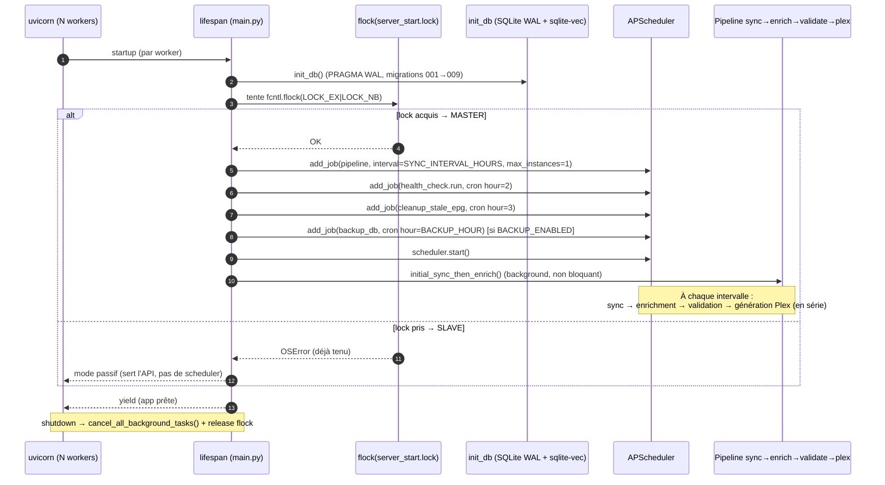
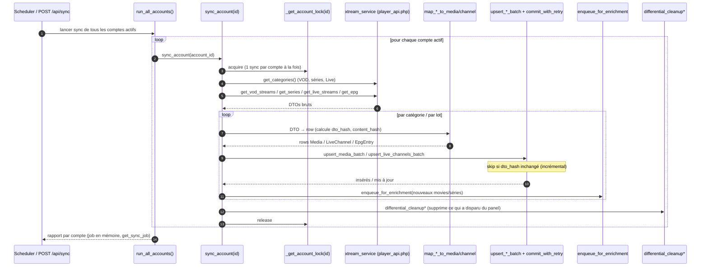
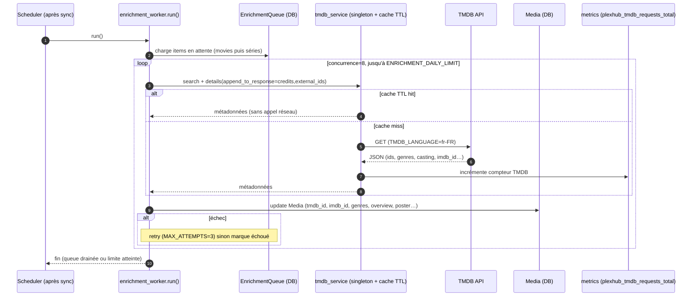
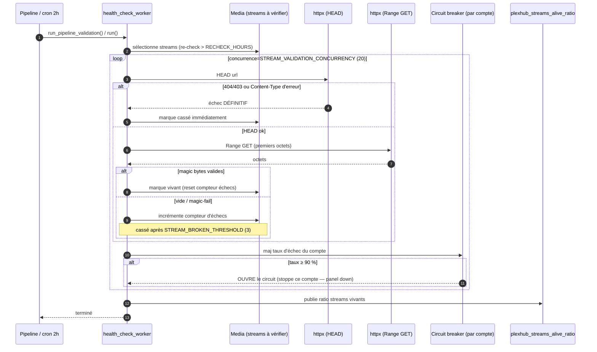
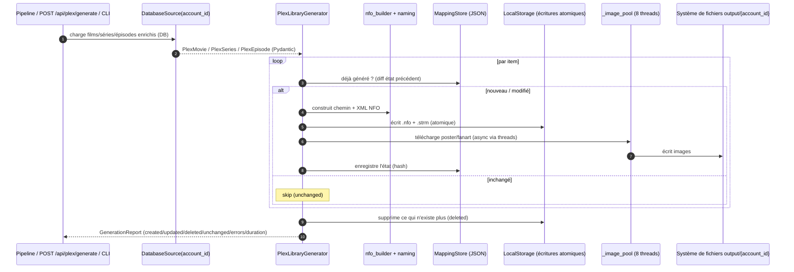
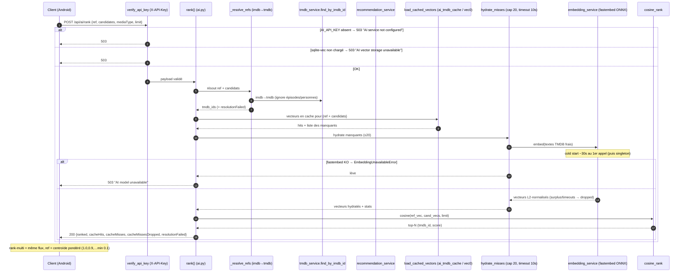
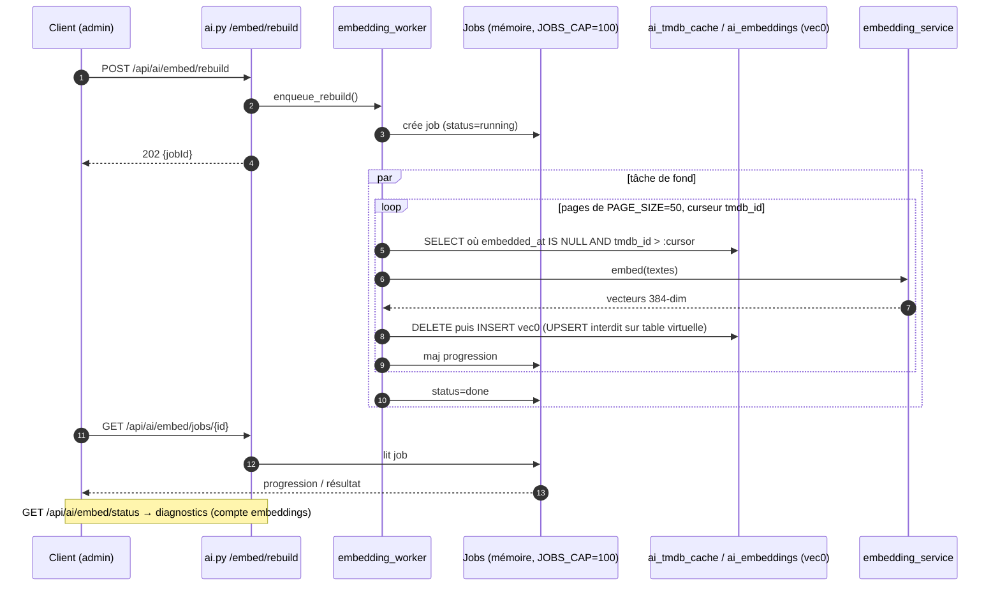
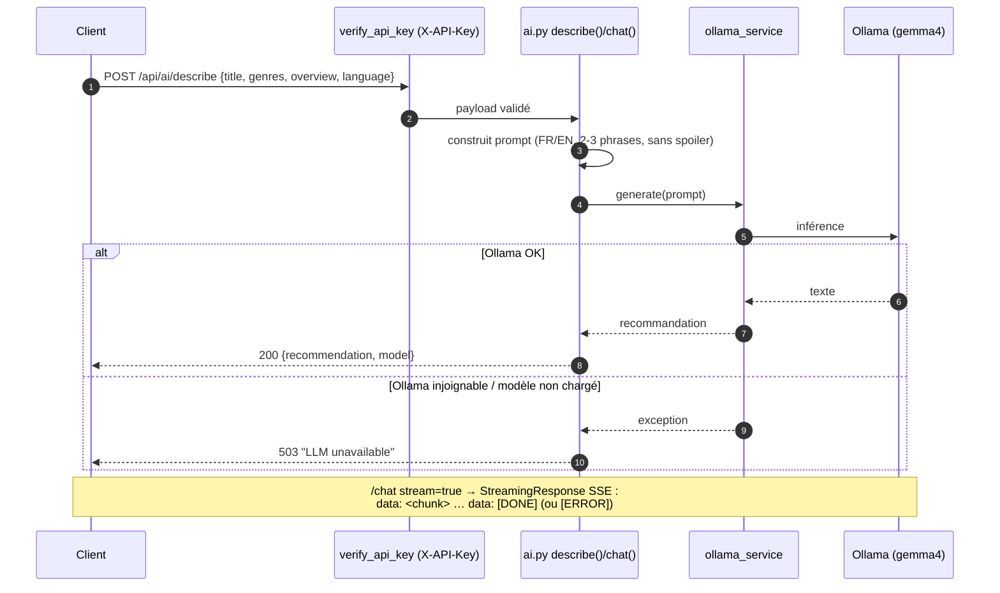
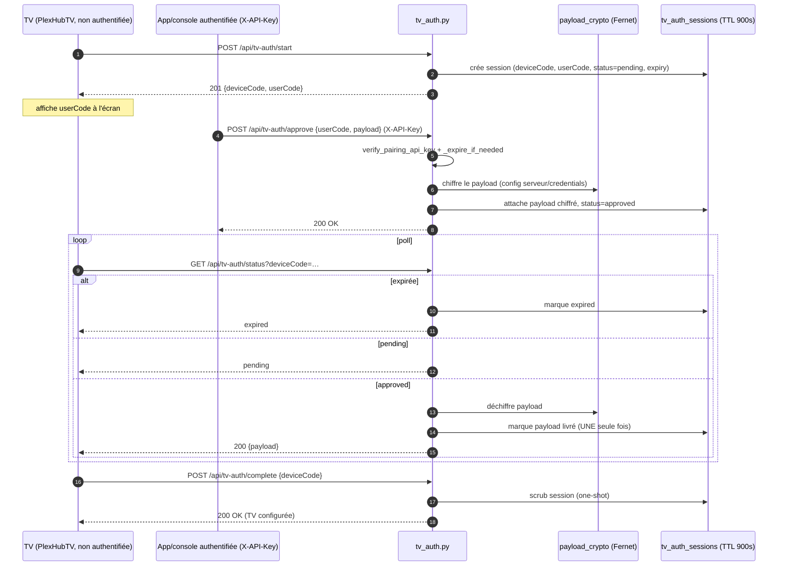

# PlexHub Backend — Diagrammes de séquence par fonctionnalité

> Cartographie des flux bout-en-bout du backend FastAPI (HEAD `40cc8e9`).
> Source : `app/main.py`, `app/api/*`, `app/workers/*`, `app/services/*`, `app/plex_generator/*`.
> **Docs liées** : `docs/architecture/ARCHITECTURE.md` §6 (description textuelle des mêmes flux + flowchart global) et `CLAUDE.md` §5 (flux clés, autorité de vérité). Ce fichier en est la **vue dynamique** (séquences d'échanges).
>
> ⚠️ Delta vs ARCHITECTURE.md/CLAUDE.md (cartographiés à HEAD `1da2ab9`) : la fonctionnalité **#7 LLM génératif (Ollama `/describe` `/chat`)** est plus récente et n'y figure pas encore — elle est documentée ici (vérifiée dans `app/api/ai.py:493-540`).

Le backend a **8 fonctionnalités** :

| # | Fonctionnalité | Déclencheur | Réf code |
|---|---|---|---|
| 0 | Boot + élection master/worker + pipeline planifié | Démarrage app | `main.py:198,241-320` |
| 1 | Sync Xtream (VOD/séries/épisodes/Live/EPG) | Pipeline / `POST /api/sync` | `workers/sync_worker.py` |
| 2 | Enrichissement TMDB | Pipeline (après sync) | `workers/enrichment_worker.py` |
| 3 | Validation de flux (santé streams) | Pipeline + cron 2h | `workers/health_check_worker.py` |
| 4 | Génération bibliothèque Plex (NFO/arbo) | Pipeline / `POST /api/plex/generate` / CLI | `plex_generator/*` |
| 5 | Recommandations IA (embeddings + cosinus) | `POST /api/ai/rank[-multi]` | `api/ai.py`, `services/recommendation_service.py` |
| 6 | Re-embedding (rebuild vecteurs) | `POST /api/ai/embed/rebuild` | `workers/embedding_worker.py` |
| 7 | LLM génératif (descriptions / chat) | `POST /api/ai/describe`, `/chat` | `api/ai.py`, `services/ollama_service.py` |
| 8 | Appairage TV (device-flow) | `POST /api/tv-auth/*` | `api/tv_auth.py` |

---

## 0. Boot, élection master/worker & pipeline planifié

Plusieurs workers uvicorn démarrent ; un **seul** (le master, élu par `fcntl.flock` POSIX) lance le scheduler. Les autres sont passifs.

---

## 1. Sync Xtream

Mirroir incrémental d'un panel Xtream. Lock **par compte**, upsert par `dto_hash`/`content_hash`, nettoyage différentiel.

---

## 2. Enrichissement TMDB

Vide la queue d'enrichissement. Phase 1 films, puis Phase 2 séries. Borné par `ENRICHMENT_DAILY_LIMIT` (appels API réels), concurrence 8, 3 tentatives max.

---

## 3. Validation de flux (santé des streams)

HEAD puis Range GET (magic bytes). Marque cassé après seuil d'échecs ou échec définitif. Circuit breaker par compte à 90 % d'échecs.

---

## 4. Génération bibliothèque Plex (NFO + arborescence + images)

Pour chaque compte : lit la DB via `DatabaseSource`, génère NFO + arbo + `.strm` + images. Idempotent (created/updated/deleted/unchanged). Images via pool de 8 threads.

---

## 5. Recommandations IA — `POST /api/ai/rank` (et `/rank-multi`)

Ranking par similarité cosinus sur embeddings 384-dim (fastembed + sqlite-vec). Auth `X-API-Key`. 3 motifs de 503 contractuels. Cap 20 hydratations TMDB fraîches par appel.

---

## 6. Re-embedding asynchrone — `POST /api/ai/embed/rebuild`

Job en mémoire (202 + jobId). **Jamais au boot.** Idempotent : scanne `embedded_at IS NULL`, curseur `tmdb_id`, DELETE-puis-INSERT sur la table virtuelle `vec0`.

---

## 7. LLM génératif — `POST /api/ai/describe` & `/chat` (Ollama)

Génère des présentations enthousiastes ou un chat libre via Ollama (gemma4). Streaming SSE possible. 503 si Ollama injoignable.

---

## 8. Appairage TV — device-flow (`/api/tv-auth/*`)

Flux RFC 8628-like. La TV démarre (non authentifiée), un client authentifié approuve avec payload chiffré Fernet, la TV poll puis complète (one-shot, scrub). TTL 900 s.

---

### Notes transverses (s'appliquent à tous les flux)

- **Écritures DB** : SQLite WAL + `commit_with_retry`/`run_with_retry` (retry « database is locked »).
- **Appels bloquants** (`sqlite3.backup`, inférence ONNX) → `asyncio.to_thread` ; images Plex → `ThreadPoolExecutor`.
- **Auth** : seuls le router `/api/ai` et `POST /api/tv-auth/approve` exigent `X-API-Key`. Les routers catalogue (`accounts`/`media`/`live`/`stream`/`sync`/`plex`/`categories`/`admin`) ne sont **pas** authentifiés (dette ouverte, cf. §10).
- **Observabilité** : métriques `plexhub_*` sur `/metrics`, `request_id` injecté par middleware.
