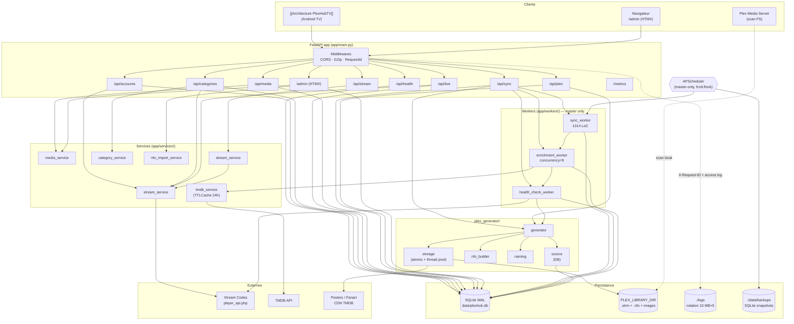
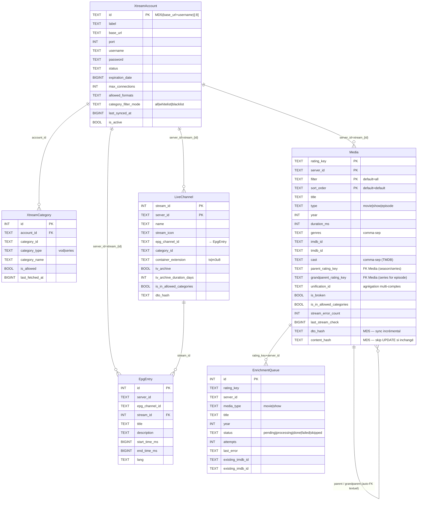
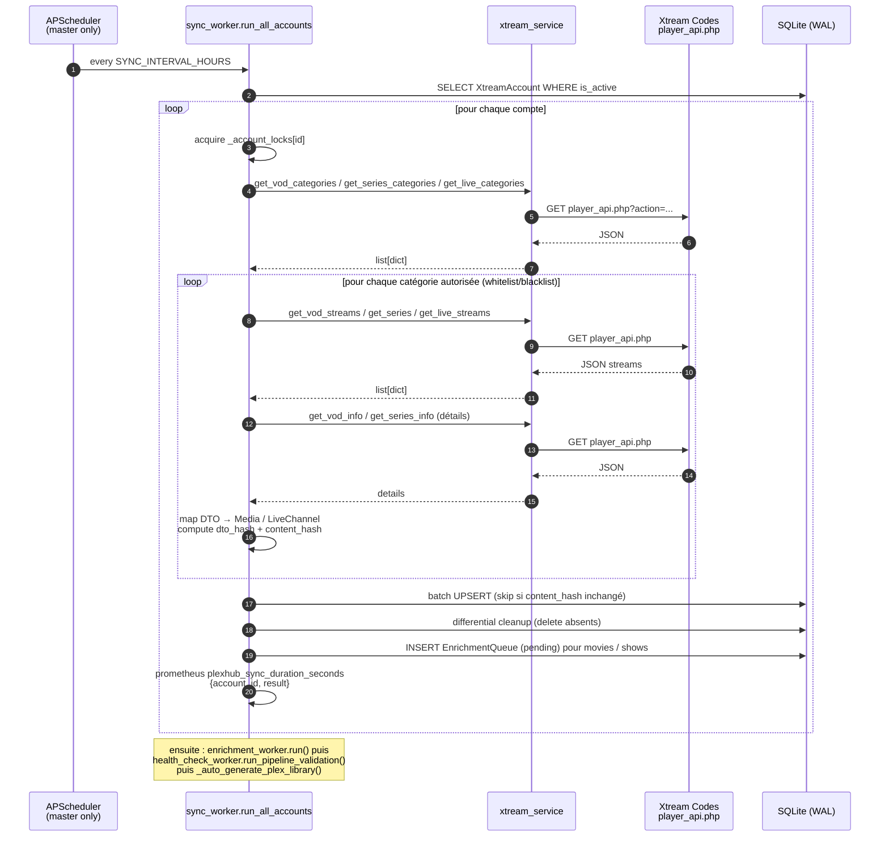
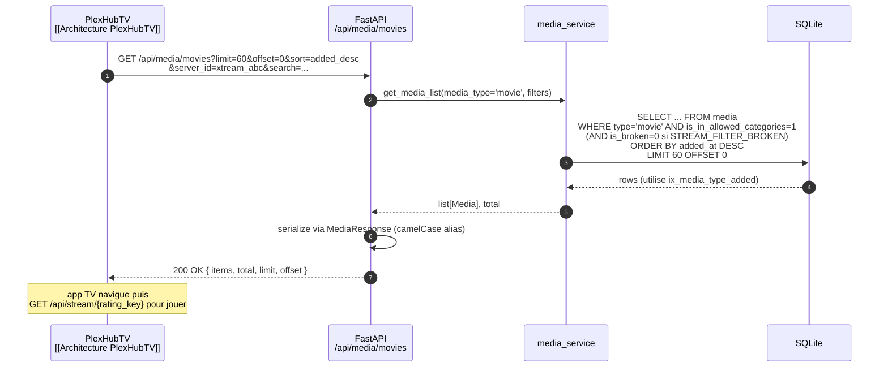
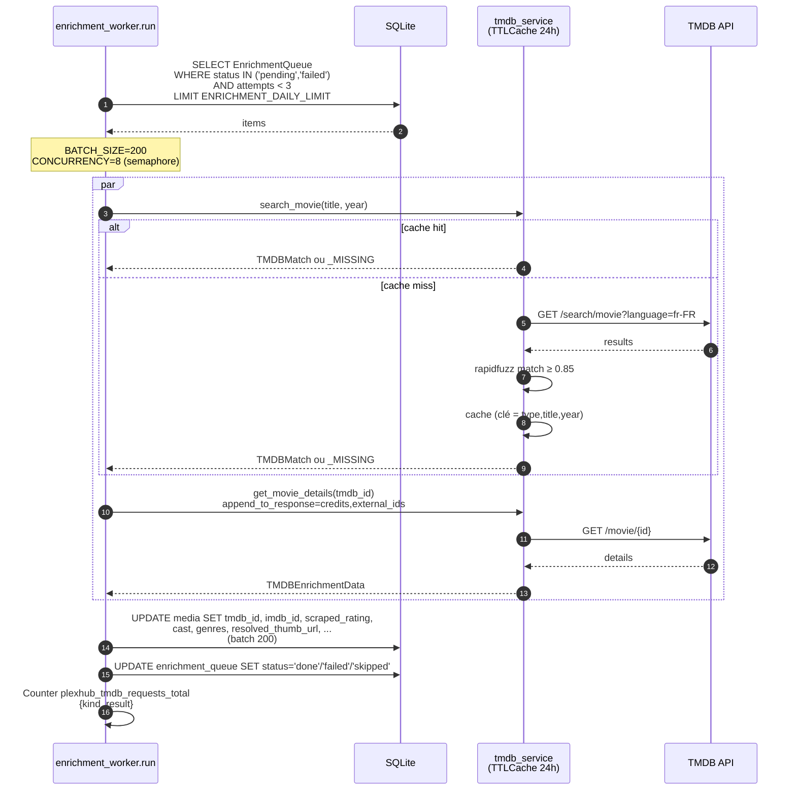
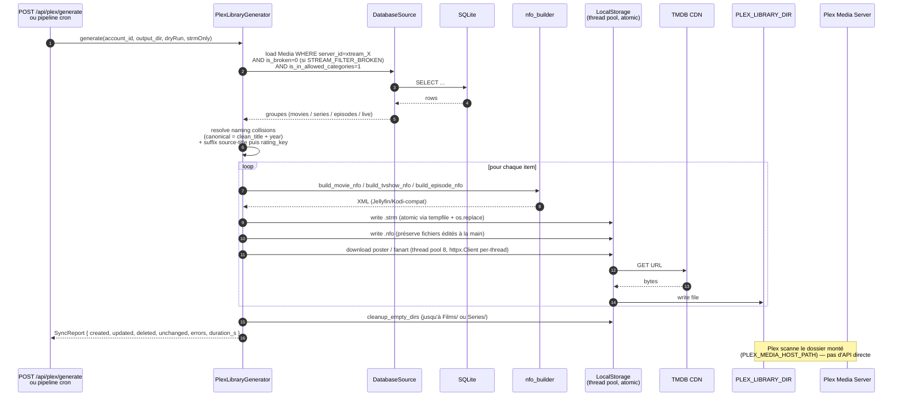
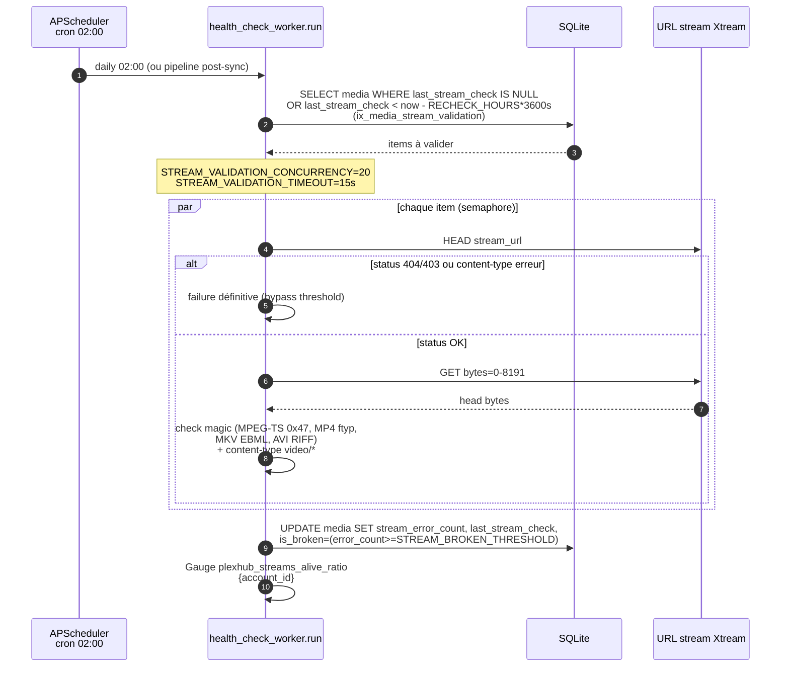

# Architecture PlexHub backend — 2026-05-13

> Documentation autoritative générée à partir du code source. Chaque fait est sourcé `fichier:Lnn` (chemins relatifs au repo backend). Doc symétrique de [[Architecture PlexHubTV]] côté client.

---

## TL;DR

- **Backend FastAPI async** qui synchronise des catalogues **Xtream Codes IPTV** (VOD / Series / Live TV) vers SQLite local, **enrichit** la métadonnée via TMDB, **valide** la santé des streams, et **génère une bibliothèque Plex-compatible** (`.strm` + `.nfo` Jellyfin/Kodi-style) consommée localement par Plex Media Server.
- **Mono-process Docker** : 1 service, SQLite WAL embarquée (~170 MB observé), pas de broker, pas de cache externe. Coordination master/slave via `fcntl.flock` sur `data/server_start.lock` — seul le master fait tourner APScheduler.
- **Surface API** : 8 routers JSON (`/api/*`) + 1 admin HTML/HTMX (`/admin`). **Aucune authentification** ; CORS `*` par défaut. Conçu pour réseau privé (Tailscale / homelab), pas pour Internet public.
- **3 intégrations externes** : Xtream Codes (13 endpoints `player_api.php`), TMDB (search + details avec TTLCache 24 h), Plex (consommation indirecte par scan du dossier `PLEX_LIBRARY_DIR`).
- **Observabilité** : Prometheus `/metrics` + 4 métriques métier ; logs rotatifs ; healthcheck Docker. Pas d'OpenTelemetry, pas de Sentry, pas de dashboards Grafana committés. Dette principale : pas d'auth, deps `>=` non bornées, `sync_worker.py` à 1314 lignes.

---

## Stack technique

| Composant | Version (≥) | Source |
|---|---|---|
| Python (runtime Docker) | 3.12-slim | [Dockerfile:L1](../../Dockerfile) |
| Python (CI tests) | 3.13 | `.github/workflows/tests.yml` |
| FastAPI | 0.115 | [requirements.txt:L1](../../requirements.txt) |
| Uvicorn (standard) | 0.27 | [requirements.txt:L2](../../requirements.txt) |
| SQLAlchemy `[asyncio]` | 2.0 | [requirements.txt:L3](../../requirements.txt) |
| aiosqlite | 0.20 | [requirements.txt:L4](../../requirements.txt) |
| httpx | 0.27 | [requirements.txt:L5](../../requirements.txt) |
| Pydantic + pydantic-settings | 2.6 / 2.1 | [requirements.txt:L6-7](../../requirements.txt) |
| APScheduler | 3.10 | [requirements.txt:L8](../../requirements.txt) |
| rapidfuzz | 3.6 | [requirements.txt:L9](../../requirements.txt) |
| Typer (CLI) | 0.9 | [requirements.txt:L11](../../requirements.txt) |
| prometheus-fastapi-instrumentator | 7.0 | [requirements.txt:L12](../../requirements.txt) |
| Jinja2 (templates admin) | 3.1 | [requirements.txt:L14](../../requirements.txt) |
| python-multipart | 0.0.9 | [requirements.txt:L15](../../requirements.txt) |

Base de données : **SQLite + aiosqlite** uniquement (chemin `{DATA_DIR}/plexhub.db`, [app/config.py:63](../../app/config.py)). PRAGMA appliqués : `WAL`, `synchronous=NORMAL`, cache 64 MB, mmap 256 MB, `busy_timeout=5000` (`app/db/database.py:40-45`).

---

## Cartographie des services



Référence partenaire côté consommateur principal : [[Architecture PlexHubTV]] (l'app TV Android appelle `/api/media`, `/api/live`, `/api/stream`).

---

## Surface API

App composée dans [app/main.py:352-379](../../app/main.py). Tous les routers JSON sont préfixés `/api` ; l'admin HTMX est monté sans préfixe. **Aucun `Depends` d'authentification** détecté sur les routes ; `Depends(get_db)` (session async, commit/rollback automatique) est la seule injection.

| Endpoint | Méthode | Auth | Source | Consommateur principal |
|---|---|---|---|---|
| `/api/health` | GET | aucune | [app/api/health.py](../../app/api/health.py) | docker healthcheck, monitoring, [[Architecture PlexHubTV]] |
| `/api/accounts` | GET | aucune | [app/api/accounts.py](../../app/api/accounts.py) | admin, [[Architecture PlexHubTV]] |
| `/api/accounts` | POST (201) | aucune | id. | admin |
| `/api/accounts/{id}` | PUT | aucune | id. | admin |
| `/api/accounts/{id}` | DELETE (204) | aucune | id. | admin |
| `/api/accounts/{id}/test` | POST | aucune | id. | admin |
| `/api/accounts/{id}/categories` | GET | aucune | [app/api/categories.py](../../app/api/categories.py) | admin |
| `/api/accounts/{id}/categories` | PUT | aucune | id. | admin |
| `/api/accounts/{id}/categories/refresh` | POST | aucune | id. | admin |
| `/api/live/channels` | GET | aucune | [app/api/live.py](../../app/api/live.py) | [[Architecture PlexHubTV]] |
| `/api/live/channels/{stream_id}` | GET | aucune | id. | [[Architecture PlexHubTV]] |
| `/api/live/channels/{stream_id}/stream` | GET | aucune | id. | [[Architecture PlexHubTV]] |
| `/api/live/channels/{stream_id}/epg` | GET | aucune | id. | [[Architecture PlexHubTV]] |
| `/api/live/epg` | GET | aucune | id. | [[Architecture PlexHubTV]] |
| `/api/media/movies` | GET | aucune | [app/api/media.py](../../app/api/media.py) | [[Architecture PlexHubTV]] |
| `/api/media/movies/stats` | GET | aucune | id. | admin, [[Architecture PlexHubTV]] |
| `/api/media/shows` | GET | aucune | id. | [[Architecture PlexHubTV]] |
| `/api/media/episodes` | GET | aucune | id. | [[Architecture PlexHubTV]] |
| `/api/media/{rating_key}` | GET | aucune | id. | [[Architecture PlexHubTV]] |
| `/api/media/{rating_key}` | PATCH | aucune | id. | admin (imdb_id / tmdb_id corrigés à la main) |
| `/api/media/{rating_key}/rescrape` | POST (202) | aucune | id. | admin, [[Architecture PlexHubTV]] |
| `/api/stream/{rating_key}` | GET | aucune | [app/api/stream.py](../../app/api/stream.py) | [[Architecture PlexHubTV]] (lecteur) |
| `/api/sync/xtream` | POST (202) | aucune | [app/api/sync.py](../../app/api/sync.py) | admin, cron |
| `/api/sync/xtream/all` | POST (202) | aucune | id. | admin |
| `/api/sync/cancel/{task_name}` | DELETE | aucune | id. | admin |
| `/api/sync/enrichment` | POST (202) | aucune | id. | admin |
| `/api/sync/validate-streams` | POST (202) | aucune | id. | admin |
| `/api/sync/full-pipeline` | POST (202) | aucune | id. | admin |
| `/api/sync/status/{job_id}` | GET | aucune | id. | admin (polling) |
| `/api/sync/jobs` | GET | aucune | id. | admin |
| `/api/plex/generate` | POST | aucune | [app/api/plex.py](../../app/api/plex.py) | admin, cron pipeline |
| `/admin`, `/admin/*` | GET / POST (form) | aucune | [app/api/admin.py](../../app/api/admin.py) | navigateur |
| `/metrics` | GET | aucune | [app/utils/metrics.py:42-45](../../app/utils/metrics.py) | Prometheus scraper |
| `/docs` (auto-Swagger FastAPI) | GET | aucune | (par défaut FastAPI, pas surchargé) | dev |

**Conventions** :
- Pagination : `limit`, `offset` (défauts variables par endpoint, à confirmer côté chaque router).
- Tri : paramètre `sort` (valeurs : `added_desc/asc`, `title_asc/desc`, `rating_desc`, `year_desc`).
- Filtres multi-critères sur `/api/media/movies` : `server_id`, `search`, `genre`, `year`, `missing_imdb`, `missing_tmdb`, `parent_rating_key` (`app/api/media.py`).
- DTO Pydantic en **camelCase** via `alias_generator` ([app/models/schemas.py](../../app/models/schemas.py)) — cohérent avec les clients mobile.
- Jobs longs : retour `202 Accepted` + `jobId` ; statut poll via `/api/sync/status/{job_id}` (file `_sync_jobs` en mémoire dans `sync_worker`, capée à 100 entrées).

**Pas de versioning** (`/v1/...`) ni de rate-limiting global. **Pas d'OpenAPI export figé** dans le repo — Swagger UI auto-générée à `/docs` mais aucune snapshot committée.

---

## Schéma données

6 tables définies dans [app/models/database.py](../../app/models/database.py). Création schéma : `Base.metadata.create_all()` au démarrage, puis migrations manuelles asynchrones M001–M007 dans [app/db/migrations.py](../../app/db/migrations.py) (pas d'Alembic).



**Notes index / performance** :

- `media` porte **16 index** ([app/models/database.py:87-106](../../app/models/database.py)), dont l'unique `uix_media_pagination(server_id, library_section_id, filter, sort_order, page_offset)` qui matérialise l'état de pagination côté client (héritage du modèle Plex).
- Index pour les recherches client : `ix_media_imdb`, `ix_media_tmdb`, `ix_media_guid`, `ix_media_type_added`, `ix_media_type_rating` ([app/models/database.py:89-95](../../app/models/database.py)).
- Index pour le worker de validation : `ix_media_stream_validation(server_id, type, is_in_allowed_categories, last_stream_check)` ajouté par M007 ([app/db/migrations.py:213-225](../../app/db/migrations.py)).
- `live_channels` : 8 index incl. compounds `(server_id, is_in_allowed_categories)` et `(server_id, category_id)` ([app/models/database.py:182-190](../../app/models/database.py)).
- `epg_entries` : 7 index, dont `uix_epg_dedup(server_id, stream_id, start_time)` UNIQUE qui sert d'idempotence pour le fetch-on-miss ([app/models/database.py:210-218](../../app/models/database.py)).
- **Pas de relations FK déclarées au niveau SQL** — les liens parent/grandparent et `server_id` → `xtream_accounts.id` sont uniquement textuels (cohérence applicative). Conséquence : pas de `ON DELETE CASCADE` natif ; la suppression d'un compte fait un `DELETE` explicite sur les 5 tables filles ([app/api/accounts.py](../../app/api/accounts.py) lignes 135-154 selon l'inventaire Explore — à recouper).
- **Modèle de cohérence** : transactions par requête HTTP (auto-commit dans `get_db`), pas de transactions multi-requêtes. Les workers commitent par batch.

---

## Flux principaux

### B1 — Auth utilisateur → JWT/session

**N/A — aucune authentification implémentée.** L'API est totalement ouverte. CORS `*` par défaut ([app/config.py:45-47](../../app/config.py)). Pour un déploiement sur réseau public il faut impérativement ajouter (au minimum) une vérification d'API key via une dépendance FastAPI. Voir [Dette technique](#dette-technique) et [Points d'extension IA — auth](#points-dextension-ia).

### B2 — Sync libraries Xtream (cron + initial)

Trigger : startup initial (background task `initial_sync_then_enrich` [app/main.py:310-320](../../app/main.py)) ou job APScheduler `sync_enrich_generate` toutes `SYNC_INTERVAL_HOURS` heures ([app/main.py:264-272](../../app/main.py), défaut 6 h).



Sources : [app/workers/sync_worker.py](../../app/workers/sync_worker.py), [app/services/xtream_service.py](../../app/services/xtream_service.py), pipeline orchestré [app/main.py:247-258](../../app/main.py). Métrique : `plexhub_sync_duration_seconds` (Histogram, buckets jusqu'à 7200 s, [app/utils/metrics.py:14-19](../../app/utils/metrics.py)).

### B3 — Browse média consommé par PlexHubTV



Sources : [app/api/media.py](../../app/api/media.py), [app/services/media_service.py](../../app/services/media_service.py). DTO : `MediaResponse` / `MediaListResponse` ([app/models/schemas.py](../../app/models/schemas.py)), pagination via `ix_media_type_added` ([app/models/database.py:90](../../app/models/database.py)).

### B4 — Enrichment TMDB



Sources : [app/workers/enrichment_worker.py](../../app/workers/enrichment_worker.py) (constantes L15-17), [app/services/tmdb_service.py](../../app/services/tmdb_service.py). Backoff 1/2/4 s + `Retry-After` honoré pour 429. Quota journalier `ENRICHMENT_DAILY_LIMIT` ([app/config.py:27](../../app/config.py), défaut 50 000).

### B5 — Génération bibliothèque Plex



Sources : [app/plex_generator/generator.py](../../app/plex_generator/generator.py), [app/plex_generator/storage.py](../../app/plex_generator/storage.py), [app/plex_generator/nfo_builder.py](../../app/plex_generator/nfo_builder.py), [app/plex_generator/naming.py](../../app/plex_generator/naming.py). CLI équivalent : `app/cli.py:generate` ([app/cli.py:87-107](../../app/cli.py)). Toggle d'auto-génération startup : `PLEX_LIBRARY_DIR` non vide ([app/main.py:309-320](../../app/main.py)).

### B6 — Stream validation (health_check_worker)



Sources : [app/workers/health_check_worker.py](../../app/workers/health_check_worker.py), config [app/config.py:30-36](../../app/config.py). Le seuil broken (3 défauts par défaut) protège contre les pannes temporaires ; 404/403 et content-type non vidéo basculent immédiatement.

---

## Intégrations externes

### Xtream Codes IPTV

- **Client** : singleton `xtream_service` ([app/services/xtream_service.py:13-34](../../app/services/xtream_service.py)) — `httpx.AsyncClient` lazy, timeout 30 s, pool 50 connexions / keepalive 30 s.
- **Endpoints** ([app/services/xtream_service.py:87-261](../../app/services/xtream_service.py)) : `authenticate`, `get_vod_categories`, `get_vod_streams`, `get_vod_info`, `get_series_categories`, `get_series`, `get_series_info`, `get_series_seasons`, `get_series_episodes`, `get_live_categories`, `get_live_streams`, `get_short_epg`, `get_xmltv`.
- **Construction URL stream** ([app/services/xtream_service.py:179-260](../../app/services/xtream_service.py)) : `{base}:{port}/movie|series|live/{username}/{password}/{id}.{ext}`.
- **Retry** : backoff exponentiel 1/2/4 s sur `TimeoutException`, `ConnectError`, `RemoteProtocolError` ; `Retry-After` honoré sur 429/502/503/504 (cap 60 s).
- **Auth** : credentials par compte stockés en clair dans `xtream_accounts.password` (TEXT). Pas de chiffrement at-rest — à signaler comme dette.

### TMDB

- **Client** : singleton `tmdb_service` ([app/services/tmdb_service.py](../../app/services/tmdb_service.py)) — timeout 10 s, pool 50 / keepalive 35, clé API en `params` par défaut.
- **Cache** : `TTLCache(maxsize=5000, ttl=24h)` sur `(media_type, title, year)`. Sentinelle `_MISSING` pour cacher les non-matches.
- **Endpoints** : `/search/movie`, `/search/tv`, `/movie/{id}?append_to_response=credits,external_ids`, `/tv/{id}?append_to_response=credits,external_ids`.
- **Fuzzy match** : rapidfuzz sur titres normalisés + bonus année, seuil 0.85 ([app/services/tmdb_service.py:221-272](../../app/services/tmdb_service.py)).
- **Langue** : `TMDB_LANGUAGE=fr-FR` ([app/config.py:48](../../app/config.py)).
- **Métriques** : `plexhub_tmdb_requests_total{kind,result}` ([app/utils/metrics.py:21-25](../../app/utils/metrics.py)).

### Plex Media Server

**Consommation indirecte** : le backend n'appelle **aucune** API Plex. Il génère un dossier `PLEX_LIBRARY_DIR` rempli de `.strm` (URL Xtream), `.nfo` (XML Jellyfin/Kodi-compatible) et images. Plex scanne ce volume monté (`PLEX_MEDIA_HOST_PATH:/app/media` dans [docker-compose.yml:28](../../docker-compose.yml)).

Côté client de lecture, c'est l'app TV [[Architecture PlexHubTV]] qui appelle `/api/stream/{rating_key}` pour obtenir l'URL Xtream à lire — Plex n'est pas dans le chemin de lecture, seulement dans la découverte/scan/affiche.

### Storage / FS

- `./data` → SQLite + backups (`./data/backups`, [app/config.py:42](../../app/config.py)).
- `./logs` → rotation 10 MB × 5, `SafeRotatingFileHandler` ([app/main.py:50-72](../../app/main.py)).
- `${PLEX_MEDIA_HOST_PATH}:/app/media` → sortie générateur Plex ([docker-compose.yml:28](../../docker-compose.yml)).

### Observabilité (cf. [Ops & déploiement](#ops--déploiement))

- Prometheus `/metrics` ([app/utils/metrics.py:42-45](../../app/utils/metrics.py)).
- Aucun Sentry, aucun OpenTelemetry, aucun Grafana committé.

### Auth provider externe

**Aucun.** Pas d'OIDC, pas de Plex OAuth, pas d'API key. À traiter avant exposition hors réseau privé.

---

## Points d'extension IA

> Cette section est la base décisionnelle pour planifier l'extension IA. Voir miroir client [[Architecture PlexHubTV#points-extension-ia]].

### Pré-requis homelab `(à confirmer)`

- **GPU** : modèle + VRAM disponibles ? `(à confirmer)` — détermine si on peut tourner Ollama/LM Studio en local pour LLM/embeddings ou si on doit passer par une API externe (OpenAI, Mistral, Together).
- **RAM totale homelab** : `(à confirmer)` — un sidecar embeddings ~150 MB modèle + 1 GB working set.
- **Topologie** : Proxmox VM vs Docker bare-metal ? `(à confirmer)` — change l'orchestration (cri-o, docker-compose, k3s).
- **Tailscale** : présent dans le réseau ? `(à confirmer)` — si oui, les endpoints IA peuvent rester sans auth (ACLs Tailscale), sinon il faut ajouter une API key.

### Où poser un service ML ?

**Recommandation : sidecar Python séparé** (FastAPI distinct, port différent, ex. `:8001`).

| Option | Avantages | Inconvénients |
|---|---|---|
| **Intégré au backend** | Partage `app/db/database.py`, un seul container | Deps lourdes (torch, transformers) gonflent l'image ; redémarrage IA = redémarrage API client ; GIL Python + httpx async se mélangent mal avec inference CPU-bound |
| **Sidecar Docker** (recommandé) | Image dédiée (cuda runtime si GPU), scaling et restart indépendants, isolation deps | 1 container de plus, IPC à concevoir (HTTP interne ou socket) |
| **Provider externe (OpenAI etc.)** | Aucune charge homelab, latence WAN | Coût récurrent, données privées sortent du réseau, pas alignment avec philosophie homelab |

### Données mobilisables

| Source | Volume estimé | Usage IA possible |
|---|---|---|
| `media` (200k+ rows estimé `à confirmer`) | titre + summary + cast + genres + year + display_rating | embeddings sémantiques, similarité, classification mood |
| `media.view_count` + `view_offset` + `last_viewed_at` | par user (à terme — actuellement single-tenant) | collaborative filtering, continue-watching rerank |
| `live_channels` + `epg_entries` | EPG des prochaines 24-48 h | recommandation TV live |
| `enrichment_queue.last_error` + `is_broken` | historique pannes | anomaly detection patterns par catégorie/serveur |

### Endpoints candidats à exposer vers [[Architecture PlexHubTV]]

| # | Endpoint | Effort | Impact | Point d'injection backend | Pré-requis infra | Latence cible |
|---|---|---|---|---|---|---|
| 1 | `GET /api/ai/recommendations?context=home` — collaborative filtering sur `view_count` / `view_offset` | M | H | nouveau `app/api/ai.py` + worker batch précompute | aucun (SQL) ou vector DB pour scaling | < 200 ms (cache) |
| 2 | `GET /api/ai/smart-rows` — rangées thématiques (mood / pacing / durée / cross-genre) | M | H | extension `media_service` + cache TTL | LLM léger (Ollama 7B) ou règles hand-tuned | < 200 ms (précomputé) |
| 3 | `POST /api/ai/voice-query` — recherche sémantique langage naturel | L | M | sidecar Python (embeddings + retrieval) | embeddings + vector DB (Qdrant ou pgvector) | < 500 ms |
| 4 | `POST /api/ai/auto-tag` — enrichment qualitatif (mood, pacing, public visé) | M | M | nouveau worker post-`enrichment_worker` | LLM (Ollama Mistral 7B) | async — batch nuit |
| 5 | `GET /api/ai/dedupe-suggest` — détection doublons multi-comptes via embeddings titre+plot | S | M | extension `unification_id` existant | embeddings | async |
| 6 | `GET /api/ai/continue-watching` — rerank personnalisé | S | M | extension `app/api/media.py` | aucun (SQL + heuristiques) | < 100 ms |
| 7 | `POST /api/ai/poster-fallback` — génération poster manquant via diffusion | L | L | extension `plex_generator/storage.py` (fallback si no `thumb_url`) | GPU + modèle SDXL/Flux | async — batch |
| 8 | `POST /api/ai/nfo-rewrite` — réécriture plot pour cohérence stylistique | S | L | option dans `nfo_builder.py` | LLM | async |
| 9 | `GET /api/ai/stream-anomalies` — patterns broken streams (saisonnier, par catégorie/serveur) | M | M | extension `health_check_worker` | métriques Prometheus + modèle simple (Prophet ou règles) | < 1 s |
| 10 | (foundation) `POST /api/ai/embeddings/recompute` — pipeline batch embeddings sur tout `media` | M | H | nouveau worker `app/workers/embeddings_worker.py` | vector DB + budget batch (1× / semaine) | async — batch |

### Architecture IA recommandée

- **Vector DB** :
  - Option A (gros chantier) : migration `SQLite → PostgreSQL + pgvector`. Permet un seul moteur ; mais change toute la stack `aiosqlite` et casse les PRAGMA. À considérer seulement si on a déjà des problèmes de scaling SQLite.
  - Option B (recommandée) : **Qdrant en sidecar Docker** (`qdrant/qdrant:latest`), intégration via httpx async. SQLite reste OLTP, Qdrant pour la recherche vectorielle. Découplage net, restart indépendant.
- **Auth des endpoints IA** : critique si exposé hors réseau privé. Recommandé : ajouter une dépendance FastAPI `verify_api_key(x_api_key: str = Header(...))` qui compare à une variable d'env `PLEXHUB_API_KEY`. Appliquée d'abord aux routes `/api/ai/*` puis progressivement à tout `/api/`.
- **Latence** :
  - Endpoints **lecture** consommés par [[Architecture PlexHubTV]] : viser **< 200 ms** (précomputer offline, exposer un GET trivial backé par cache + table préagrégée).
  - Endpoints **génération** (auto-tag, embeddings, poster-AI) : exclusivement asynchrones (`202 Accepted` + jobId, comme `/api/sync/*`).
- **Multi-tenant** : actuellement single-tenant implicite (pas de `user_id`). Si on introduit des recos personnalisées, il faut un modèle `User` et lier `view_*` à un user — chantier à planifier avant la feature `recommendations`.

---

## Ops & déploiement

### Build / package

[Dockerfile](../../Dockerfile) (11 lignes, single-stage) :

```dockerfile
FROM python:3.12-slim
WORKDIR /app
COPY requirements.txt .
RUN pip install --no-cache-dir -r requirements.txt
COPY app/ ./app/
RUN mkdir -p /app/data /app/logs
ENV PYTHONUNBUFFERED=1
ENV APP_PORT=8000
EXPOSE ${APP_PORT}
CMD ["sh", "-c", "exec uvicorn app.main:app --host 0.0.0.0 --port ${APP_PORT}"]
```

**Note durcissement** `(à confirmer)` : pas de directive `USER`, le process tourne en root dans le container. À ajouter `USER` non-root pour défense en profondeur.

### Déploiement

- Cible : **homelab Docker** (compose). Pas de manifeste K8s / Helm dans le repo.
- [docker-compose.yml](../../docker-compose.yml) : 1 service `plexhub-backend`, image construite localement, port `${APP_PORT:-8000}`, 3 volumes (`./data`, `./logs`, `${PLEX_MEDIA_HOST_PATH}:/app/media`).
- Resource limits : 1 GB RAM, 1.0 CPU ([docker-compose.yml:37-40](../../docker-compose.yml)).
- Restart : `unless-stopped`.

### Variables d'env / secrets

26 variables documentées via `.env.example`. Secrets clés :
- `TMDB_API_KEY` — requise pour enrichment.
- `XTREAM_USERNAME` / `XTREAM_PASSWORD` — auto-provisionnement d'un compte au boot.

Pas de `.env` committé. Pas de Vault / secrets manager — injection runtime via env Docker.

### CI/CD

- `.github/workflows/tests.yml` : pytest Python 3.13 sur push/PR `main` (deselect `test_base64_decode` flaky).
- `.github/workflows/docker.yml` : Buildx + push GHCR sur main et tags semver, GHA cache.
- **Absent** : lint (Ruff/Black/Mypy), SAST (Bandit/Semgrep), test coverage gate, CD (pas de déploiement automatique).

### Healthchecks

- **Docker** : `python -c "import urllib.request; urllib.request.urlopen('http://localhost:${APP_PORT}/api/health')"` toutes 30 s, timeout 10 s, 3 retries, start_period 60 s ([docker-compose.yml:30-35](../../docker-compose.yml)).
- **Endpoint** `/api/health` ([app/api/health.py](../../app/api/health.py)) — vérifie DB (count accounts, max `last_synced_at`, stats media). **Ne vérifie pas** explicitement : scheduler vivant, dernier sync réussi, connectivité Xtream/TMDB.

### Liveness vs Readiness

Pas de distinction — un seul endpoint `/api/health`. Au démarrage initial le sync peut prendre plusieurs minutes ; `start_period: 60s` couvre l'init mais pas l'initial sync (qui est non-bloquant pour le serveur HTTP — bon design).

### Logging

- Console INFO + fichier DEBUG rotatif 10 MB × 5 ([app/main.py:50-72](../../app/main.py)).
- `SafeRotatingFileHandler` — catch `PermissionError` (résilient sur Windows quand un tail tient le handle).
- Request ID propagé via ContextVar et header `X-Request-ID` ([app/utils/request_context.py](../../app/utils/request_context.py)).
- Niveaux **non env-driven** (plexhub=DEBUG, third-party=WARNING hardcodés). À paramétrer pour debug ciblé sans redéploiement.

### Métriques business

| Métrique | Type | Labels | Source |
|---|---|---|---|
| `plexhub_sync_duration_seconds` | Histogram (buckets 1→7200) | `account_id`, `result` | [app/utils/metrics.py:14-19](../../app/utils/metrics.py) |
| `plexhub_tmdb_requests_total` | Counter | `kind`, `result` | [app/utils/metrics.py:21-25](../../app/utils/metrics.py) |
| `plexhub_streams_alive_ratio` | Gauge | `account_id` | [app/utils/metrics.py:27-31](../../app/utils/metrics.py) |
| `plexhub_enrichment_queue_size` | Gauge | `status` | [app/utils/metrics.py:33-37](../../app/utils/metrics.py) |

### Backup / restore

- **Backup** : `app/scripts/backup_db.py` — `sqlite3.Connection.backup()` (online, supporte WAL). Job APScheduler cron quotidien à `BACKUP_HOUR` (défaut 4 h) si `BACKUP_ENABLED` ([app/main.py:291-306](../../app/main.py)).
- **Naming** : `plexhub-YYYYMMDD-HHMMSS.db` dans `BACKUP_DIR` (défaut `./data/backups`).
- **Rétention** : `BACKUP_RETENTION_DAYS` jours (défaut 7).
- **Restore** : pas de script — opération manuelle (`cp backup.db data/plexhub.db` après arrêt du service).

---

## Dette technique (top 10)

1. **Aucune authentification** sur l'API ([app/main.py:358-363](../../app/main.py), CORS `*`). Bloquant pour exposition hors LAN/Tailscale. → ajouter dépendance API key ou intégration OAuth (Authelia / Authentik).
2. **God-object `sync_worker.py`** : 1314 lignes ([app/workers/sync_worker.py](../../app/workers/sync_worker.py)). Mapping VOD/Series/Live + différentiel + cleanup + Prometheus + locks dans un seul module. → découpage en `mappers/`, `differential/`, `runner/`.
3. **Dépendances `>=` non bornées** ([requirements.txt](../../requirements.txt)) — risque de breaking change silencieux au build. → pinner les majeures (`fastapi>=0.115,<1.0`, etc.) ou passer à `uv` / `poetry.lock`.
4. **Credentials Xtream stockés en clair** dans `xtream_accounts.password` (TEXT). → chiffrement at-rest avec clé dans variable d'env (Fernet).
5. **Conteneur run as root** ([Dockerfile](../../Dockerfile) sans `USER`). → ajouter `RUN adduser --system app && USER app`.
6. **Pas d'OpenAPI snapshot committé** — la contrat d'API évolue silencieusement. → exporter `app.openapi()` en CI dans `docs/openapi.json` et review au PR.
7. **Pas de migrations Alembic** : 7 migrations manuelles asynchrones ([app/db/migrations.py](../../app/db/migrations.py)) sans rollback et sans versioning hors-code. → migrer vers Alembic avant le 10ème ALTER.
8. **Pas de lint / SAST en CI** (cf. workflows). → ajouter `ruff check`, `mypy --strict app/`, `bandit -r app/`.
9. **Niveaux de log hardcodés** (plexhub=DEBUG, third-party=WARNING, [app/main.py:38-75](../../app/main.py)). → exposer `LOG_LEVEL` env var.
10. **Healthcheck superficiel** : `/api/health` ne vérifie ni le scheduler ni la connectivité Xtream/TMDB. → enrichir avec mode `?deep=1`.

**Note encourageante** : aucun `TODO`/`FIXME`/`HACK` dans `app/` (codebase propre côté commentaires).

---

## Glossaire & wiki-links

- [[PlexHub backend]] — cette codebase (FastAPI, Python 3.12).
- [[Architecture PlexHubTV]] — doc symétrique de l'app TV Android. Note partenaire actuellement représentée sur disque par [PlexHubTV/docs/ARCHITECTURE.md](../../../AndroidStudioProjects/PlexHubTV/docs/ARCHITECTURE.md). `(à confirmer)` — note vault à créer si on veut un vrai wiki-link Obsidian, sinon rediriger vers le fichier in-repo.
- [[Homelab]] — environnement de déploiement (Proxmox / Docker / Tailscale `(à confirmer)`).
- [[Plex Media Server]] — consommateur indirect de la sortie `PLEX_LIBRARY_DIR` via scan FS.
- [[Xtream Codes]] — protocole IPTV source (`player_api.php`).
- [[TMDB]] — provider métadonnées (search + details).

### `(à confirmer)` à clarifier avec l'utilisateur

1. Création d'une note vault Obsidian `[[Architecture PlexHubTV]]` distincte du fichier `PlexHubTV/docs/ARCHITECTURE.md`, ou redirection ?
2. Infra homelab : GPU (modèle/VRAM), RAM serveur, Proxmox VM vs Docker bare-metal, Tailscale ?
3. Chemin vault Obsidian cible — `wiki/Context/` ou autre (`Areas/Tech/`, `Projects/PlexHub/`) ?
4. Stockage embeddings : migration SQLite → Postgres+pgvector envisageable, ou rester SQLite + sidecar Qdrant ?
5. Suppression cascade compte : confirmer le périmètre exact dans [app/api/accounts.py](../../app/api/accounts.py) (l'inventaire mentionne 5 tables filles).
6. Volume `media` actuel : combien de rows en production homelab ? (information utile pour dimensionner les workers IA).
