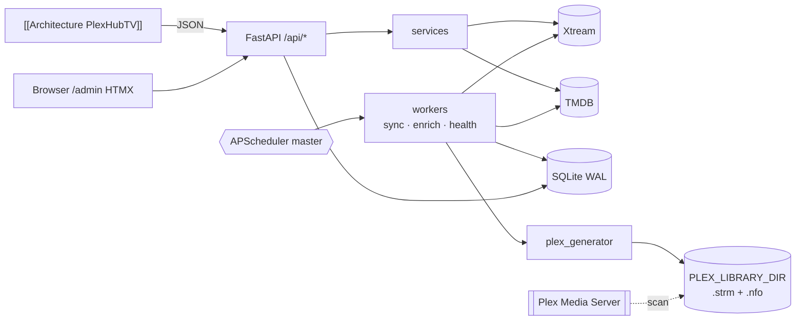
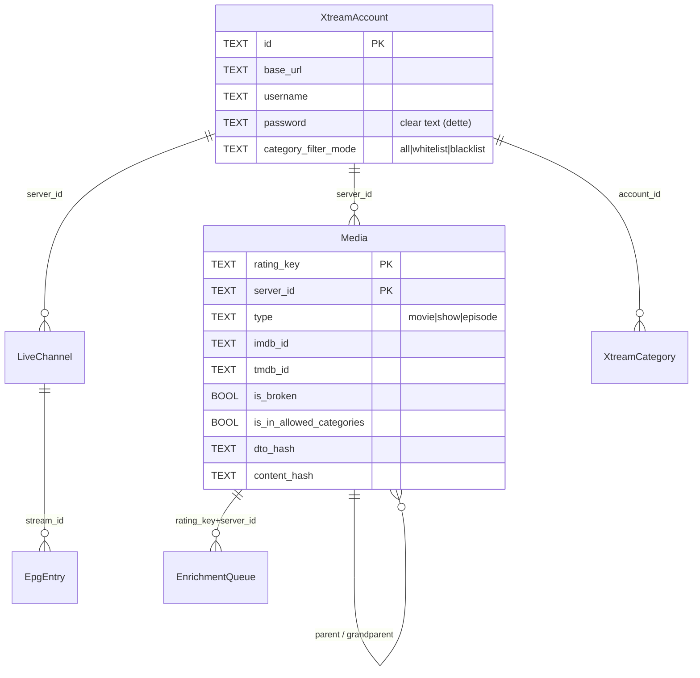
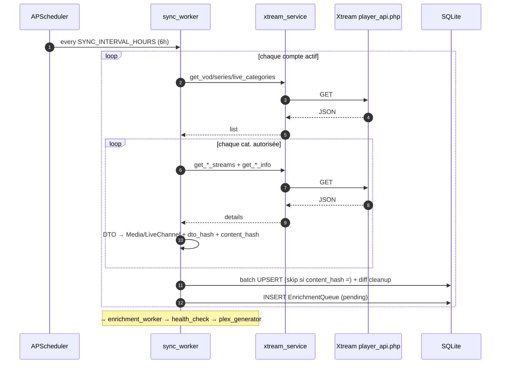
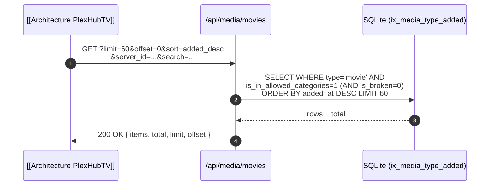

# Architecture PlexHub backend — 2026-05-13

> Version condensée pour vault Obsidian. Doc complète : `docs/architecture/architecture-2026-05-13.md`. Doc symétrique côté client : [[Architecture PlexHubTV]].

## TL;DR

- **FastAPI async** synchronise des catalogues **Xtream Codes IPTV** (VOD / Series / Live) vers SQLite WAL local, enrichit via **TMDB**, valide la santé des streams, et génère une bibliothèque scannable par [[Plex Media Server]] (`.strm` + `.nfo` Jellyfin/Kodi-style).
- **Mono-process Docker** : 1 service, SQLite embarquée (~170 MB observé), pas de broker, master/slave via `fcntl.flock` (`data/server_start.lock`), APScheduler master-only.
- **Surface API** : 8 routers JSON `/api/*` + 1 admin HTMX `/admin`. **Aucune auth, CORS `*`** — conçu pour réseau privé [[Homelab]] / Tailscale.
- **Intégrations** : [[Xtream Codes]] (`player_api.php`), [[TMDB]] (search + details, TTLCache 24 h), [[Plex Media Server]] (consommation FS indirecte).
- **Obs** : Prometheus `/metrics` + 4 métriques métier ; logs rotatifs ; healthcheck Docker. **Pas d'OpenTelemetry, Sentry, Grafana** committés. Dette : pas d'auth, deps `>=` non bornées, `sync_worker.py` à 1314 lignes.

## Stack

FastAPI 0.115 · SQLAlchemy 2.0 + aiosqlite · APScheduler 3.10 · httpx 0.27 · Pydantic 2.6 · rapidfuzz 3.6 · Typer · Prometheus instrumentator 7.0 · Jinja2 3.1. Runtime `python:3.12-slim` (CI Python 3.13).

## Cartographie services

## Surface API (résumé)

| Préfixe | Endpoints clés | Consommateur |
|---|---|---|
| `/api/health` | GET | docker healthcheck + monitoring |
| `/api/accounts` | CRUD + `/test` + `/categories[/refresh]` | admin |
| `/api/live` | channels, EPG (fetch-on-miss) | [[Architecture PlexHubTV]] |
| `/api/media` | movies/shows/episodes, search, stats, PATCH ids, rescrape | [[Architecture PlexHubTV]] |
| `/api/stream/{rating_key}` | GET → URL Xtream | [[Architecture PlexHubTV]] (lecteur) |
| `/api/sync` | 8 triggers async (sync/enrich/validate/full-pipeline) + status | admin, cron |
| `/api/plex/generate` | POST → SyncReport | admin, cron |
| `/admin` | HTML/HTMX (Jinja2) — édition ids, import NFO | navigateur |
| `/metrics` | GET Prometheus | scraper |

Pagination `limit`/`offset`, tri `sort` (added_desc/asc, title_*, rating_desc, year_desc). DTO Pydantic camelCase via `alias_generator`. **Aucune auth, pas de versioning, pas de rate limit.**

## Schéma données (essentiel)

6 tables ([app/models/database.py](../../../app/models/database.py)) :

Migrations manuelles asynchrones M001→M007 dans `app/db/migrations.py` (pas d'Alembic). `media` porte 16 index incl. unique `uix_media_pagination` + `ix_media_stream_validation` (M007). PRAGMA : `WAL`, cache 64 MB, mmap 256 MB, busy_timeout 5 s.

## Flux principaux

### B2 — Sync Xtream (cron + initial, master-only)

### B3 — Browse pour [[Architecture PlexHubTV]]

## Points d'extension IA

> Miroir client : [[Architecture PlexHubTV#points-extension-ia]]

**Pré-requis à confirmer** : GPU homelab, RAM, Proxmox vs Docker, Tailscale.

**Architecture recommandée** : sidecar Python FastAPI séparé (port distinct) ; [[Plex Media Server]] et [[Xtream Codes]] inchangés ; SQLite reste OLTP + **Qdrant sidecar Docker** pour le vectoriel (option moins risquée que migration Postgres+pgvector) ; **API key obligatoire** dès qu'on expose `/api/ai/*`.

Latence cible : **< 200 ms** pour endpoints lecture précomputés ; jobs `202 Accepted` pour la génération.

### Features candidates (top 5)

| # | Feature | Effort | Impact | Injection | Prérequis |
|---|---|---|---|---|---|
| 1 | `GET /api/ai/recommendations` — CF sur `view_count`/`view_offset` | M | H | nouveau router `app/api/ai.py` + worker batch | aucun (SQL) ou Qdrant |
| 2 | `GET /api/ai/smart-rows` — rangées thématiques (mood/durée/cross-genre) | M | H | extension `media_service` + cache TTL | LLM léger ou règles |
| 3 | `POST /api/ai/voice-query` — recherche sémantique NL | L | M | sidecar Python + retrieval | embeddings + vector DB |
| 4 | `POST /api/ai/auto-tag` — tags qualitatifs (mood, pacing) | M | M | nouveau worker post-enrichment | LLM (Ollama Mistral) |
| 5 | `GET /api/ai/stream-anomalies` — patterns broken streams | M | M | extension `health_check_worker` | métriques + modèle simple |

Foundation transverse : `POST /api/ai/embeddings/recompute` (worker batch, vector DB).

**Multi-tenant** : actuellement pas de modèle `User`. Pré-requis avant features personnalisées (recommandations, continue-watching rerank).

## Ops & dette (résumé)

- Build : Docker single-stage Python 3.12-slim, root user `(à confirmer/durcir)`.
- Compose : 1 GB RAM / 1 CPU, healthcheck `/api/health` toutes 30 s.
- CI GHA : pytest + Docker push GHCR. **Manquant** : lint, SAST, coverage, CD.
- Backup : `sqlite3.Connection.backup()` cron @ `BACKUP_HOUR`, rétention 7 j.
- **Dette top 5** : (1) pas d'auth, (2) `sync_worker.py` god-object, (3) deps `>=` non bornées, (4) credentials Xtream en clair, (5) pas de migrations Alembic.

## Glossaire & wiki-links

- [[PlexHub backend]] — cette codebase
- [[Architecture PlexHubTV]] — doc symétrique côté app TV Android (note partenaire — créer dans le vault si absente)
- [[Homelab]] — environnement de déploiement
- [[Plex Media Server]] — consommateur indirect via scan FS
- [[Xtream Codes]] — provider IPTV
- [[TMDB]] — provider métadonnées

### `(à confirmer)`

1. Note vault `[[Architecture PlexHubTV]]` à créer (la doc partenaire existe à `PlexHubTV/docs/ARCHITECTURE.md`).
2. Infra homelab (GPU, RAM, Proxmox / Docker bare-metal, Tailscale).
3. Chemin vault cible recommandé : `wiki/Context/architecture-plexhub-backend-2026-05-13.md`.
4. Stockage embeddings IA : Qdrant sidecar (reco) vs migration Postgres+pgvector.
